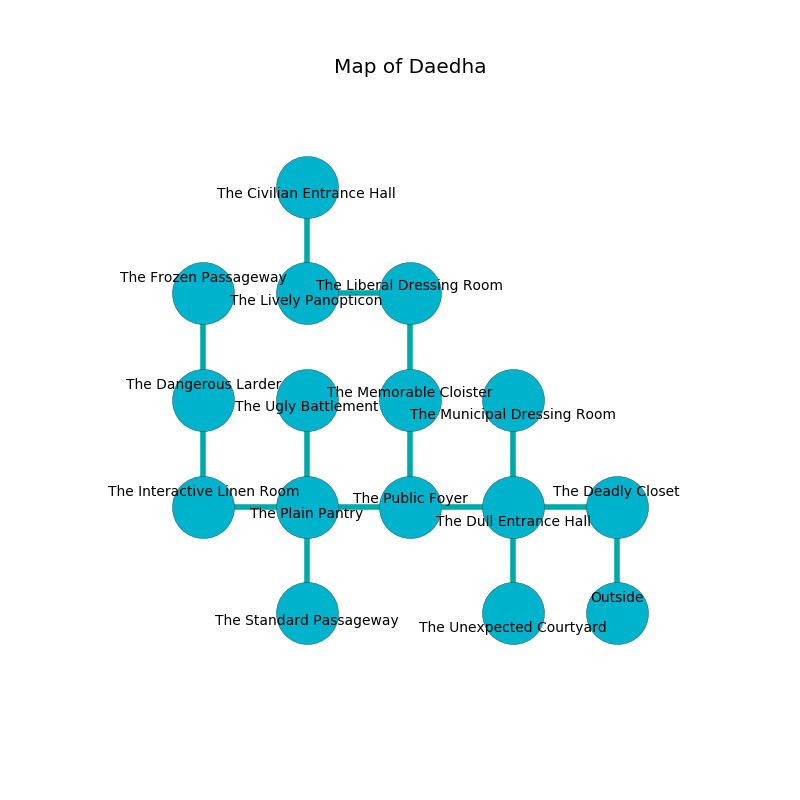

%Ruin Dogs

##Daedha
###Overview
Daedha is located under a volcanic rift. Some areas of Daedha are inaccessible. A battle between raiders is happening outside. It is occupied by Satyrs. Linwood Winstead The Mean, a Drow Mage is here. The Satyrs are ruled by Linwood Winstead The Mean. He  is founding a new religion. 

###Artifact
####Uodhaema

Uodhaema looks like a broken cube. Water glows towards it. When rubbed it repels insects. 

###Locations

####the deadly closet
There are a Giant Crocodile and an Ogre here. The floor is sticky. 

* To the west a torchlit cavern connects to [the dull entrance hall](#the-dull-entrance-hall).
* To the south is the entrance.

####the dull entrance hall
The air tastes like grapefruit here. 

* To the west a torchlit cavern leads to [the public foyer](#the-public-foyer).
* To the east a torchlit cavern connects to [the deadly closet](#the-deadly-closet).
* To the north a dark hall opens to [the municipal dressing room](#the-municipal-dressing-room).
* To the south a long passageway opens to [the unexpected courtyard](#the-unexpected-courtyard).

####the unexpected courtyard
The floor is smooth. Red ferns are growing from the ceiling. The air tastes like neroli here. 

* To the north a long passageway leads to [the dull entrance hall](#the-dull-entrance-hall).

####the public foyer
The floor is flooded with seven inch deep cool water. The glass walls are scratched. Gray mushrooms are swaying in cracks in the floor. 

There is an engraving on the floor written in Satyrs Script. 

> I am fleeing Daedha.
>
> Do not try giving up.
>

* To the west a dark cave connects to [the plain pantry](#the-plain-pantry).
* To the east a torchlit cavern opens to [the dull entrance hall](#the-dull-entrance-hall).
* To the north a small corridor leads to [the memorable cloister](#the-memorable-cloister).

####the memorable cloister
Green mushrooms are sprouting in broken urns. The wooden walls are scratched. The air smells like fruit here. There are an Aarakocra, a Spider, a Swarm of Insects, a Scarecrow, a Lizardfolk, a Giant Hyena, a Gold Dragon Wyrmling, and a Deer here. 

There is an engraving on a tablet written in common. 

> I am lost in Daedha.
>

* To the north a torchlit threshold connects to [the liberal dressing room](#the-liberal-dressing-room).
* To the south a small corridor opens to [the public foyer](#the-public-foyer).

####the liberal dressing room
The air tastes like cologne here. 

* There is a cart here.
* To the west a dripping gap leads to [the lively panopticon](#the-lively-panopticon).
* To the south a torchlit threshold opens to [the memorable cloister](#the-memorable-cloister).

####the plain pantry
The concrete walls are caving in. Green moss is swaying in a patch on the floor. There are a Mud Mephit, a Wolf, a Blue Dragon Wyrmling, a Fire Elemental, and an Owl here. The air tastes like vegetables here. 

* [Uodhaema](#Uodhaema) is here.
* To the west a long artery opens to [the interactive linen room](#the-interactive-linen-room).
* To the east a dark cave connects to [the public foyer](#the-public-foyer).
* To the north a torchlit cavern opens to [the ugly battlement](#the-ugly-battlement).
* To the south a small passageway leads to [the standard passageway](#the-standard-passageway).

####the interactive linen room
Blue razorgrass is swaying from the walls. The floor is glossy. 

* To the east a long artery connects to [the plain pantry](#the-plain-pantry).
* To the north a long gap connects to [the dangerous larder](#the-dangerous-larder).

####the lively panopticon
The air tastes like marjoram here. Red ferns are swaying in broken urns. There are a Riding Horse, an Ettin, a Mezzoloth, and a Vulture here. 

* To the east a dripping gap opens to [the liberal dressing room](#the-liberal-dressing-room).
* To the north a hazy gap leads to [the civilian entrance hall](#the-civilian-entrance-hall).

####the civilian entrance hall
There is a trap here. When activated, a tripwire will launch an arrow. Gray ferns are swaying from the ceiling. The brick walls are caving in. The air smells like tansy here. 

* To the south a hazy gap connects to [the lively panopticon](#the-lively-panopticon).

####the dangerous larder
Green ferns are growing from the ceiling. The glass walls are bloodstained. There are a Giant Octopus, a Dust Mephit, a Duodrone, a Gargoyle, a Hobgoblin Captain, a Giant Lizard, a Sea Horse, a Steam Mephit, an Octopus, and a Hyena here. 

* There is a basin here.
* There is an amulet here.
* To the north a narrow hallway opens to [the frozen passageway](#the-frozen-passageway).
* To the south a long gap opens to [the interactive linen room](#the-interactive-linen-room).

####the municipal dressing room
The air tastes like baked potato here. The floor is cluttered with rocks. Yellow ferns are swaying from the walls. There are a Quaggoth Thonot, a Plesiosaurus, a Tiger, a Baboon, and an Owl here. 

* To the south a dark hall connects to [the dull entrance hall](#the-dull-entrance-hall).

####the frozen passageway
The air tastes like myrrh here. The crystal walls are caving in. Red mushrooms are growing in broken urns. 

* [Linwood Winstead The Mean](#Linwood-Winstead-The-Mean) is here.
* To the south a narrow hallway opens to [the dangerous larder](#the-dangerous-larder).

####the standard passageway
The stone walls are caving in. White razorgrass is sprouting in broken urns. There are twelve Satyrs here. If the Satyrs notice the Ruin Dogs, one of them will retreat and alert [Linwood Winstead](#Linwood-Winstead). 

* To the north a small passageway leads to [the plain pantry](#the-plain-pantry).

####the ugly battlement
There is a trap here. When activated, a tripwire will extend a spring loaded spear. The floor is flooded with two inch deep cool water. The air smells like acetone here. There are twelve Satyrs here. One of the Satyrs is working a mechanism that can flood the room. 

* To the south a torchlit cavern connects to [the plain pantry](#the-plain-pantry).

