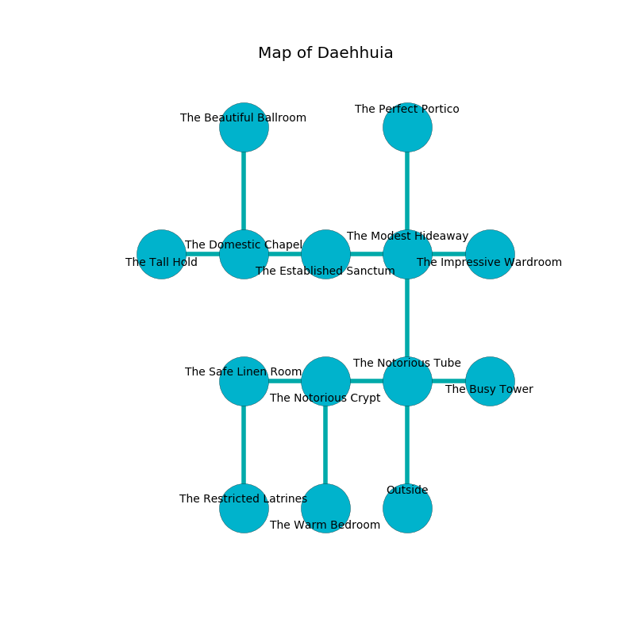

%Ruin Dogs

##Daehhuia
###Overview
Daehhuia is located under a ruined mountain. Some rooms of Daehhuia are cursed. A massive flood is happening outside. It is occupied by Quaggoths. Rodrick Cooley The Impatient, a Cloud Giant is here. The Quaggoths are the slaves of Rodrick Cooley The Impatient. He  is trying to hide [Mahhaehamca Codduefl](#Mahhaehamca-Codduefl). 

###Artifact
####Mahhaehamca Codduefl

Mahhaehamca Codduefl looks like a smooth rock. It smells like dates. When held it becomes lost. 

###Locations

####the notorious tube
The floor is smooth. The metallic walls are ruined. 

* There is a whip here.
* To the west a narrow hallway leads to [the notorious crypt](#the-notorious-crypt).
* To the east a narrow hallway leads to [the busy tower](#the-busy-tower).
* To the north a torchlit cavern opens to [the modest hideaway](#the-modest-hideaway).
* To the south is the entrance.

####the modest hideaway
The air smells like ginger here. There are a Quaggoth Thonot and three Quaggoths here. Blue mushrooms are swaying from the ceiling. The Quaggoths are performing a ritual. If not interrupted, [Rodrick Cooley](#Rodrick-Cooley) will be magically alarmed. 

There is an engraving on a monolith written in Quaggoths Script. 

> We are dying
>
> charismatic and particular
>
> All of us are love
>
> but comprehensive
>

* To the west a small cave leads to [the established sanctum](#the-established-sanctum).
* To the east a small hall connects to [the impressive wardroom](#the-impressive-wardroom).
* To the north a dark artery leads to [the perfect portico](#the-perfect-portico).
* To the south a torchlit cavern connects to [the notorious tube](#the-notorious-tube).

####the established sanctum
The brick walls are bloodstained. The floor is glossy. There are a Hunter Shark and a Mind Flayer Arcanist here. Blue ferns are swaying from the walls. 

There is an engraving on the ceiling written in Quaggoths Script. 

> I am lost in Daehhuia.
>

* There is a basin here.
* To the west a dark passageway leads to [the domestic chapel](#the-domestic-chapel).
* To the east a small cave leads to [the modest hideaway](#the-modest-hideaway).

####the notorious crypt
The crystal walls are pristine. The floor is glossy. There are four Quaggoths here. One of the Quaggoths is working a mechanism that can pour bees from the ceiling. 

* To the west a narrow corridor leads to [the safe linen room](#the-safe-linen-room).
* To the east a narrow hallway connects to [the notorious tube](#the-notorious-tube).
* To the south a dripping gap leads to [the warm bedroom](#the-warm-bedroom).

####the domestic chapel
The floor is smooth. There are four Quaggoths here. The Quaggoths are willing to negotiate. 

* There is a sceptre here.
* There is a spear here.
* To the west a small cavern opens to [the tall hold](#the-tall-hold).
* To the east a dark passageway connects to [the established sanctum](#the-established-sanctum).
* To the north a twisted opening connects to [the beautiful ballroom](#the-beautiful-ballroom).

####the busy tower
The metallic walls are covered in mold. The air tastes like marjoram here. Green moss is growing from the ceiling. 

* To the west a narrow hallway leads to [the notorious tube](#the-notorious-tube).

####the perfect portico
Gray mushrooms are sprouting in cracks in the floor. The stone walls are caving in. 

There is an engraving on the ceiling written in common. 

> Oh the memory of you is woe
>
> but never sick
>
> but never slow
>
> cruelty is thick
>

* There is a crossbow here.
* To the south a dark artery leads to [the modest hideaway](#the-modest-hideaway).

####the tall hold
The floor is cluttered with rocks. Red lichens are sprouting in broken urns. The glass walls are caving in. 

* To the east a small cavern leads to [the domestic chapel](#the-domestic-chapel).

####the beautiful ballroom
There is a trap here. When activated, a magical rune will ring a bell. There are a Will-O’-Wisp, a Half-Red Dragon Veteran, a Lemure, an Orc Eye of Gruumsh, and a Brown Bear here. The air tastes like peach here. Yellow razorgrass is growing in cracks in the floor. 

There is an engraving on the floor written in common. 

> Treasure here.
>

* To the south a twisted opening connects to [the domestic chapel](#the-domestic-chapel).

####the safe linen room
The air smells like roasted meaty here. Yellow lichens are decaying in cracks in the floor. There is a trap here. When activated, a magical rune will launch a poison needle. There are two Quaggoth Thonots and two Quaggoths here. One of the Quaggoths is pointing a ballista at the entrance. 

* There is a horse here.
* [Mahhaehamca Codduefl](#Mahhaehamca-Codduefl) is here.
* To the east a narrow corridor connects to [the notorious crypt](#the-notorious-crypt).
* To the south a hazy threshold opens to [the restricted latrines](#the-restricted-latrines).

####the impressive wardroom
The air smells like sandalwood here. White mushrooms are decaying from the walls. 

There is an engraving on a monolith written in common. 

> Leave at once.
>

* To the west a small hall leads to [the modest hideaway](#the-modest-hideaway).

####the warm bedroom
The air smells like melon rind here. The floor is sticky. 

* [Rodrick Cooley The Impatient](#Rodrick-Cooley-The-Impatient) is here.
* To the north a dripping gap leads to [the notorious crypt](#the-notorious-crypt).

####the restricted latrines
Green lichens are growing in cracks in the floor. There are two Quaggoth Thonots and two Quaggoths here. The floor is smooth. The air smells like barley here. One of the Quaggoths is on watch, the rest are celebrating. 

* To the north a hazy threshold leads to [the safe linen room](#the-safe-linen-room).

