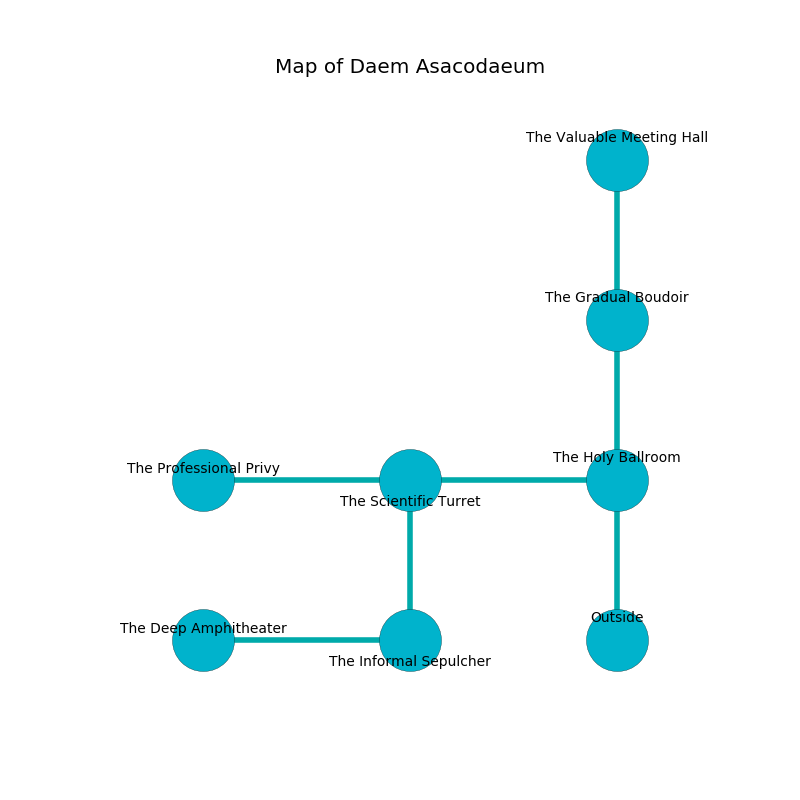

%Ruin Dogs

##Daem Asacodaeum
###Overview
Daem Asacodaeum is located on a spikey plain. Regions of it are cursed. A solar eclipse is happening outside. It is occupied by Mind Flayers. Rodger Halverson The Self-Centred, a Drow Priestess of Lolth is here. The Mind Flayers are battling Rodger Halverson The Self-Centred. He  is founding a new religion. 

###Artifact
####The Lost Intention

The Lost Intention has the form of a broken gem. Psychic energy incinerates towards it. It smells like clover. When smelled it liquifies. 

###Locations

####the holy ballroom
Yellow mushrooms are growing in a patch on the floor. There is a Mind Flayer Arcanist here. The floor is glossy. If the Mind Flayer Arcanist notice the Ruin Dogs, one of them will retreat and alert the others. 

There is an engraving on the wall written in common. 

> Poor me! our fate is sadistic
>
> it is always artistic
>
> sweet, dominant, profound
>
> sadness is round
>

* To the west a dark passageway opens to [the scientific turret](#the-scientific-turret).
* To the north a torchlit cave connects to [the gradual boudoir](#the-gradual-boudoir).
* To the south is the entrance.

####the scientific turret
Yellow moss is growing in broken urns. The concrete walls are pristine. The air smells like opoponax here. 

* To the west a dripping walkway connects to [the professional privy](#the-professional-privy).
* To the east a dark passageway leads to [the holy ballroom](#the-holy-ballroom).
* To the south a flooded opening opens to [the informal sepulcher](#the-informal-sepulcher).

####the informal sepulcher
There is a Mind Flayer Arcanist here. The floor is bloodstained. The air smells like butterscotch here. The Mind Flayer Arcanist is caring for babies. 

* There is an icon here.
* To the west a dripping hallway connects to [the deep amphitheater](#the-deep-amphitheater).
* To the north a flooded opening opens to [the scientific turret](#the-scientific-turret).

####the professional privy
The air smells like lettuce here. The crystal walls are unsettled. There are two Mind Flayers here. If the Mind Flayers notice the Ruin Dogs, one of them will retreat and alert [Rodger Halverson](#Rodger-Halverson). 

* [Rodger Halverson The Self-Centred](#Rodger-Halverson-The-Self-Centred) is here.
* To the east a dripping walkway opens to [the scientific turret](#the-scientific-turret).

####the deep amphitheater
There are two Mind Flayers here. There is a trap here. When activated, a tripwire will launch a rolling boulder. The air smells like orchid here. The Mind Flayers are willing to negotiate. 

* To the east a dripping hallway opens to [the informal sepulcher](#the-informal-sepulcher).

####the gradual boudoir
The crystal walls are caving in. The floor is flooded with eight inch deep scalding water. 

There is an engraving on the floor written in common. 

> Maybe try swimming.
>

* [The Lost Intention](#The-Lost-Intention) is here.
* To the north a narrow opening connects to [the valuable meeting hall](#the-valuable-meeting-hall).
* To the south a torchlit cave connects to [the holy ballroom](#the-holy-ballroom).

####the valuable meeting hall
The crystal walls are caving in. 

* To the south a narrow opening opens to [the gradual boudoir](#the-gradual-boudoir).

