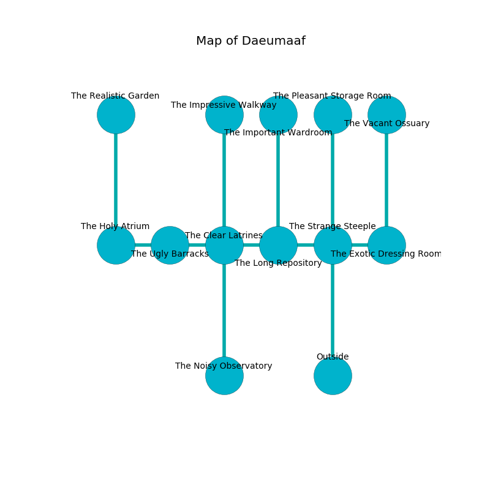

%Ruin Dogs

##Daeumaaf
###Overview
Daeumaaf is located on a cursed plain. Parts of it are unbearably cold. The ruin is flooding. It is occupied by Orc. Wesley Nunes The Perverse, a Drow Elite Warrior is here. The Orc worship Wesley Nunes The Perverse. She  is trying to find [Baehh Eluemdeha](#Baehh-Eluemdeha). 

###Artifact
####Baehh Eluemdeha

Baehh Eluemdeha has the form of an opaque prism. It is a dark orange color. When held it changes the past. 

###Locations

####the strange steeple
The floor is bloodstained. White lichens are growing from the walls. The air tastes like green tea here. 

* To the west a windy walkway opens to [the long repository](#the-long-repository).
* To the east a narrow cavern opens to [the exotic dressing room](#the-exotic-dressing-room).
* To the north a dripping gap leads to [the pleasant storage room](#the-pleasant-storage-room).
* To the south is the entrance.

####the exotic dressing room
The floor is smooth. There are twelve Orcs here. Blue mushrooms are growing from the ceiling. One of the Orc is on watch, the rest are feasting. 

* [Wesley Nunes The Perverse](#Wesley-Nunes-The-Perverse) is here.
* To the west a narrow cavern opens to [the strange steeple](#the-strange-steeple).
* To the north a narrow artery opens to [the vacant ossuary](#the-vacant-ossuary).

####the long repository
The floor is glossy. The air tastes like white chocolate here. There are a Rust Monster, a Vampire Spawn, a Bulette, a Giant Weasel, and a Vulture here. 

* [Baehh Eluemdeha](#Baehh-Eluemdeha) is here.
* To the west a torchlit cavern leads to [the clear latrines](#the-clear-latrines).
* To the east a windy walkway connects to [the strange steeple](#the-strange-steeple).
* To the north a hazy threshold opens to [the important wardroom](#the-important-wardroom).

####the clear latrines
The mirrored walls are covered in mold. There are a Quaggoth, a Spider, a Swarm of Poisonous Snakes, and an Ankylosaurus here. 

There is an engraving on the floor written in Orc Script. 

> O terrible fate
>
> it is always late
>
> vicious and unexpected
>
> fate is expected
>

* There is a cart here.
* To the west a long pathway connects to [the ugly barracks](#the-ugly-barracks).
* To the east a torchlit cavern opens to [the long repository](#the-long-repository).
* To the north a small passageway connects to [the impressive walkway](#the-impressive-walkway).
* To the south a dark gap opens to [the noisy observatory](#the-noisy-observatory).

####the ugly barracks
The metallic walls are scratched. There are a Guard, a Wight, a Flumph, and a Grell here. Yellow moss is sprouting in a patch on the floor. 

* To the west a long hall connects to [the holy atrium](#the-holy-atrium).
* To the east a long pathway opens to [the clear latrines](#the-clear-latrines).

####the vacant ossuary
The air tastes like pecan here. There are twelve Orcs here. Yellow ferns are decaying from the ceiling. The Orc are performing a ritual. If not interrupted, a powerful monster will be summoned. 

* To the south a narrow artery connects to [the exotic dressing room](#the-exotic-dressing-room).

####the noisy observatory
There are twelve Orcs here. The air smells like coconut here. White mushrooms are swaying in a patch on the floor. The brick walls are covered in mold. If the Orc notice the Ruin Dogs, one of them will retreat and alert the others. 

* There is a stamp here.
* To the north a dark gap opens to [the clear latrines](#the-clear-latrines).

####the pleasant storage room
There are twelve Orcs here. The air smells like chrysanthemum here. There is a trap here. When activated, a magical rune will open a large pit in the floor. One of the Orc is working a mechanism that can flood the room. 

* There is a brooch here.
* There is a plow here.
* To the south a dripping gap opens to [the strange steeple](#the-strange-steeple).

####the holy atrium
The brick walls are scratched. The floor is bloodstained. 

* To the east a long hall leads to [the ugly barracks](#the-ugly-barracks).
* To the north a small pathway opens to [the realistic garden](#the-realistic-garden).

####the realistic garden
Red mushrooms are decaying in cracks in the floor. The obsidion walls are caving in. 

There is an engraving on the ceiling written in Orc Script. 

> A fish is a discrimination
>
> yet fashionable
>
> stupid and urban
>
> just and lucky
>
> always experimental
>

* To the south a small pathway connects to [the holy atrium](#the-holy-atrium).

####the impressive walkway
The floor is bloodstained. The air smells like plum skin here. There is a trap here. When activated, a magical sound detector will extend a spring loaded spear. 

* There is a hare here.
* To the south a small passageway opens to [the clear latrines](#the-clear-latrines).

####the important wardroom
The air smells like pine here. There are twelve Orcs here. The wooden walls are caving in. The floor is bloodstained. The Orc are willing to negotiate. 

There is an engraving on the floor written in Orc Script. 

> I lost [Baehh Eluemdeha](#Baehh-Eluemdeha).
>

* To the south a hazy threshold opens to [the long repository](#the-long-repository).

