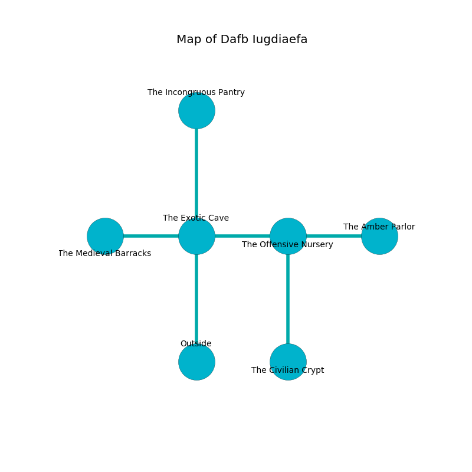

%Ruin Dogs

##Dafb Iugdiaefa
###Overview
Dafb Iugdiaefa is located in a poisoned rift. Some areas of it are flooded. A lunar eclipse is happening outside. It is occupied by Sprites. Leann Wilburn The Changeable, a Drow Priestess of Lolth is here. The Sprites have been charmed by Leann Wilburn The Changeable. She  is trying to find [The Intermediate Bird](#The-Intermediate-Bird). 

###Artifact
####The Intermediate Bird

The Intermediate Bird has the form of a warm cube. Fire incinerates around it. When held it destroys itself. 

###Locations

####the exotic cave
The floor is bloodstained. The air smells like violet leaf here. White moss is swaying from the ceiling. 

There is an engraving on a stone written in common. 

> Oh sorry you
>
> yet never true
>
> confident, general, secular
>
> cruelty is molecular
>

* [Leann Wilburn The Changeable](#Leann-Wilburn-The-Changeable) is here.
* To the west a windy threshold opens to [the medieval barracks](#the-medieval-barracks).
* To the east a torchlit threshold opens to [the offensive nursery](#the-offensive-nursery).
* To the north a windy cave leads to [the incongruous pantry](#the-incongruous-pantry).
* To the south is the entrance.

####the offensive nursery
The air smells like bay here. Red mushrooms are decaying in a patch on the floor. 

There is an engraving on a tablet written in common. 

> I discovered [The Intermediate Bird](#The-Intermediate-Bird).
>
> I thought about digging.
>

* [The Intermediate Bird](#The-Intermediate-Bird) is here.
* To the west a torchlit threshold connects to [the exotic cave](#the-exotic-cave).
* To the east a dark cavern opens to [the amber parlor](#the-amber-parlor).
* To the south a small cave leads to [the civilian crypt](#the-civilian-crypt).

####the medieval barracks
The floor is bloodstained. The obsidion walls are caving in. 

* There is a crossbow here.
* There is a jewel here.
* To the east a windy threshold connects to [the exotic cave](#the-exotic-cave).

####the incongruous pantry
Green moss is growing from the ceiling. There are a Giant Toad, a Helmed Horror, and a Blue Slaad here. 

There is an engraving on the wall written in Sprites Script. 

> [The Intermediate Bird](#The-Intermediate-Bird)
>
> serious, residential, internal
>
> [The Intermediate Bird](#The-Intermediate-Bird)
>
> bland, productive, finished
>
> yet never irrelevant
>

* To the south a windy cave connects to [the exotic cave](#the-exotic-cave).

####the amber parlor
The obsidion walls are bloodstained. The floor is sticky. 

There is an engraving on a monolith written in Sprites Script. 

> O sorry we
>
> but free
>
> it is always economic
>
> all is free
>

* There is an amulet here.
* To the west a dark cavern connects to [the offensive nursery](#the-offensive-nursery).

####the civilian crypt
The air smells like cologne here. 

* There is a mug here.
* To the north a small cave connects to [the offensive nursery](#the-offensive-nursery).

