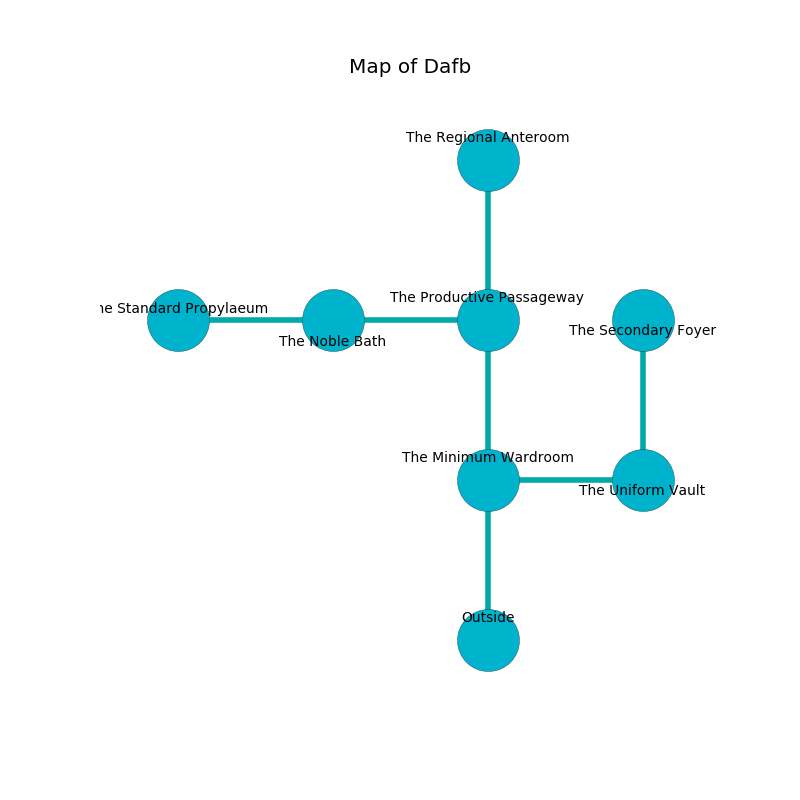

%Ruin Dogs

##Dafb
###Overview
Dafb is located under a haunted plain. Some areas of it are flooded. The ruin is sinking into the earth. It is occupied by Demons. Janice Mcbride The Careless, a Stone Giant is here. The Demons are ruled by Janice Mcbride The Careless. She  is trying to discover [Imua](#Imua). 

###Artifact
####Imua

Imua looks like a broken sphere. It smells like onion. Light pours near it. When carried it grants power to its owner. 

###Locations

####the minimum wardroom
There are a Barbed Devil and a Succubus here. The floor is smooth. One of the Demons is on watch, the rest are fighting amongst themselves. 

* To the east a long artery leads to [the uniform vault](#the-uniform-vault).
* To the north a narrow corridor opens to [the productive passageway](#the-productive-passageway).
* To the south is the entrance.

####the uniform vault
The floor is flooded with five inch deep cool water. The metallic walls are unsettled. There are a Zombie, a Spider, an Orc War Chief, and a Saber-Toothed Tiger here. 

* [Imua](#Imua) is here.
* To the west a long artery connects to [the minimum wardroom](#the-minimum-wardroom).
* To the north a hazy passageway leads to [the secondary foyer](#the-secondary-foyer).

####the productive passageway
There are an Azer, a Duodrone, an Orog, and a Rug of Smothering here. 

* [Janice Mcbride The Careless](#Janice-Mcbride-The-Careless) is here.
* To the west a windy walkway connects to [the noble bath](#the-noble-bath).
* To the north a hazy gap connects to [the regional anteroom](#the-regional-anteroom).
* To the south a narrow corridor connects to [the minimum wardroom](#the-minimum-wardroom).

####the noble bath
There are a Cultist, a Duodrone, a Carrion Crawler, a Hobgoblin Warlord, a Smoke Mephit, a Gelatinous Cube, and an Octopus here. 

There is an engraving on the ceiling written in Demons Script. 

> I tried fighting.
>

* To the west a twisted corridor leads to [the standard propylaeum](#the-standard-propylaeum).
* To the east a windy walkway opens to [the productive passageway](#the-productive-passageway).

####the standard propylaeum
The air smells like cedarwood here. The floor is bloodstained. Blue razorgrass is swaying in a patch on the floor. The glass walls are pristine. 

There is an engraving on a monolith written in Demons Script. 

> I was injured in Dafb.
>
> Leave now.
>

* To the east a twisted corridor connects to [the noble bath](#the-noble-bath).

####the regional anteroom
The floor is cluttered with broken glass. The wooden walls are ruined. The air smells like gooseberry here. 

There is an engraving on the wall written in common. 

> Oh weak god
>
> constant and odd
>
> it is always married
>
> the world is varied
>

* There is a snake here.
* To the south a hazy gap connects to [the productive passageway](#the-productive-passageway).

####the secondary foyer
The stone walls are ruined. The air smells like lamb here. The floor is flooded with four inch deep scalding water. 

* To the south a hazy passageway leads to [the uniform vault](#the-uniform-vault).

