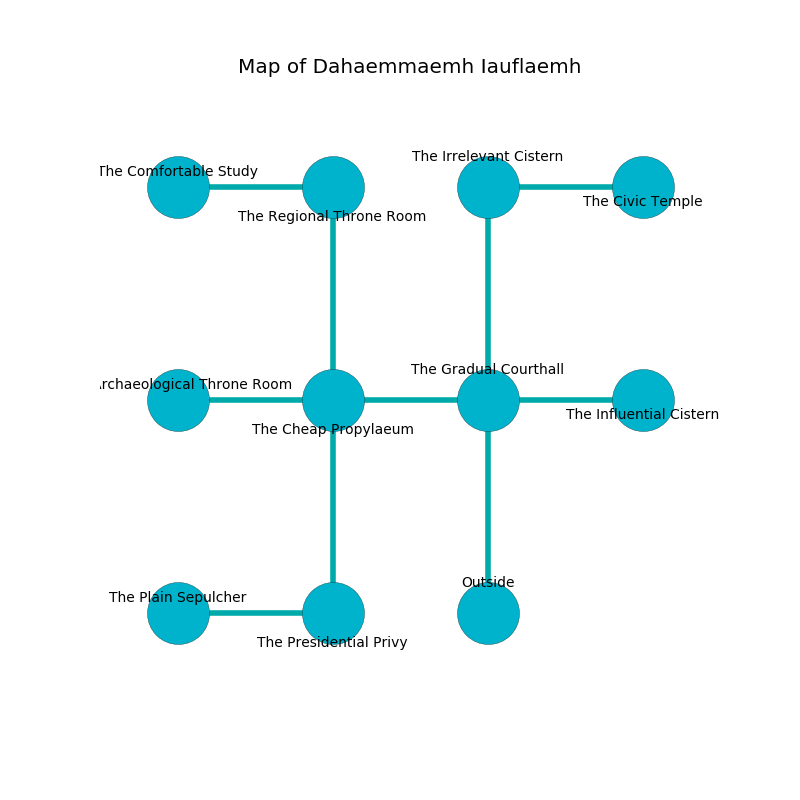

%Ruin Dogs

##Dahaemmaemh Iauflaemh
###Overview
Dahaemmaemh Iauflaemh is located in a crystal rift. Parts of it are frozen. A solar eclipse is happening outside. It is occupied by Giants. Jarod Hartley The Foolhardy, a Drow Priestess of Lolth is here. The Giants are the minions of Jarod Hartley The Foolhardy. He  is trying to research [Medofa](#Medofa). 

###Artifact
####Medofa

Medofa has the form of a soft gem. It smells like ginseng. When picked up it tunnels into the earth. 

###Locations

####the gradual courthall
The floor is sticky. The glass walls are pristine. Blue mushrooms are swaying in broken urns. 

* To the west a flooded passageway connects to [the cheap propylaeum](#the-cheap-propylaeum).
* To the east a windy threshold leads to [the influential cistern](#the-influential-cistern).
* To the north a dripping hall leads to [the irrelevant cistern](#the-irrelevant-cistern).
* To the south is the entrance.

####the cheap propylaeum
Green razorgrass is swaying from the walls. There are a Homunculus, a Giant Rat, a Githzerai Zerth, and a Couatl here. The floor is bloodstained. The air tastes like nut here. 

* To the west a small passageway leads to [the archaeological throne room](#the-archaeological-throne-room).
* To the east a flooded passageway connects to [the gradual courthall](#the-gradual-courthall).
* To the north a narrow passageway opens to [the regional throne room](#the-regional-throne-room).
* To the south a torchlit walkway leads to [the presidential privy](#the-presidential-privy).

####the irrelevant cistern
There are a Cult Fanatic, an Orc War Chief, a Will-O’-Wisp, and a Giant Owl here. The floor is smooth. The metallic walls are pristine. White moss is decaying in a patch on the floor. 

* [Medofa](#Medofa) is here.
* To the east a dripping corridor leads to [the civic temple](#the-civic-temple).
* To the south a dripping hall leads to [the gradual courthall](#the-gradual-courthall).

####the influential cistern
There is a trap here. When activated, a magical proximity detector will flood the room with water. The wooden walls are unsettled. The air tastes like green apple here. 

* To the west a windy threshold leads to [the gradual courthall](#the-gradual-courthall).

####the presidential privy
The wooden walls are scratched. The air tastes like skunk here. There are a Hell Hound, a Minotaur Skeleton, and a Berserker here. 

* To the west a twisted cavern opens to [the plain sepulcher](#the-plain-sepulcher).
* To the north a torchlit walkway opens to [the cheap propylaeum](#the-cheap-propylaeum).

####the regional throne room
Gray ferns are growing from the ceiling. The air smells like bacon here. There is a trap here. When activated, a magical rune will swing a tripping chain. 

* To the west a hazy hall connects to [the comfortable study](#the-comfortable-study).
* To the south a narrow passageway opens to [the cheap propylaeum](#the-cheap-propylaeum).

####the comfortable study
There is a trap here. When activated, a pressure plate will shoot a lightning bolt. There are a Kuo-Toa Monitor, an Ogre Zombie, and a Young Remorhaz here. Yellow mushrooms are growing in broken urns. The floor is glossy. The air tastes like tarragon here. 

* To the east a hazy hall leads to [the regional throne room](#the-regional-throne-room).

####the archaeological throne room
The floor is bloodstained. 

* There is an icon here.
* To the east a small passageway opens to [the cheap propylaeum](#the-cheap-propylaeum).

####the plain sepulcher
The floor is smooth. There are a Copper Dragon Wyrmling, an Ogre, and a Flesh Golem here. The glass walls are scratched. There is a trap here. When activated, a magical sound detector will launch a rolling boulder. 

* [Jarod Hartley The Foolhardy](#Jarod-Hartley-The-Foolhardy) is here.
* To the east a twisted cavern opens to [the presidential privy](#the-presidential-privy).

####the civic temple
Gray mushrooms are growing in cracks in the floor. The air smells like caramel here. The floor is sticky. There is a trap here. When activated, a magical proximity detector will collapse a column. 

There is an engraving on the wall written in Giants Script. 

> A trap ahead.
>

* There is a berry here.
* There is a hat here.
* To the west a dripping corridor leads to [the irrelevant cistern](#the-irrelevant-cistern).

