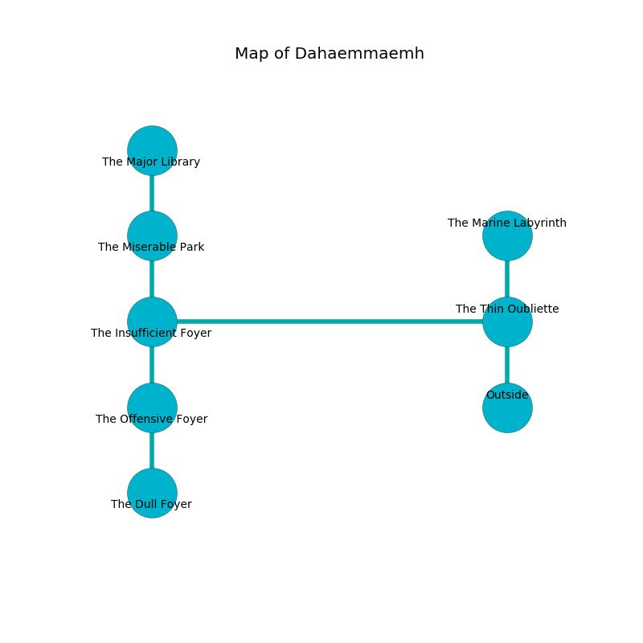

%Ruin Dogs

##Dahaemmaemh
###Overview
Dahaemmaemh is constructed on an obsidion city. Regions of Dahaemmaemh are corrupted. The ruin is larger on the inside than the outside. It is occupied by Ogres. Jessia Vance The Bone-Idle, a Cloud Giant is here. The Ogres are ruled by Jessia Vance The Bone-Idle. She  is trying to exploit [Haemam Luhh](#Haemam-Luhh). 

###Artifact
####Haemam Luhh

Haemam Luhh has the form of a glassy spear. When gazed upon it grants power to its owner. 

###Locations

####the thin oubliette

* To the west a twisted gap opens to [the insufficient foyer](#the-insufficient-foyer).
* To the north a dripping opening leads to [the marine labyrinth](#the-marine-labyrinth).
* To the south is the entrance.

####the insufficient foyer
The wooden walls are bloodstained. The air tastes like sulfur here. 

* To the east a twisted gap opens to [the thin oubliette](#the-thin-oubliette).
* To the north a long pathway opens to [the miserable park](#the-miserable-park).
* To the south a small gap connects to [the offensive foyer](#the-offensive-foyer).

####the marine labyrinth
The air tastes like herbs here. The floor is sticky. The crystal walls are bloodstained. 

* There is a sheep here.
* There is a fowl here.
* To the south a dripping opening leads to [the thin oubliette](#the-thin-oubliette).

####the offensive foyer
The air smells like beeswax here. Gray razorgrass is decaying in cracks in the floor. The floor is sticky. 

* To the north a small gap opens to [the insufficient foyer](#the-insufficient-foyer).
* To the south a torchlit cavern connects to [the dull foyer](#the-dull-foyer).

####the miserable park
The obsidion walls are ruined. 

* [Haemam Luhh](#Haemam-Luhh) is here.
* To the north a twisted gap connects to [the major library](#the-major-library).
* To the south a long pathway leads to [the insufficient foyer](#the-insufficient-foyer).

####the dull foyer
The air smells like oatmeal here. 

There is an engraving on the floor written in Ogres Script. 

> Oh the memory of you is sadistic
>
> original, civilian, outside
>
> but artistic
>
> everything is applied
>

* There is a pot here.
* To the north a torchlit cavern opens to [the offensive foyer](#the-offensive-foyer).

####the major library
Blue moss is decaying in cracks in the floor. There are two Half-Ogres and four Ogres here. There is a trap here. When activated, a magical proximity detector will launch a javelin. The Ogres are drunk. 

* [Jessia Vance The Bone-Idle](#Jessia-Vance-The-Bone-Idle) is here.
* To the south a twisted gap connects to [the miserable park](#the-miserable-park).

