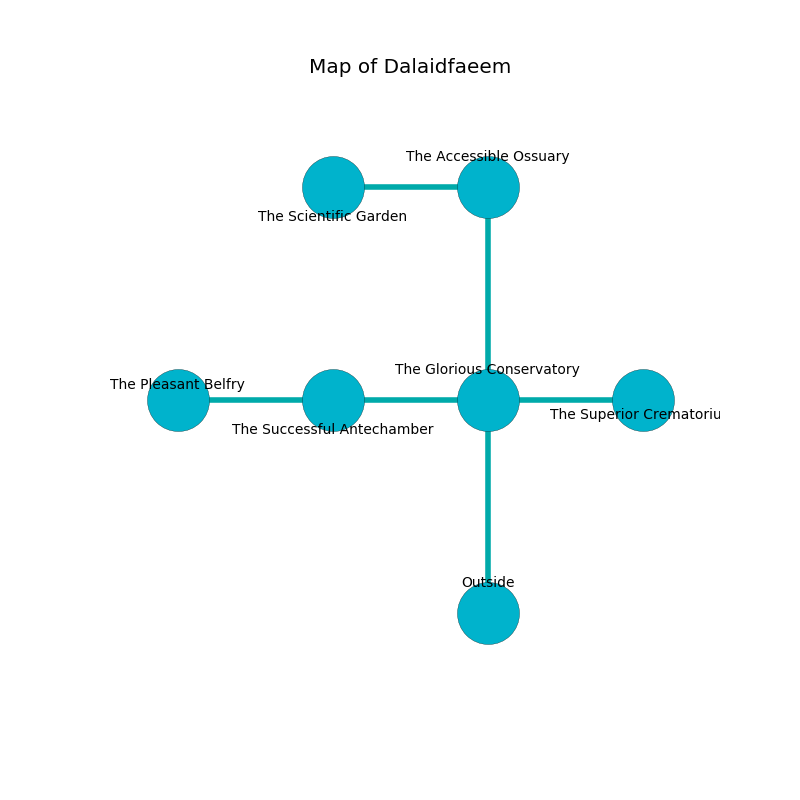

%Ruin Dogs

##Dalaidfaeem
###Overview
Dalaidfaeem is located in a spikey mountain. Regions of it are inaccessible. A massive storm is happening outside. It is occupied by Cyclopses. Marry Beers The Patronizing, an Assassin is here. The Cyclopses worship Marry Beers The Patronizing. She  is founding a new religion. 

###Artifact
####Mahudaeedaeum

Mahudaeedaeum is a powerful artifact in the shape of a cold blade. It is a sickly brown color. When smelled it grants a wish. 

###Locations

####the glorious conservatory
There are a Manticore, a Flumph, a Tyrannosaurus Rex, a Deep Gnome, and an Animated Armor here. Gray lichens are sprouting in a patch on the floor. 

* There is a bowl here.
* To the west a flooded pathway connects to [the successful antechamber](#the-successful-antechamber).
* To the east a windy hallway connects to [the superior crematorium](#the-superior-crematorium).
* To the north a narrow hall leads to [the accessible ossuary](#the-accessible-ossuary).
* To the south is the entrance.

####the superior crematorium
There are a Blink Dog, an Imp, an Orc, a White Dragon Wyrmling, and a Chimera here. The floor is bloodstained. The concrete walls are caving in. 

* To the west a windy hallway opens to [the glorious conservatory](#the-glorious-conservatory).

####the accessible ossuary
The glass walls are bloodstained. The air tastes like pine here. 

There is an engraving on the floor written in common. 

> I am lost in Dalaidfaeem.
>

* There is a bridge here.
* There is a treasure here.
* To the west a torchlit pathway connects to [the scientific garden](#the-scientific-garden).
* To the south a narrow hall connects to [the glorious conservatory](#the-glorious-conservatory).

####the successful antechamber
The floor is cluttered with bones. Green ferns are decaying from the ceiling. 

* [Mahudaeedaeum](#Mahudaeedaeum) is here.
* To the west a narrow hallway leads to [the pleasant belfry](#the-pleasant-belfry).
* To the east a flooded pathway leads to [the glorious conservatory](#the-glorious-conservatory).

####the scientific garden
The floor is cluttered with ashes. The air smells like maple here. There are a Veteran, a Galeb Duhr, and a Succubus here. There is a trap here. When activated, a magical sound detector will launch a poison dart. 

* To the east a torchlit pathway connects to [the accessible ossuary](#the-accessible-ossuary).

####the pleasant belfry
The air tastes like apple skin here. There are two Cyclopses here. The Cyclopses are willing to negotiate. 

* [Marry Beers The Patronizing](#Marry-Beers-The-Patronizing) is here.
* To the east a narrow hallway opens to [the successful antechamber](#the-successful-antechamber).

