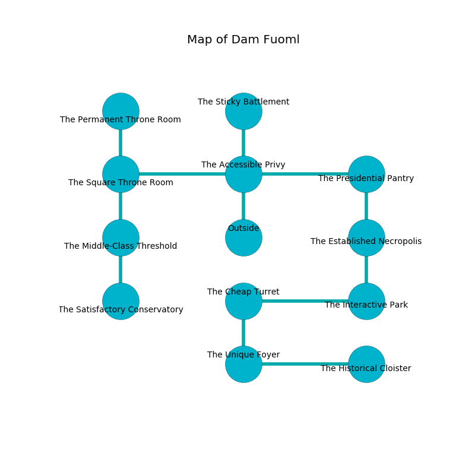

%Ruin Dogs

##Dam Fuoml
###Overview
Dam Fuoml is located under a giant mountain. Parts of Dam Fuoml are flooded. A battle between raiders is happening outside. It is occupied by Humans. Derek Workman The Boastful, a Knight is here. The Humans have been charmed by Derek Workman The Boastful. He  is trying to find [Doddha Dfaemcaedha](#Doddha-Dfaemcaedha). 

###Artifact
####Doddha Dfaemcaedha

Doddha Dfaemcaedha is a powerful artifact in the shape of a wet rock. Magic incinerates from it. It smells like lily of the valley. When eaten it levitates those nearby. 

###Locations

####the accessible privy
There are a Guard, a Scout, a Cultist, a Priest, and a Berserker here. The air tastes like dill here. The stone walls are pristine. The Humans are crazy with bloodlust. 

* To the west a long pathway opens to [the square throne room](#the-square-throne-room).
* To the east a twisted path leads to [the presidential pantry](#the-presidential-pantry).
* To the north a dripping hallway leads to [the sticky battlement](#the-sticky-battlement).
* To the south is the entrance.

####the square throne room
The air smells like amber here. There are a Veteran, two Commoners, a Berserker, and  here. The Humans are drunk. 

* To the east a long pathway connects to [the accessible privy](#the-accessible-privy).
* To the north a narrow opening opens to [the permanent throne room](#the-permanent-throne-room).
* To the south a twisted gap connects to [the middle-class threshold](#the-middle-class-threshold).

####the middle-class threshold
The air tastes like petitgrain here. 

* To the north a twisted gap opens to [the square throne room](#the-square-throne-room).
* To the south a windy pathway connects to [the satisfactory conservatory](#the-satisfactory-conservatory).

####the satisfactory conservatory
Red moss is swaying in a patch on the floor. The crystal walls are pristine. The air tastes like macadamia here. There are two Drows, an Eagle, a Basilisk, a Druid, and  here. 

* To the north a windy pathway leads to [the middle-class threshold](#the-middle-class-threshold).

####the presidential pantry
The floor is glossy. 

* To the west a twisted path opens to [the accessible privy](#the-accessible-privy).
* To the south a windy path connects to [the established necropolis](#the-established-necropolis).

####the established necropolis
There are a Rat, a Bugbear Chief, a Myconid Adult, a Spined Devil, a Goat, and an Orc here. Gray lichens are growing in cracks in the floor. The air smells like watermelon here. 

* To the north a windy path opens to [the presidential pantry](#the-presidential-pantry).
* To the south a narrow path connects to [the interactive park](#the-interactive-park).

####the interactive park
Blue razorgrass is swaying from the ceiling. The floor is flooded with nine inch deep cold water. There are a Guard, a Scarecrow, a Crawling Claw, a Basilisk, and a Kuo-Toa here. 

* To the west a windy walkway leads to [the cheap turret](#the-cheap-turret).
* To the north a narrow path connects to [the established necropolis](#the-established-necropolis).

####the cheap turret
The stone walls are ruined. 

There is an engraving on a stone written in common. 

> [Doddha Dfaemcaedha](#Doddha-Dfaemcaedha)
>
> sweet and positive
>
> [Doddha Dfaemcaedha](#Doddha-Dfaemcaedha)
>
> jealous, sexual, frozen
>
> astonishing, exclusive, sweet
>
> [Doddha Dfaemcaedha](#Doddha-Dfaemcaedha)
>
> manual and fair
>
> All of us are damned
>
> multiple and productive
>
> regular, similar, physical
>
> All of us are corrupted
>
> but never inevitable
>
> always secular
>
> A leg is an embarrassment
>
> innocent, solar, classical
>
> yet complex
>
> We are maddened
>
> distant and important
>
> A match is a permission
>
> solar, helpless, diplomatic
>

* There is a cheese here.
* To the east a windy walkway leads to [the interactive park](#the-interactive-park).
* To the south a narrow threshold opens to [the unique foyer](#the-unique-foyer).

####the sticky battlement
The concrete walls are bloodstained. The floor is bloodstained. There are two Guards, a Priest, a Bandit Captain, an Acolyte, and  here. The Humans are willing to negotiate. 

* To the south a dripping hallway connects to [the accessible privy](#the-accessible-privy).

####the unique foyer
Gray ferns are sprouting in broken urns. The air smells like earth here. There are a Cult Fanatic, a Commoner, and a Bandit Captain here. The obsidion walls are scratched. If the Humans notice the Ruin Dogs, one of them will retreat and alert the others. 

There is an engraving on the wall written in common. 

> I am defending this place.
>

* [Doddha Dfaemcaedha](#Doddha-Dfaemcaedha) is here.
* To the east a hazy cavern opens to [the historical cloister](#the-historical-cloister).
* To the north a narrow threshold leads to [the cheap turret](#the-cheap-turret).

####the permanent throne room
There is a Banshee here. 

* To the south a narrow opening connects to [the square throne room](#the-square-throne-room).

####the historical cloister
The air tastes like sarsaparilla here. 

* [Derek Workman The Boastful](#Derek-Workman-The-Boastful) is here.
* To the west a hazy cavern opens to [the unique foyer](#the-unique-foyer).

