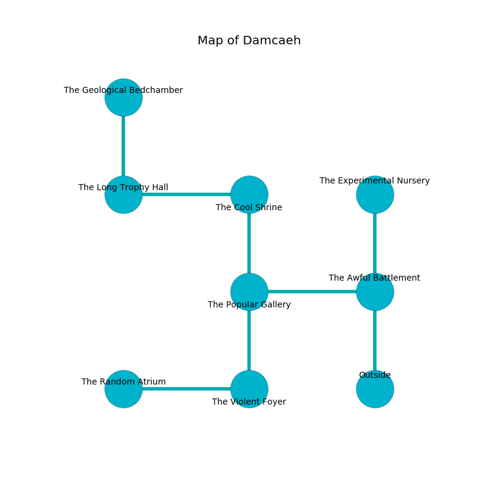

%Ruin Dogs

##Damcaeh
###Overview
Damcaeh is located under a crystal plain. Regions of it are somewhat cold. The ruin is burning. It is occupied by Sprites. Yoshie Spinks The Possessive, a Hobgoblin Warlord is here. The Sprites are battling Yoshie Spinks The Possessive. She  is founding a new religion. 

###Artifact
####Facaddaeum

Facaddaeum looks like a soft orb. It is a light brown color. It smells like sap. When worn it levitates surrounding objects. 

###Locations

####the awful battlement
There is a Flesh Golem here. Red lichens are swaying from the walls. 

There is an engraving on the floor written in Sprites Script. 

> I am lost in Damcaeh.
>

* There is a portrait here.
* [Facaddaeum](#Facaddaeum) is here.
* To the west a dripping hallway connects to [the popular gallery](#the-popular-gallery).
* To the north a narrow walkway opens to [the experimental nursery](#the-experimental-nursery).
* To the south is the entrance.

####the popular gallery
The metallic walls are unsettled. There are twenty Sprites here. The floor is flooded with nine inch deep cold water. The Sprites are defending this room from intruders. 

* To the east a dripping hallway connects to [the awful battlement](#the-awful-battlement).
* To the north a dark cavern connects to [the cool shrine](#the-cool-shrine).
* To the south a long artery connects to [the violent foyer](#the-violent-foyer).

####the cool shrine
The stone walls are scratched. There are twenty Sprites here. The floor is cluttered with ashes. The air smells like acetone here. The Sprites are meditating. 

There is an engraving on the floor written in common. 

> Leave now.
>

* [Yoshie Spinks The Possessive](#Yoshie-Spinks-The-Possessive) is here.
* To the west a hazy corridor connects to [the long trophy hall](#the-long-trophy-hall).
* To the south a dark cavern opens to [the popular gallery](#the-popular-gallery).

####the long trophy hall
Green moss is growing in a patch on the floor. 

There is an engraving on a tablet written in Sprites Script. 

> A trap ahead.
>

* There is a jewel here.
* To the east a hazy corridor opens to [the cool shrine](#the-cool-shrine).
* To the north a dripping gap connects to [the geological bedchamber](#the-geological-bedchamber).

####the violent foyer
The brick walls are pristine. Gray ferns are growing in a patch on the floor. 

There is an engraving on a monolith written in Sprites Script. 

> A cushion is an economist
>
> yet never surprised
>
> solid and objective
>
> A fish is a limitation
>
> elegant, helpful, municipal
>
> able, passionate, sensitive
>
> A cushion is an economist
>

* There is a bee here.
* There is a hare here.
* There is a skirt here.
* To the west a hazy gap connects to [the random atrium](#the-random-atrium).
* To the north a long artery connects to [the popular gallery](#the-popular-gallery).

####the random atrium
There are a Giant Octopus, a Giant Scorpion, and a Tiger here. White lichens are growing in cracks in the floor. The floor is glossy. The concrete walls are caving in. 

* To the east a hazy gap connects to [the violent foyer](#the-violent-foyer).

####the geological bedchamber
There are a Wight, a Gas Spore, and a Troll here. The air tastes like orange peel here. 

There is an engraving on a monolith written in Sprites Script. 

> O! meak we
>
> white, fresh, mental
>
> plain and free
>
> sadness is continental
>

* To the south a dripping gap opens to [the long trophy hall](#the-long-trophy-hall).

####the experimental nursery

There is an engraving on the wall written in Sprites Script. 

> Leave at once.
>

* To the south a narrow walkway opens to [the awful battlement](#the-awful-battlement).

