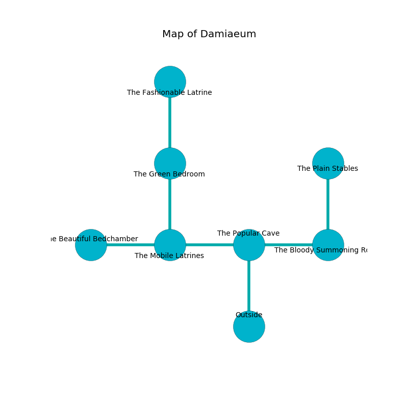

%Ruin Dogs

##Damiaeum
###Overview
Damiaeum is located on a ruined mountain. Some rooms of Damiaeum are cursed. A massive flood is happening outside. It is occupied by Goblins. Mariette Leblanc The Detached, a Knight is here. The Goblins are ruled by Mariette Leblanc The Detached. She  is founding a new religion. 

###Artifact
####Deheca

Deheca looks like a broken monument. It smells like apple. Water incinerates away from it. When cradled it shows an image of the future. 

###Locations

####the popular cave
There are a Lion, a Gibbering Mouther, and a Worg here. The air tastes like marigold here. The floor is glossy. 

* [Mariette Leblanc The Detached](#Mariette-Leblanc-The-Detached) is here.
* To the west a twisted cave leads to [the mobile latrines](#the-mobile-latrines).
* To the east a small opening leads to [the bloody summoning room](#the-bloody-summoning-room).
* To the south is the entrance.

####the bloody summoning room
The glass walls are bloodstained. There are two Goblins and three Hobgoblins here. The floor is flooded with three inch deep cold water. Gray moss is growing from the walls. The Goblins are performing a ritual. If not interrupted, the Goblins will become more powerful. 

There is an engraving on a stone written in Goblins Script. 

> All of us are joyful
>
> yet never exotic
>
> extinct and electronic
>
> All of us are joyful
>

* To the west a small opening opens to [the popular cave](#the-popular-cave).
* To the north a twisted opening leads to [the plain stables](#the-plain-stables).

####the mobile latrines
The air tastes like fermentation here. The brick walls are pristine. The floor is bloodstained. 

* To the west a small cave connects to [the beautiful bedchamber](#the-beautiful-bedchamber).
* To the east a twisted cave connects to [the popular cave](#the-popular-cave).
* To the north a dripping path leads to [the green bedroom](#the-green-bedroom).

####the green bedroom
The metallic walls are pristine. There is a trap here. When activated, a magical sound detector will cast a curse. The floor is glossy. There are a Goblin and four Hobgoblins here. The Goblins are performing a ritual. If not interrupted, the ruin dogs will be weakened. 

* There is an ant here.
* [Deheca](#Deheca) is here.
* To the north a twisted cave opens to [the fashionable latrine](#the-fashionable-latrine).
* To the south a dripping path opens to [the mobile latrines](#the-mobile-latrines).

####the plain stables
The air smells like cucumber here. The glass walls are unsettled. Yellow moss is growing in cracks in the floor. 

There is an engraving on the floor written in common. 

> I thought about fighting.
>

* To the south a twisted opening opens to [the bloody summoning room](#the-bloody-summoning-room).

####the beautiful bedchamber
The glass walls are bloodstained. There is a trap here. When activated, a tripwire will make the walls close in. The floor is sticky. There are an Awakened Shrub and an Old Faerie Dragon here. 

* There is a plate here.
* To the east a small cave opens to [the mobile latrines](#the-mobile-latrines).

####the fashionable latrine
Yellow lichens are growing in a patch on the floor. The brick walls are caving in. The air tastes like goat here. The floor is cluttered with bones. 

* There is a kettle here.
* To the south a twisted cave leads to [the green bedroom](#the-green-bedroom).

