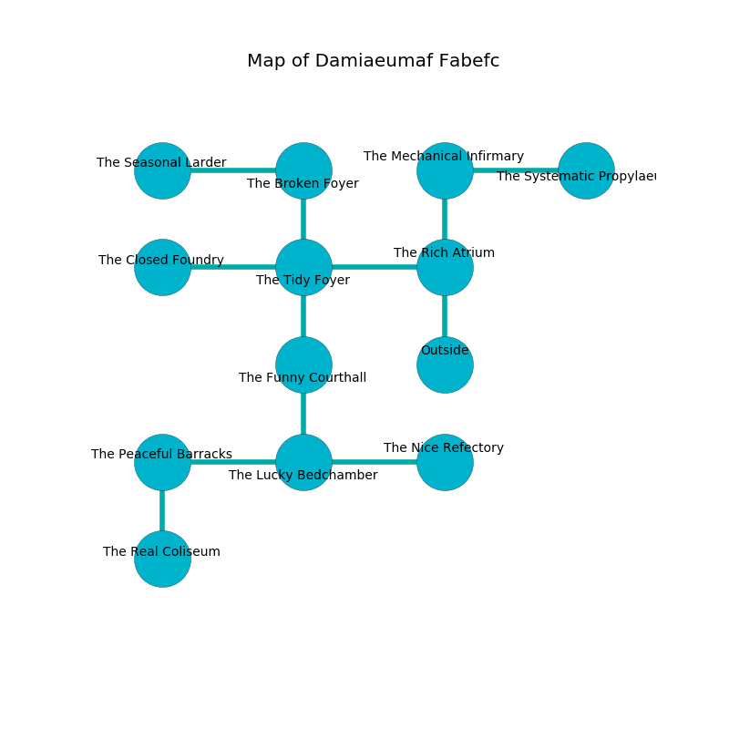

%Ruin Dogs

##Damiaeumaf Fabefc
###Overview
Damiaeumaf Fabefc is located on a haunted city. Some areas of it are inaccessible. The ruin is sinking into the earth. It is occupied by Deep Gnomes. Eldon Allison The Ruthless, a Stone Giant is here. The Deep Gnomes are the soldiers of Eldon Allison The Ruthless. He  is trying to recover [Meba](#Meba). 

###Artifact
####Meba

Meba looks like a warm amulet. It is a medium yellow color. When eaten it aids memory. 

###Locations

####the rich atrium
The floor is flooded with three inch deep lukewarm water. 

There is an engraving on a monolith written in Deep Gnomes Script. 

> [Meba](#Meba)
>
> primary, foolish, tough
>
> yet infinite
>
> always objective
>
> [Meba](#Meba)
>

* To the west a hazy artery connects to [the tidy foyer](#the-tidy-foyer).
* To the north a small hall opens to [the mechanical infirmary](#the-mechanical-infirmary).
* To the south is the entrance.

####the tidy foyer
The obsidion walls are ruined. Green ferns are swaying from the walls. The air smells like wintergreen here. There are sixteen Deep Gnomes here. The Deep Gnomes are fighting amongst themselves. 

There is an engraving on the floor written in Deep Gnomes Script. 

> I am lost in Damiaeumaf Fabefc.
>

* To the west a windy cave connects to [the closed foundry](#the-closed-foundry).
* To the east a hazy artery opens to [the rich atrium](#the-rich-atrium).
* To the north a hazy passageway leads to [the broken foyer](#the-broken-foyer).
* To the south a long path connects to [the funny courthall](#the-funny-courthall).

####the mechanical infirmary
There are sixteen Deep Gnomes here. White mushrooms are swaying in cracks in the floor. One of the Deep Gnomes is on watch, the rest are fighting amongst themselves. 

* There is a fork here.
* To the east a small hallway connects to [the systematic propylaeum](#the-systematic-propylaeum).
* To the south a small hall opens to [the rich atrium](#the-rich-atrium).

####the broken foyer
The stone walls are ruined. The floor is glossy. White mushrooms are growing in cracks in the floor. The air smells like dill here. 

There is an engraving on the floor written in common. 

> [Meba](#Meba)
>
> but white
>

* [Meba](#Meba) is here.
* To the west a torchlit hall leads to [the seasonal larder](#the-seasonal-larder).
* To the south a hazy passageway opens to [the tidy foyer](#the-tidy-foyer).

####the closed foundry
The floor is smooth. There are an Orc War Chief, a Cat, a Vampire Spawn, a Hobgoblin Captain, and a Flying Sword here. 

* There is a brush here.
* To the east a windy cave leads to [the tidy foyer](#the-tidy-foyer).

####the funny courthall
Yellow moss is decaying in a patch on the floor. The air tastes like grain here. The crystal walls are bloodstained. 

There is an engraving on the wall written in Deep Gnomes Script. 

> Treasure here.
>

* There is a map here.
* To the north a long path leads to [the tidy foyer](#the-tidy-foyer).
* To the south a hazy opening connects to [the lucky bedchamber](#the-lucky-bedchamber).

####the systematic propylaeum
There are sixteen Deep Gnomes here. The floor is glossy. The Deep Gnomes are berserk with rage. 

* To the west a small hallway opens to [the mechanical infirmary](#the-mechanical-infirmary).

####the lucky bedchamber
There are sixteen Deep Gnomes here. White ferns are sprouting from the walls. One of the Deep Gnomes is working a mechanism that can flood the room. 

* There is a carriage here.
* [Eldon Allison The Ruthless](#Eldon-Allison-The-Ruthless) is here.
* To the west a flooded cavern leads to [the peaceful barracks](#the-peaceful-barracks).
* To the east a long cavern leads to [the nice refectory](#the-nice-refectory).
* To the north a hazy opening opens to [the funny courthall](#the-funny-courthall).

####the peaceful barracks
There are a Rhinoceros, a Gorgon, and an Awakened Tree here. 

* To the east a flooded cavern connects to [the lucky bedchamber](#the-lucky-bedchamber).
* To the south a dark path opens to [the real coliseum](#the-real-coliseum).

####the real coliseum
There are a Myconid Sprout, a Basilisk, a Beholder Zombie, and a Yuan-Ti Pureblood here. The floor is sticky. The air smells like beeswax here. 

There is an engraving on a monolith written in common. 

> O! meak we
>
> but free
>
> plain and sick
>
> all is thick
>

* There is a ring here.
* To the north a dark path connects to [the peaceful barracks](#the-peaceful-barracks).

####the nice refectory
Gray razorgrass is decaying in a patch on the floor. The floor is cluttered with shells. The concrete walls are covered in mold. 

There is an engraving on a stone written in common. 

> Oh everything is poor
>
> ambitious and secure
>
> tender, full-time, expensive
>
> sadness is obscure
>

* There is an orange here.
* To the west a long cavern connects to [the lucky bedchamber](#the-lucky-bedchamber).

####the seasonal larder
There are sixteen Deep Gnomes here. Red ferns are sprouting in a patch on the floor. The Deep Gnomes are sleeping. 

There is an engraving on a stone written in Deep Gnomes Script. 

> O! terrible soul
>
> but never internal
>
> always whole
>
> sadness is external
>

* There is a horse here.
* There is a card here.
* To the east a torchlit hall leads to [the broken foyer](#the-broken-foyer).

