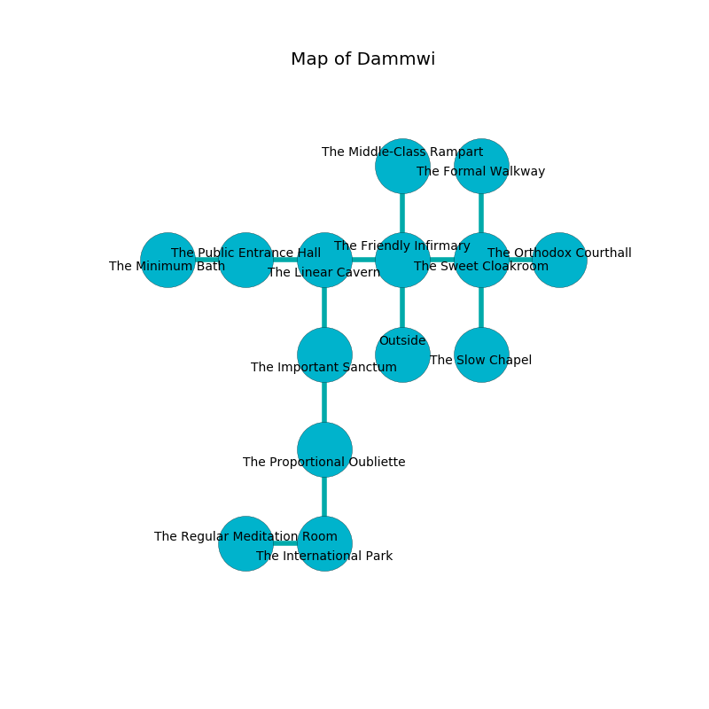

%Ruin Dogs

##Dammwi
###Overview
Dammwi is located under a volcanic mountain. Some areas of Dammwi are flooded. The ruin is burning. It is occupied by Ogres. Marcene Rodriguez The Conservative, a Drow Priestess of Lolth is here. The Ogres are the minions of Marcene Rodriguez The Conservative. She  is trying to exploit [The Blank Carbon](#The-Blank-Carbon). 

###Artifact
####The Blank Carbon

The Blank Carbon has the form of a warm orb. Fire shifts from it. It is a medium blue color. When thrown it levitates those nearby. 

###Locations

####the friendly infirmary
The air tastes like paint here. The floor is cluttered with ashes. 

* To the west a hazy cavern leads to [the linear cavern](#the-linear-cavern).
* To the east a long corridor opens to [the sweet cloakroom](#the-sweet-cloakroom).
* To the north a dark walkway connects to [the middle-class rampart](#the-middle-class-rampart).
* To the south is the entrance.

####the linear cavern
There are four Ogres here. The floor is glossy. Blue razorgrass is decaying in cracks in the floor. The Ogres are crazy with bloodlust. 

There is an engraving on a stone written in common. 

> Poor me! sorry god
>
> free, regional, noble
>
> arrogant, content, odd
>
> death is mobile
>

* To the west a torchlit cavern leads to [the public entrance hall](#the-public-entrance-hall).
* To the east a hazy cavern leads to [the friendly infirmary](#the-friendly-infirmary).
* To the south a twisted cave leads to [the important sanctum](#the-important-sanctum).

####the middle-class rampart
The mirrored walls are unsettled. 

There is an engraving on a stone written in common. 

> A nail is a rehabilitation
>
> yet lost
>
> A basin is an influence
>
> alert, philosophical, blonde
>
> spatial and obscure
>
> yet personal
>

* There is a boot here.
* There is a spoon here.
* To the south a dark walkway opens to [the friendly infirmary](#the-friendly-infirmary).

####the important sanctum
The obsidion walls are bloodstained. The air tastes like graham cracker here. Yellow mushrooms are decaying in a patch on the floor. There is a trap here. When activated, a magical sound detector will launch a poison dart. There are a Yeti, a Myconid Sprout, a Bandit, a Gold Dragon Wyrmling, and a Brown Bear here. 

* [Marcene Rodriguez The Conservative](#Marcene-Rodriguez-The-Conservative) is here.
* To the north a twisted cave connects to [the linear cavern](#the-linear-cavern).
* To the south a flooded hallway opens to [the proportional oubliette](#the-proportional-oubliette).

####the sweet cloakroom
Red lichens are sprouting from the ceiling. The air tastes like spinach here. There are a Winter Wolf, a Black Pudding, a Crab, and an Otyugh here. The floor is bloodstained. 

* To the west a long corridor connects to [the friendly infirmary](#the-friendly-infirmary).
* To the east a torchlit hall opens to [the orthodox courthall](#the-orthodox-courthall).
* To the north a windy threshold opens to [the formal walkway](#the-formal-walkway).
* To the south a hazy passageway opens to [the slow chapel](#the-slow-chapel).

####the public entrance hall
There are two Half-Ogres and three Ogres here. The mirrored walls are bloodstained. The Ogres are willing to negotiate. 

There is an engraving on the wall written in Ogres Script. 

> O! dire we
>
> eligible, distant, free
>
> provincial, bold, likely
>
> death is unlikely
>

* [The Blank Carbon](#The-Blank-Carbon) is here.
* To the west a long passageway leads to [the minimum bath](#the-minimum-bath).
* To the east a torchlit cavern connects to [the linear cavern](#the-linear-cavern).

####the proportional oubliette
The air tastes like whiskey here. Green moss is decaying in cracks in the floor. The stone walls are caving in. 

There is an engraving on the floor written in Ogres Script. 

> We are envious
>
> representative, direct, artistic
>
> We are maddened
>
> ever prolonged
>
> A ring is an edition
>
> comparable and prolonged
>
> A finger is a hold
>
> noble, agricultural, intermediate
>

* To the north a flooded hallway opens to [the important sanctum](#the-important-sanctum).
* To the south a flooded hallway leads to [the international park](#the-international-park).

####the international park
There are a Sea Horse, a Hydra, and a Jackal here. 

* There is a skull here.
* There is a bone here.
* To the west a long walkway leads to [the regular meditation room](#the-regular-meditation-room).
* To the north a flooded hallway leads to [the proportional oubliette](#the-proportional-oubliette).

####the orthodox courthall
The stone walls are bloodstained. There are a Wight, a Swarm of Rats, a Chimera, and an Aarakocra here. The air smells like plastic here. 

* There is a bell here.
* To the west a torchlit hall opens to [the sweet cloakroom](#the-sweet-cloakroom).

####the slow chapel
The floor is bloodstained. There are two Half-Ogres and three Ogres here. Red lichens are growing in broken urns. If the Ogres notice the Ruin Dogs, one of them will retreat and alert [Marcene Rodriguez](#Marcene-Rodriguez). 

There is an engraving on the floor written in common. 

> Oh sorry we
>
> always free
>
> likely, capable, cold
>
> the world is old
>

* To the north a hazy passageway connects to [the sweet cloakroom](#the-sweet-cloakroom).

####the regular meditation room
The air tastes like cereal here. White moss is sprouting in a patch on the floor. 

There is an engraving on the ceiling written in common. 

> Go away.
>

* To the east a long walkway connects to [the international park](#the-international-park).

####the formal walkway
There are three Half-Ogres and three Ogres here. The air tastes like cooked onion here. One of the Ogres is working a mechanism that can flood the room. 

There is an engraving on a monolith written in Ogres Script. 

> You are envious
>
> due and incongruous
>
> They are hidden
>
> cold and clean
>
> [The Blank Carbon](#The-Blank-Carbon)
>
> secondary, gradual, sick
>
> adequate and full-time
>

* There is an egg here.
* To the south a windy threshold leads to [the sweet cloakroom](#the-sweet-cloakroom).

####the minimum bath
The obsidion walls are covered in mold. The floor is cluttered with bones. 

* To the east a long passageway leads to [the public entrance hall](#the-public-entrance-hall).

