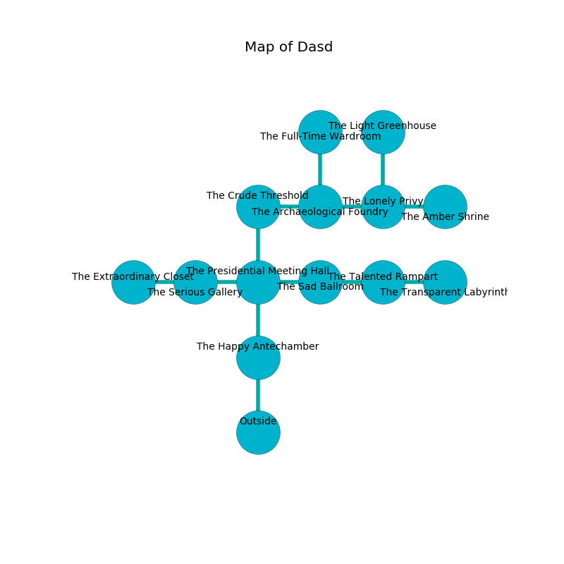

%Ruin Dogs

##Dasd
###Overview
Dasd is located on a broken mountain. Regions of it are frozen. A massive storm is happening outside. It is occupied by Goblins. Vaughn Harper The Cynical, an Orc Eye of Gruumsh is here. The Goblins are ruled by Vaughn Harper The Cynical. He  is trying to hide [The Exotic Compartment](#The-Exotic-Compartment). 

###Artifact
####The Exotic Compartment

The Exotic Compartment looks like a soft prism. It smells like sausage. Psychic energy slips towards it. When picked up it flies into the air. 

###Locations

####the happy antechamber
Yellow moss is decaying from the walls. There is a trap here. When activated, a magical rune will blast flames. The floor is glossy. The wooden walls are scratched. 

* To the north a windy corridor leads to [the presidential meeting hall](#the-presidential-meeting-hall).
* To the south is the entrance.

####the presidential meeting hall
There is a trap here. When activated, a pressure plate will fire a net. The floor is sticky. The glass walls are pristine. Red lichens are growing in cracks in the floor. The air smells like burnt butter here. 

* [Vaughn Harper The Cynical](#Vaughn-Harper-The-Cynical) is here.
* To the west a twisted hallway connects to [the serious gallery](#the-serious-gallery).
* To the east a narrow path opens to [the sad ballroom](#the-sad-ballroom).
* To the north a small cavern leads to [the crude threshold](#the-crude-threshold).
* To the south a windy corridor leads to [the happy antechamber](#the-happy-antechamber).

####the serious gallery
The air smells like char here. The glass walls are caving in. Yellow mushrooms are decaying in a patch on the floor. 

* To the west a torchlit artery leads to [the extraordinary closet](#the-extraordinary-closet).
* To the east a twisted hallway leads to [the presidential meeting hall](#the-presidential-meeting-hall).

####the crude threshold
There are four Goblins and two Hobgoblins here. Green razorgrass is swaying in a patch on the floor. The floor is cluttered with bones. The Goblins are berserk with rage. 

* To the east a windy pathway leads to [the archaeological foundry](#the-archaeological-foundry).
* To the south a small cavern connects to [the presidential meeting hall](#the-presidential-meeting-hall).

####the sad ballroom
Yellow razorgrass is decaying from the walls. The metallic walls are bloodstained. The floor is bloodstained. 

* There is a cart here.
* To the west a narrow path connects to [the presidential meeting hall](#the-presidential-meeting-hall).
* To the east a dark cavern connects to [the talented rampart](#the-talented-rampart).

####the archaeological foundry
The brick walls are ruined. There is a trap here. When activated, a tripwire will ring a bell. Blue lichens are growing in cracks in the floor. There are three Goblins and three Hobgoblins here. If the Goblins notice the Ruin Dogs, one of them will retreat and alert the others. 

* To the west a windy pathway connects to [the crude threshold](#the-crude-threshold).
* To the east a narrow path opens to [the lonely privy](#the-lonely-privy).
* To the north a dripping hall leads to [the full-time wardroom](#the-full-time-wardroom).

####the full-time wardroom
The wooden walls are scratched. 

There is an engraving on a tablet written in Goblins Script. 

> I hid something in Dasd.
>

* There is a pot here.
* There is a wheel here.
* There is a whip here.
* To the south a dripping hall opens to [the archaeological foundry](#the-archaeological-foundry).

####the talented rampart
There are four Hobgoblins here. The air smells like fat here. If the Goblins notice the Ruin Dogs, one of them will retreat and alert [Vaughn Harper](#Vaughn-Harper). 

* [The Exotic Compartment](#The-Exotic-Compartment) is here.
* To the west a dark cavern connects to [the sad ballroom](#the-sad-ballroom).
* To the east a small hall connects to [the transparent labyrinth](#the-transparent-labyrinth).

####the lonely privy
There are an Imp, a Dryad, and a Noble here. The floor is flooded with four inch deep lukewarm water. Green mushrooms are sprouting in broken urns. 

* To the west a narrow path opens to [the archaeological foundry](#the-archaeological-foundry).
* To the east a narrow corridor leads to [the amber shrine](#the-amber-shrine).
* To the north a flooded cavern opens to [the light greenhouse](#the-light-greenhouse).

####the extraordinary closet
The floor is bloodstained. Gray razorgrass is growing from the ceiling. The crystal walls are scratched. The air smells like lily here. 

* To the east a torchlit artery leads to [the serious gallery](#the-serious-gallery).

####the light greenhouse
The air smells like mulberry here. The brick walls are pristine. There are six Goblins and a Hobgoblin here. The floor is sticky. The Goblins are willing to negotiate. 

* To the south a flooded cavern connects to [the lonely privy](#the-lonely-privy).

####the amber shrine
There is a trap here. When activated, a magical rune will open a large pit in the floor. There are three Goblins and three Hobgoblins here. The air smells like dried fruit here. The Goblins are willing to fight to the death. 

* To the west a narrow corridor opens to [the lonely privy](#the-lonely-privy).

####the transparent labyrinth
The air tastes like ginseng here. The concrete walls are scratched. There are a Giant Frog, a Drow, two Lizardfolk, a Shadow, a Flying Snake, and  here. 

* To the west a small hall opens to [the talented rampart](#the-talented-rampart).

