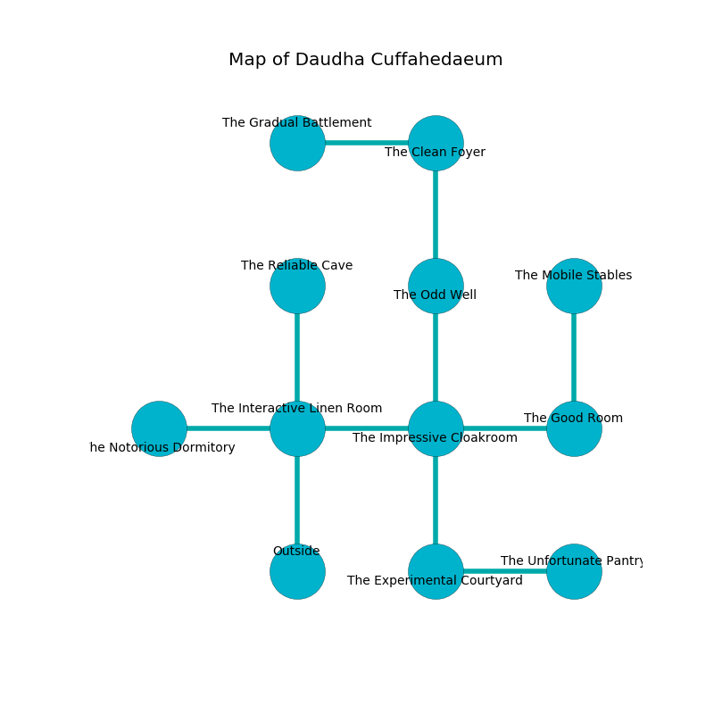

%Ruin Dogs

##Daudha Cuffahedaeum
###Overview
Daudha Cuffahedaeum is located under a giant mountain. Regions of it are incredibly cold. The ruin is burning. It is occupied by Kuo-Toa. Sergio Parent The Vain, a Duergar is here. The Kuo-Toa are battling Sergio Parent The Vain. He  is founding a new religion. 

###Artifact
####Geaef

Geaef looks like a wet cube. It is a pale pink color. When gazed upon it becomes lost. 

###Locations

####the interactive linen room
There is a trap here. When activated, a magical sound detector will launch a rolling boulder. The floor is sticky. The air smells like lavender here. 

* To the west a flooded pathway leads to [the notorious dormitory](#the-notorious-dormitory).
* To the east a flooded corridor opens to [the impressive cloakroom](#the-impressive-cloakroom).
* To the north a dark cavern leads to [the reliable cave](#the-reliable-cave).
* To the south is the entrance.

####the impressive cloakroom
There are a Giant Vulture, a Satyr, a Scout, a Myconid Adult, a Crawling Claw, and a Giant Centipede here. The air smells like humus here. The floor is bloodstained. 

* There is a comb here.
* To the west a flooded corridor leads to [the interactive linen room](#the-interactive-linen-room).
* To the east a hazy corridor leads to [the good room](#the-good-room).
* To the north a windy cavern connects to [the odd well](#the-odd-well).
* To the south a torchlit path connects to [the experimental courtyard](#the-experimental-courtyard).

####the experimental courtyard
White mushrooms are growing from the ceiling. 

* To the east a torchlit gap leads to [the unfortunate pantry](#the-unfortunate-pantry).
* To the north a torchlit path connects to [the impressive cloakroom](#the-impressive-cloakroom).

####the odd well
The air smells like marjoram here. There are a Plesiosaurus and a Monodrone here. The floor is smooth. 

* To the north a torchlit threshold leads to [the clean foyer](#the-clean-foyer).
* To the south a windy cavern opens to [the impressive cloakroom](#the-impressive-cloakroom).

####the clean foyer
The floor is sticky. The crystal walls are scratched. 

* There is a coat here.
* To the west a twisted path opens to [the gradual battlement](#the-gradual-battlement).
* To the south a torchlit threshold leads to [the odd well](#the-odd-well).

####the notorious dormitory
The wooden walls are caving in. Red moss is decaying from the walls. 

There is an engraving on a stone written in Kuo-Toa Script. 

> A fish is a fuss
>
> full, necessary, capable
>
> mobile and encouraging
>

* [Sergio Parent The Vain](#Sergio-Parent-The-Vain) is here.
* To the east a flooded pathway leads to [the interactive linen room](#the-interactive-linen-room).

####the unfortunate pantry
White mushrooms are swaying in broken urns. The floor is glossy. 

* To the west a torchlit gap connects to [the experimental courtyard](#the-experimental-courtyard).

####the reliable cave
Yellow razorgrass is swaying from the walls. There are two Kuo-Toa Whips here. The Kuo-Toa are crazy with bloodlust. 

* To the south a dark cavern connects to [the interactive linen room](#the-interactive-linen-room).

####the good room
Gray ferns are growing from the walls. The floor is glossy. 

There is an engraving on the ceiling written in Kuo-Toa Script. 

> I thought about running.
>

* [Geaef](#Geaef) is here.
* To the west a hazy corridor connects to [the impressive cloakroom](#the-impressive-cloakroom).
* To the north a small opening opens to [the mobile stables](#the-mobile-stables).

####the gradual battlement
The metallic walls are unsettled. The floor is smooth. Red lichens are sprouting in cracks in the floor. There are a Kuo-Toa Whip and four Kuo-Toa here. The Kuo-Toa are crazy with bloodlust. 

* There is a cat here.
* There is a salamander here.
* To the east a twisted path leads to [the clean foyer](#the-clean-foyer).

####the mobile stables
There is a trap here. When activated, a magical proximity detector will launch a hail of needles. The metallic walls are bloodstained. The air tastes like pineapple here. There are a Giant Wolf Spider, a Pony, a Giant Eagle, a Giant Constrictor Snake, a Quipper, a Poisonous Snake, and a Flying Snake here. 

* To the south a small opening connects to [the good room](#the-good-room).

