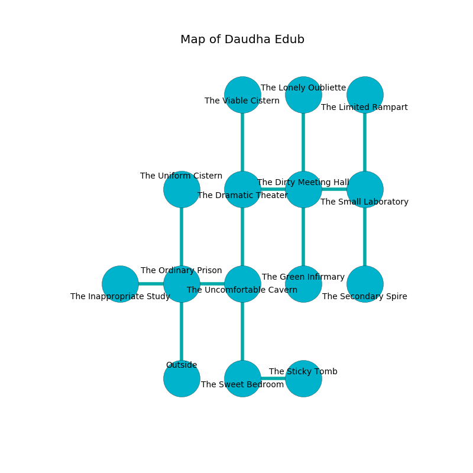

%Ruin Dogs

##Daudha Edub
###Overview
Daudha Edub is located on a cursed plain. Some rooms of it are flooded. A windstorm is happening outside. It is occupied by Gnolls. Nelson Windham The Overemotional, a Vampire Spawn is here. The Gnolls are the slaves of Nelson Windham The Overemotional. He  is founding a new religion. 

###Artifact
####The Lazy Mark

The Lazy Mark looks like a transparent cube. It is a shifting brown color. Water pours around it. When carried it liquifies. 

###Locations

####the ordinary prison
There is a trap here. When activated, a magical proximity detector will fire an acid arrow. The air tastes like jonquil here. Gray ferns are sprouting from the walls. 

* To the west a long passageway opens to [the inappropriate study](#the-inappropriate-study).
* To the east a twisted artery connects to [the uncomfortable cavern](#the-uncomfortable-cavern).
* To the north a windy passageway opens to [the uniform cistern](#the-uniform-cistern).
* To the south is the entrance.

####the uncomfortable cavern
There are four Gnolls and two Gnoll Pack Lords here. The air smells like fruit here. The Gnolls are berserk with rage. 

* To the west a twisted artery opens to [the ordinary prison](#the-ordinary-prison).
* To the north a hazy cave connects to [the dramatic theater](#the-dramatic-theater).
* To the south a dripping hall leads to [the sweet bedroom](#the-sweet-bedroom).

####the uniform cistern
The concrete walls are pristine. The air tastes like tagette here. 

* To the south a windy passageway leads to [the ordinary prison](#the-ordinary-prison).

####the dramatic theater
There are a Wraith, a Dryad, an Acolyte, and a Manes here. Red lichens are growing in broken urns. 

* To the east a flooded cave opens to [the dirty meeting hall](#the-dirty-meeting-hall).
* To the north a torchlit hall opens to [the viable cistern](#the-viable-cistern).
* To the south a hazy cave opens to [the uncomfortable cavern](#the-uncomfortable-cavern).

####the dirty meeting hall
The crystal walls are caving in. Yellow moss is growing from the walls. The air tastes like celery here. The floor is bloodstained. 

There is an engraving on the ceiling written in common. 

> [The Lazy Mark](#The-Lazy-Mark)
>
> moving and seasonal
>
> you are not remembered
>

* To the west a flooded cave leads to [the dramatic theater](#the-dramatic-theater).
* To the east a flooded opening connects to [the small laboratory](#the-small-laboratory).
* To the north a narrow passageway opens to [the lonely oubliette](#the-lonely-oubliette).
* To the south a hazy path opens to [the green infirmary](#the-green-infirmary).

####the green infirmary
The glass walls are ruined. The floor is cluttered with bones. 

* To the north a hazy path opens to [the dirty meeting hall](#the-dirty-meeting-hall).

####the sweet bedroom
There are a Black Pudding and a Wererat here. Red mushrooms are swaying from the ceiling. 

* To the east a hazy gap leads to [the sticky tomb](#the-sticky-tomb).
* To the north a dripping hall opens to [the uncomfortable cavern](#the-uncomfortable-cavern).

####the lonely oubliette
The obsidion walls are pristine. The floor is flooded with two inch deep scalding water. The air tastes like cauliflower here. 

* To the south a narrow passageway opens to [the dirty meeting hall](#the-dirty-meeting-hall).

####the small laboratory
There are a Bugbear Chief, a Dust Mephit, and a Giant Scorpion here. Red moss is swaying in cracks in the floor. The floor is glossy. 

* [The Lazy Mark](#The-Lazy-Mark) is here.
* To the west a flooded opening leads to [the dirty meeting hall](#the-dirty-meeting-hall).
* To the north a twisted opening leads to [the limited rampart](#the-limited-rampart).
* To the south a twisted cavern leads to [the secondary spire](#the-secondary-spire).

####the inappropriate study
Gray ferns are decaying from the walls. The obsidion walls are ruined. 

* To the east a long passageway leads to [the ordinary prison](#the-ordinary-prison).

####the sticky tomb
There is a trap here. When activated, a pressure plate will flood the room with water. There are two Gnoll Fangs of Yeenoghu and three Gnolls here. The crystal walls are bloodstained. The air smells like vetiver here. Red razorgrass is sprouting in cracks in the floor. The Gnolls are performing a ritual. If not interrupted, the Gnolls will become more powerful. 

* To the west a hazy gap leads to [the sweet bedroom](#the-sweet-bedroom).

####the viable cistern
Red mushrooms are swaying in broken urns. There are a Gnoll Fang of Yeenoghu and a Gnoll Pack Lord here. The stone walls are covered in mold. One of the Gnolls is pointing a ballista at the entrance. 

* There is a specter here.
* [Nelson Windham The Overemotional](#Nelson-Windham-The-Overemotional) is here.
* To the south a torchlit hall connects to [the dramatic theater](#the-dramatic-theater).

####the limited rampart
The glass walls are pristine. 

* To the south a twisted opening opens to [the small laboratory](#the-small-laboratory).

####the secondary spire
Gray razorgrass is decaying in a patch on the floor. 

* To the north a twisted cavern connects to [the small laboratory](#the-small-laboratory).

