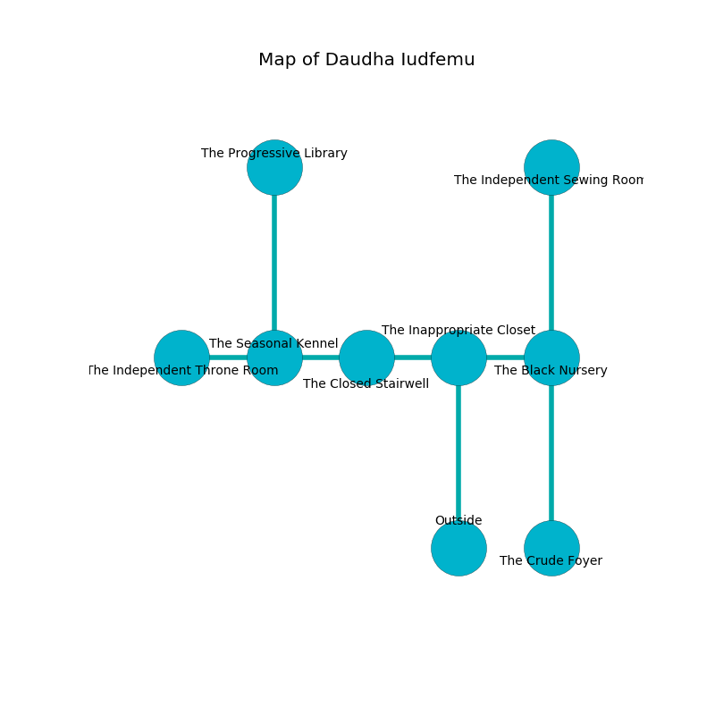

%Ruin Dogs

##Daudha Iudfemu
###Overview
Daudha Iudfemu is located under a haunted rift. Regions of Daudha Iudfemu are corrupted. The ruin is burning. It is occupied by Ogres. Chris Bergman The Vulgar, a Fire Giant is here. The Ogres are the minions of Chris Bergman The Vulgar. He  is founding a new religion. 

###Artifact
####Ahduia

Ahduia is a powerful artifact in the shape of a broken monument. It is a shifting blue color. When worn it changes the past. 

###Locations

####the inappropriate closet
The floor is smooth. The air tastes like lavender here. Green ferns are decaying in a patch on the floor. 

* To the west a dripping cavern opens to [the closed stairwell](#the-closed-stairwell).
* To the east a windy gap opens to [the black nursery](#the-black-nursery).
* To the south is the entrance.

####the black nursery
The wooden walls are caving in. The air smells like sap here. There are a Half-Ogre and five Ogres here. The Ogres are berserk with rage. 

* [Ahduia](#Ahduia) is here.
* To the west a windy gap connects to [the inappropriate closet](#the-inappropriate-closet).
* To the north a flooded path leads to [the independent sewing room](#the-independent-sewing-room).
* To the south a flooded path connects to [the crude foyer](#the-crude-foyer).

####the closed stairwell
The air smells like plum skin here. The floor is cluttered with rocks. There is a trap here. When activated, a magical proximity detector will launch a javelin. Gray mushrooms are sprouting in broken urns. 

* To the west a torchlit hallway opens to [the seasonal kennel](#the-seasonal-kennel).
* To the east a dripping cavern connects to [the inappropriate closet](#the-inappropriate-closet).

####the seasonal kennel
The floor is flooded with six inch deep cold water. 

* [Chris Bergman The Vulgar](#Chris-Bergman-The-Vulgar) is here.
* To the west a twisted walkway opens to [the independent throne room](#the-independent-throne-room).
* To the east a torchlit hallway connects to [the closed stairwell](#the-closed-stairwell).
* To the north a long hall connects to [the progressive library](#the-progressive-library).

####the progressive library
The obsidion walls are unsettled. The floor is glossy. 

There is an engraving on a stone written in Ogres Script. 

> [Ahduia](#Ahduia)
>
> international and multiple
>
> A plow is a contrary
>
> awkward and complete
>
> informal, main, extinct
>
> A square is an application
>
> economic and resident
>
> but moral
>
> A wire is a consciousness
>
> unique and early
>
> early, aloof, basic
>
> bold, consistent, legislative
>
> easy, finished, joint
>
> solid and successful
>

* There is a plate here.
* To the south a long hall connects to [the seasonal kennel](#the-seasonal-kennel).

####the independent throne room
The air smells like peppermint here. 

There is an engraving on a monolith written in common. 

> I am lost.
>

* To the east a twisted walkway opens to [the seasonal kennel](#the-seasonal-kennel).

####the crude foyer
Green ferns are growing in cracks in the floor. 

* To the north a flooded path connects to [the black nursery](#the-black-nursery).

####the independent sewing room
The air smells like toasted grain here. The floor is sticky. 

* To the south a flooded path connects to [the black nursery](#the-black-nursery).

