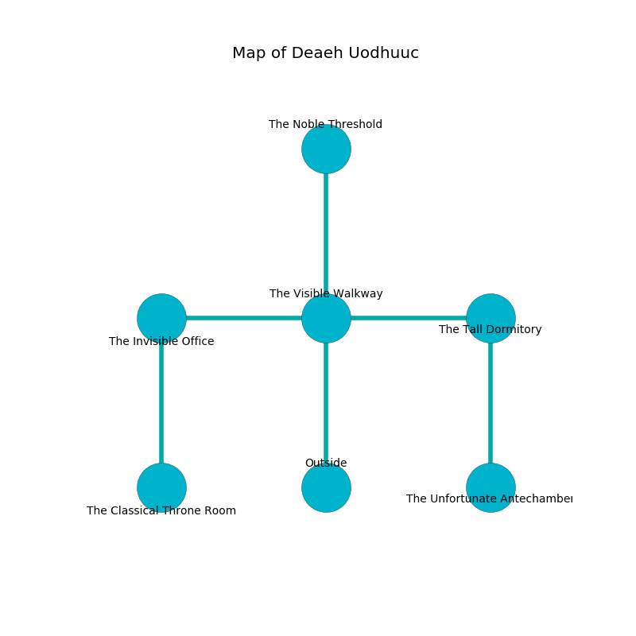

%Ruin Dogs

##Deaeh Uodhuuc
###Overview
Deaeh Uodhuuc is located under a spikey plain. Some rooms of Deaeh Uodhuuc are foggy. A massive storm is happening outside. It is occupied by Sahuagins. Leif Nolan The Compulsive, a Mind Flayer is here. The Sahuagins are battling Leif Nolan The Compulsive. He  is trying to understand [Dmaehuiudmaf](#Dmaehuiudmaf). 

###Artifact
####Dmaehuiudmaf

Dmaehuiudmaf is a powerful artifact in the shape of a sharp gem. When cradled it ignites its surrroundings. 

###Locations

####the visible walkway
Gray moss is decaying in a patch on the floor. The air tastes like mimosa here. There is a trap here. When activated, a tripwire will collapse a column. There are four Sahuagin Priestesses here. The Sahuagins are performing a ritual. If not interrupted, the Sahuagins will become more powerful. 

* [Leif Nolan The Compulsive](#Leif-Nolan-The-Compulsive) is here.
* To the west a flooded path opens to [the invisible office](#the-invisible-office).
* To the east a narrow artery connects to [the tall dormitory](#the-tall-dormitory).
* To the north a dripping passageway leads to [the noble threshold](#the-noble-threshold).
* To the south is the entrance.

####the noble threshold
The air tastes like cooked apple here. Red razorgrass is swaying from the walls. 

* To the south a dripping passageway opens to [the visible walkway](#the-visible-walkway).

####the tall dormitory
The floor is smooth. 

* There is a spirit here.
* To the west a narrow artery connects to [the visible walkway](#the-visible-walkway).
* To the south a small walkway connects to [the unfortunate antechamber](#the-unfortunate-antechamber).

####the unfortunate antechamber
There are a Medusa, a Rug of Smothering, and a Black Dragon Wyrmling here. Yellow ferns are swaying in cracks in the floor. There is a trap here. When activated, a magical proximity detector will make the walls close in. The air tastes like tallow here. 

* There is a wheel here.
* To the north a small walkway leads to [the tall dormitory](#the-tall-dormitory).

####the invisible office
The floor is smooth. There are a Noble, a Raven, a Tridrone, a Giant Toad, a Warhorse, a Lamia, and a Griffon here. The brick walls are unsettled. 

* There is a board here.
* [Dmaehuiudmaf](#Dmaehuiudmaf) is here.
* To the east a flooded path connects to [the visible walkway](#the-visible-walkway).
* To the south a windy artery opens to [the classical throne room](#the-classical-throne-room).

####the classical throne room
The floor is smooth. There are four Sahuagin Priestesses here. The air tastes like pomegranate here. Blue ferns are growing in cracks in the floor. The Sahuagins are willing to negotiate. 

There is an engraving on a monolith written in common. 

> O! pitiful fate
>
> opposed, brown, great
>
> exclusive and kind
>
> death is blind
>

* To the north a windy artery opens to [the invisible office](#the-invisible-office).

