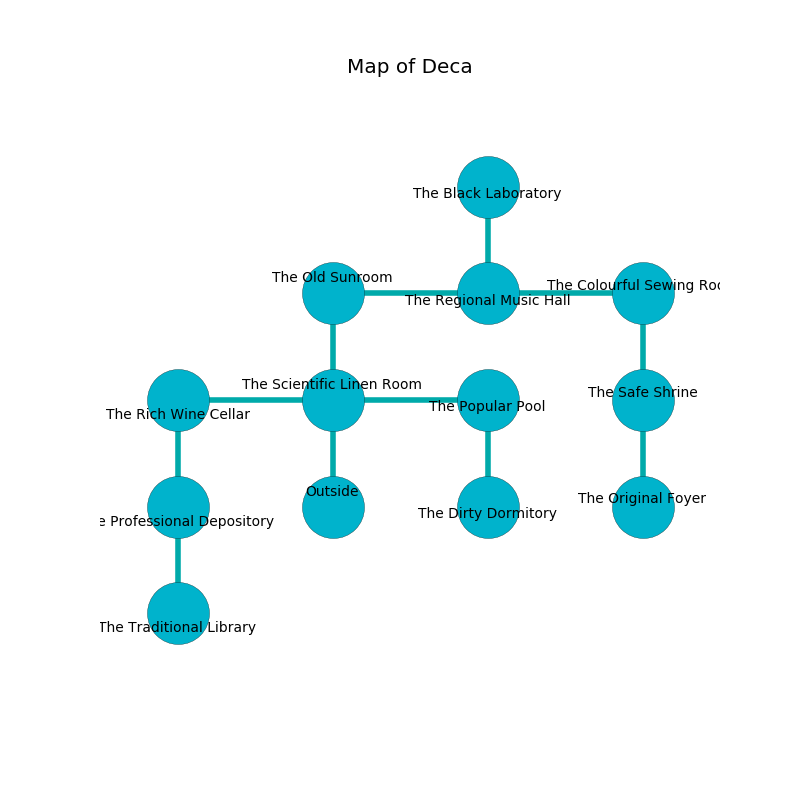

%Ruin Dogs

##Deca
###Overview
Deca is located in a haunted tree. Some areas of it are somewhat cold. A lunar eclipse is happening outside. It is occupied by Duergars. Karren Leeper The Unpredictable, a Stone Giant is here. The Duergars worship Karren Leeper The Unpredictable. She  is trying to recover [Maiacubaf Iaed](#Maiacubaf-Iaed). 

###Artifact
####Maiacubaf Iaed

Maiacubaf Iaed is a powerful artifact in the shape of a smooth figurine. It smells like eucalyptus. Gravity shifts near it. When smelled it destroys itself. 

###Locations

####the scientific linen room
The air tastes like hay here. There are seven Duergars here. The Duergars are defending this room from intruders. 

There is an engraving on a stone written in common. 

> Try digging.
>

* To the west a windy corridor connects to [the rich wine cellar](#the-rich-wine-cellar).
* To the east a long threshold leads to [the popular pool](#the-popular-pool).
* To the north a hazy hall opens to [the old sunroom](#the-old-sunroom).
* To the south is the entrance.

####the old sunroom
There is a trap here. When activated, a pressure plate will ring a bell. The floor is cluttered with shells. The glass walls are scratched. The air smells like deertongue here. 

* To the east a torchlit corridor leads to [the regional music hall](#the-regional-music-hall).
* To the south a hazy hall opens to [the scientific linen room](#the-scientific-linen-room).

####the rich wine cellar
The air smells like red rose here. There are a Red Dragon Wyrmling, a Ghost, a Camel, and a Druid here. 

There is an engraving on the floor written in common. 

> Poor me! the world is sadistic
>
> small and long
>
> annual, applied, artistic
>
> everything is strong
>

* [Karren Leeper The Unpredictable](#Karren-Leeper-The-Unpredictable) is here.
* To the east a windy corridor opens to [the scientific linen room](#the-scientific-linen-room).
* To the south a narrow cave opens to [the professional depository](#the-professional-depository).

####the professional depository
Yellow razorgrass is growing in a patch on the floor. The crystal walls are scratched. The floor is bloodstained. The air smells like roasted almond here. There are a Copper Dragon Wyrmling, a Baboon, an Old Faerie Dragon, and a Yuan-Ti Abomination here. 

* To the north a narrow cave leads to [the rich wine cellar](#the-rich-wine-cellar).
* To the south a twisted threshold leads to [the traditional library](#the-traditional-library).

####the popular pool
There is a trap here. When activated, a tripwire will launch a hail of needles. The floor is glossy. The air tastes like wine here. 

* There is a cup here.
* There is a skirt here.
* To the west a long threshold connects to [the scientific linen room](#the-scientific-linen-room).
* To the south a windy walkway connects to [the dirty dormitory](#the-dirty-dormitory).

####the regional music hall
The obsidion walls are unsettled. 

* To the west a torchlit corridor leads to [the old sunroom](#the-old-sunroom).
* To the east a dark opening leads to [the colourful sewing room](#the-colourful-sewing-room).
* To the north a small gap opens to [the black laboratory](#the-black-laboratory).

####the traditional library
The air tastes like roasted hazelnut here. There are seven Duergars here. Yellow ferns are growing in a patch on the floor. There is a trap here. When activated, a magical sound detector will launch a ceiling pendulum. The Duergars are willing to negotiate. 

* There is a rat here.
* To the north a twisted threshold leads to [the professional depository](#the-professional-depository).

####the dirty dormitory
The metallic walls are bloodstained. The floor is glossy. There is a trap here. When activated, a pressure plate will fire an acid arrow. There are a Winter Wolf, a Yeti, a Crab, a Jackalwere, a Gnoll, a Brass Dragon Wyrmling, and an Orc here. 

There is an engraving on the ceiling written in Duergars Script. 

> Dear me! pitiful you
>
> it is never tired
>
> ever due
>
> cruelty is retired
>

* To the north a windy walkway connects to [the popular pool](#the-popular-pool).

####the colourful sewing room
The air tastes like chicken here. The floor is flooded with two inch deep lukewarm water. There are a Drow, a Spined Devil, and a Stone Giant here. The mirrored walls are pristine. 

* To the west a dark opening connects to [the regional music hall](#the-regional-music-hall).
* To the south a windy path connects to [the safe shrine](#the-safe-shrine).

####the black laboratory
There is a trap here. When activated, a tripwire will open a large pit in the floor. The floor is smooth. The air smells like valerian root here. Green lichens are sprouting in cracks in the floor. 

* To the south a small gap opens to [the regional music hall](#the-regional-music-hall).

####the safe shrine
Red ferns are sprouting in a patch on the floor. The concrete walls are bloodstained. 

* [Maiacubaf Iaed](#Maiacubaf-Iaed) is here.
* To the north a windy path leads to [the colourful sewing room](#the-colourful-sewing-room).
* To the south a dark corridor leads to [the original foyer](#the-original-foyer).

####the original foyer
There are a Galeb Duhr and a Shadow Demon here. Yellow moss is sprouting in a patch on the floor. The air tastes like blackberry here. The floor is bloodstained. 

* To the north a dark corridor leads to [the safe shrine](#the-safe-shrine).

