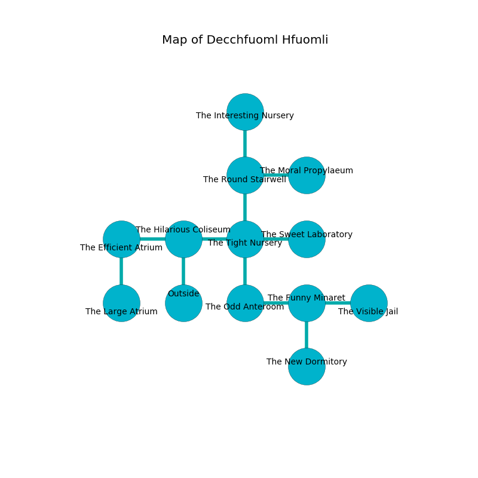

%Ruin Dogs

##Decchfuoml Hfuomli
###Overview
Decchfuoml Hfuomli is located in a poisoned city. Some areas of Decchfuoml Hfuomli are flooded. A massive storm is happening outside. It is occupied by Drows. Ed Chisholm The Unpredictable, a Mind Flayer Arcanist is here. The Drows worship Ed Chisholm The Unpredictable. He  is trying to hide [Cubgufd Befim](#Cubgufd-Befim). 

###Artifact
####Cubgufd Befim

Cubgufd Befim has the form of a soft spear. It smells like rubber. It is a shifting gray color. When cradled it destroys itself. 

###Locations

####the hilarious coliseum
The brick walls are covered in mold. The floor is bloodstained. Green moss is growing in a patch on the floor. 

There is an engraving on the floor written in Drows Script. 

> I am alone.
>

* There is a hook here.
* To the west a long hallway leads to [the efficient atrium](#the-efficient-atrium).
* To the east a windy hallway opens to [the tight nursery](#the-tight-nursery).
* To the south is the entrance.

####the tight nursery
The stone walls are bloodstained. There are thirty two Drows here. The air tastes like soap here. There is a trap here. When activated, a magical sound detector will fire a scything blade. The Drows are willing to negotiate. 

* To the west a windy hallway opens to [the hilarious coliseum](#the-hilarious-coliseum).
* To the east a small hall opens to [the sweet laboratory](#the-sweet-laboratory).
* To the north a twisted path opens to [the round stairwell](#the-round-stairwell).
* To the south a dripping path connects to [the odd anteroom](#the-odd-anteroom).

####the round stairwell
The air smells like green onion here. The floor is smooth. White mushrooms are sprouting in a patch on the floor. 

* To the east a windy walkway opens to [the moral propylaeum](#the-moral-propylaeum).
* To the north a dripping gap connects to [the interesting nursery](#the-interesting-nursery).
* To the south a twisted path leads to [the tight nursery](#the-tight-nursery).

####the sweet laboratory
The floor is glossy. The air tastes like popcorn here. 

* To the west a small hall connects to [the tight nursery](#the-tight-nursery).

####the odd anteroom
White lichens are swaying in a patch on the floor. The floor is sticky. The air smells like spearmint here. 

* To the east a torchlit threshold leads to [the funny minaret](#the-funny-minaret).
* To the north a dripping path leads to [the tight nursery](#the-tight-nursery).

####the funny minaret
The floor is cluttered with shells. The air smells like apple skin here. 

There is an engraving on the ceiling written in Drows Script. 

> [Cubgufd Befim](#Cubgufd-Befim)
>
> yet never acceptable
>

* To the west a torchlit threshold connects to [the odd anteroom](#the-odd-anteroom).
* To the east a torchlit artery opens to [the visible jail](#the-visible-jail).
* To the south a dark walkway opens to [the new dormitory](#the-new-dormitory).

####the moral propylaeum
The air tastes like elderflower here. Green ferns are decaying in cracks in the floor. The floor is smooth. The glass walls are unsettled. There are thirty two Drows here. The Drows are willing to negotiate. 

* There is a flag here.
* There is a snake here.
* To the west a windy walkway connects to [the round stairwell](#the-round-stairwell).

####the visible jail

There is an engraving on the ceiling written in Drows Script. 

> Dear me! my life is inhumane
>
> predictable and plain
>
> pregnant, available, consistent
>
> life is persistent
>

* There is a chainmail here.
* To the west a torchlit artery opens to [the funny minaret](#the-funny-minaret).

####the new dormitory
Gray razorgrass is decaying in cracks in the floor. The air smells like fruit here. 

* [Ed Chisholm The Unpredictable](#Ed-Chisholm-The-Unpredictable) is here.
* To the north a dark walkway leads to [the funny minaret](#the-funny-minaret).

####the efficient atrium
The floor is smooth. The brick walls are ruined. Yellow ferns are growing from the ceiling. The air tastes like freesia here. 

* There is a tree here.
* There is a blade here.
* [Cubgufd Befim](#Cubgufd-Befim) is here.
* To the east a long hallway leads to [the hilarious coliseum](#the-hilarious-coliseum).
* To the south a dark hallway connects to [the large atrium](#the-large-atrium).

####the interesting nursery
There are a Swarm of Quippers, an Ettercap, and a Revenant here. 

There is an engraving on the ceiling written in common. 

> I could not try praying.
>

* There is a cheese here.
* To the south a dripping gap leads to [the round stairwell](#the-round-stairwell).

####the large atrium
The floor is bloodstained. The air tastes like magnolia here. There are an Ettin, a Nightmare, and a Chimera here. 

* To the north a dark hallway opens to [the efficient atrium](#the-efficient-atrium).

