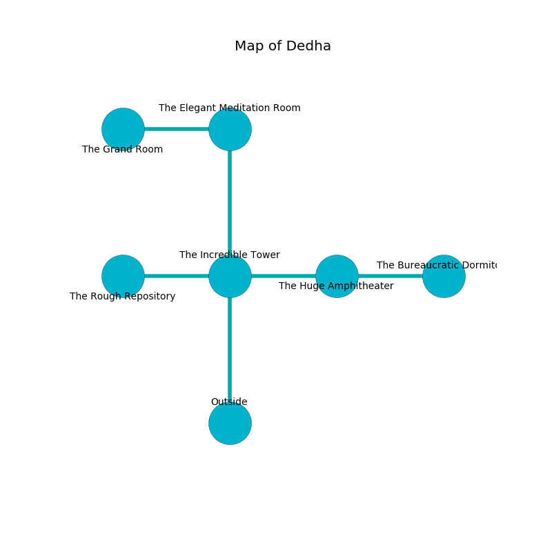

%Ruin Dogs

##Dedha
###Overview
Dedha is located on a flooded plain. Some areas of it are flooded. The ruin is sinking into the earth. It is occupied by Troglodytes. Cassaundra Callaway The Sneaky, a Cloud Giant is here. The Troglodytes are the minions of Cassaundra Callaway The Sneaky. She  is founding a new religion. 

###Artifact
####Cmeaef Dfaecc

Cmeaef Dfaecc looks like a hard gem. It smells like lemongrass. When worn it repels insects. 

###Locations

####the incredible tower
There are a Lion, a Goat, an Owlbear, a Myconid Adult, a Plesiosaurus, a Giant Goat, an Elk, a Green Dragon Wyrmling, and an Animated Armor here. The floor is glossy. 

There is an engraving on a stone written in Troglodytes Script. 

> Dear me! sad fate
>
> it is never aesthetic
>
> regular, glorious, late
>
> all is magnetic
>

* To the west a small artery opens to [the rough repository](#the-rough-repository).
* To the east a narrow passageway opens to [the huge amphitheater](#the-huge-amphitheater).
* To the north a dripping walkway opens to [the elegant meditation room](#the-elegant-meditation-room).
* To the south is the entrance.

####the rough repository
Green lichens are swaying in cracks in the floor. The obsidion walls are unsettled. 

* To the east a small artery leads to [the incredible tower](#the-incredible-tower).

####the huge amphitheater
The metallic walls are ruined. The floor is smooth. There are forty Troglodytes here. The Troglodytes are performing a ritual. If not interrupted, the ruin dogs will be weakened. 

There is an engraving on a monolith written in common. 

> Go away.
>

* To the west a narrow passageway opens to [the incredible tower](#the-incredible-tower).
* To the east a torchlit hall connects to [the bureaucratic dormitory](#the-bureaucratic-dormitory).

####the elegant meditation room
The air tastes like forest here. Red mushrooms are swaying from the walls. There is a trap here. When activated, a pressure plate will collapse a wall. The floor is glossy. 

* [Cmeaef Dfaecc](#Cmeaef-Dfaecc) is here.
* To the west a flooded artery opens to [the grand room](#the-grand-room).
* To the south a dripping walkway leads to [the incredible tower](#the-incredible-tower).

####the bureaucratic dormitory
There are a Goat, a Treant, and a Bone Devil here. The stone walls are scratched. The air smells like whiskey here. Yellow mushrooms are growing in broken urns. The floor is sticky. 

* [Cassaundra Callaway The Sneaky](#Cassaundra-Callaway-The-Sneaky) is here.
* To the west a torchlit hall opens to [the huge amphitheater](#the-huge-amphitheater).

####the grand room
The floor is cluttered with bones. Green razorgrass is decaying from the walls. The brick walls are pristine. 

* To the east a flooded artery leads to [the elegant meditation room](#the-elegant-meditation-room).

