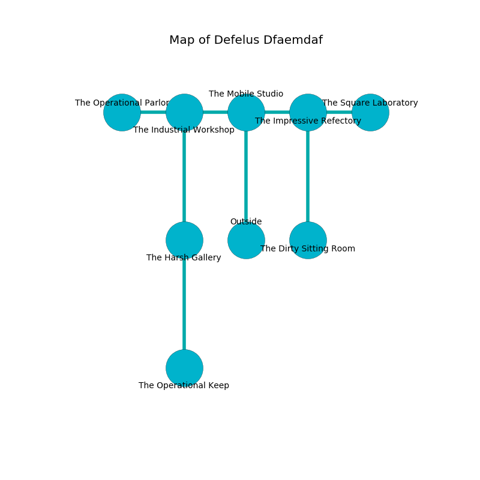

%Ruin Dogs

##Defelus Dfaemdaf
###Overview
Defelus Dfaemdaf is located on a broken city. Some rooms of it are cursed. The ruin is sinking into the earth. It is occupied by Satyrs. Emile Pitt The Inconsistent, an Incubus is here. The Satyrs are ruled by Emile Pitt The Inconsistent. He  is founding a new religion. 

###Artifact
####The Cooperative Gap

The Cooperative Gap has the form of a mushy doll. It smells like clove. When touched it becomes lost. 

###Locations

####the mobile studio
Yellow moss is growing in broken urns. The air smells like watermelon here. There are a Nothic and an Intellect Devourer here. 

* To the west a long cavern connects to [the industrial workshop](#the-industrial-workshop).
* To the east a flooded pathway opens to [the impressive refectory](#the-impressive-refectory).
* To the south is the entrance.

####the industrial workshop
Blue ferns are growing in cracks in the floor. There are a Tribal Warrior, a Hyena, a Myconid Adult, a Hunter Shark, a Reef Shark, a Vine Blight, a Needle Blight, and an Octopus here. The concrete walls are bloodstained. The floor is flooded with one inch deep scalding water. 

* To the west a dripping artery connects to [the operational parlor](#the-operational-parlor).
* To the east a long cavern opens to [the mobile studio](#the-mobile-studio).
* To the south a small hall leads to [the harsh gallery](#the-harsh-gallery).

####the impressive refectory
The stone walls are pristine. Yellow ferns are decaying in broken urns. 

* [The Cooperative Gap](#The-Cooperative-Gap) is here.
* To the west a flooded pathway leads to [the mobile studio](#the-mobile-studio).
* To the east a dark passageway opens to [the square laboratory](#the-square-laboratory).
* To the south a windy threshold leads to [the dirty sitting Room](#the-dirty-sitting-Room).

####the harsh gallery
There is a trap here. When activated, a tripwire will fire a net. There are six Satyrs here. One of the Satyrs is on watch, the rest are celebrating. 

* There is a tome here.
* [Emile Pitt The Inconsistent](#Emile-Pitt-The-Inconsistent) is here.
* To the north a small hall leads to [the industrial workshop](#the-industrial-workshop).
* To the south a windy gap leads to [the operational keep](#the-operational-keep).

####the dirty sitting Room
The floor is flooded with two inch deep scalding water. The brick walls are unsettled. There are six Satyrs here. The Satyrs are caring for babies. 

* To the north a windy threshold opens to [the impressive refectory](#the-impressive-refectory).

####the operational parlor
There are six Satyrs here. The Satyrs are performing a ritual. If not interrupted, [Emile Pitt](#Emile-Pitt) will be magically alarmed. 

* To the east a dripping artery opens to [the industrial workshop](#the-industrial-workshop).

####the operational keep
The floor is sticky. Blue lichens are sprouting from the ceiling. 

* To the north a windy gap connects to [the harsh gallery](#the-harsh-gallery).

####the square laboratory
Green moss is growing in a patch on the floor. The concrete walls are pristine. 

* To the west a dark passageway connects to [the impressive refectory](#the-impressive-refectory).

