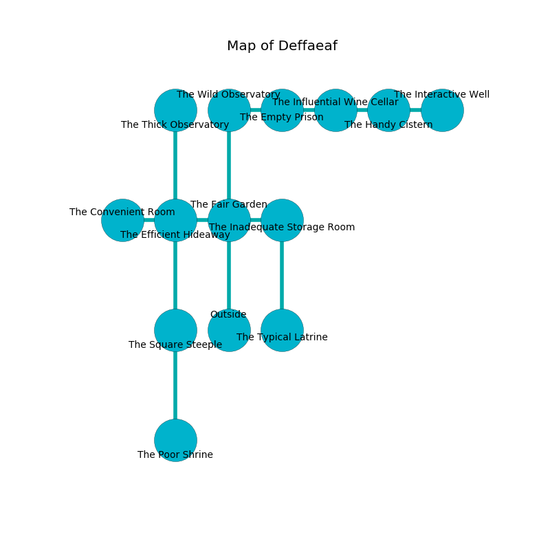

%Ruin Dogs

##Deffaeaf
###Overview
Deffaeaf is located under a haunted tree. Some rooms of it are frozen. The ruin is flooding. It is occupied by Satyrs. Darron Brogan The Cunning, a Mind Flayer Arcanist is here. The Satyrs are the slaves of Darron Brogan The Cunning. He  is trying to discover [Cess Dhemd](#Cess-Dhemd). 

###Artifact
####Cess Dhemd

Cess Dhemd is a powerful artifact in the shape of a transparent monument. It is a light black color. When worn it levitates surrounding objects. 

###Locations

####the fair garden
There are fourteen Satyrs here. The air smells like grain here. The Satyrs are willing to negotiate. 

There is an engraving on the wall written in common. 

> Do not try fighting.
>

* To the west a narrow passageway connects to [the efficient hideaway](#the-efficient-hideaway).
* To the east a long cave opens to [the inadequate storage room](#the-inadequate-storage-room).
* To the north a hazy opening connects to [the wild observatory](#the-wild-observatory).
* To the south is the entrance.

####the efficient hideaway
The stone walls are caving in. There is a trap here. When activated, a pressure plate will open a trapdoor in the floor. There are fourteen Satyrs here. Red razorgrass is sprouting in cracks in the floor. If the Satyrs notice the Ruin Dogs, one of them will retreat and alert [Darron Brogan](#Darron-Brogan). 

* To the west a torchlit path connects to [the convenient room](#the-convenient-room).
* To the east a narrow passageway leads to [the fair garden](#the-fair-garden).
* To the north a twisted hallway opens to [the thick observatory](#the-thick-observatory).
* To the south a small hallway opens to [the square steeple](#the-square-steeple).

####the thick observatory
There are fourteen Satyrs here. The Satyrs are defending this room from intruders. 

* To the south a twisted hallway connects to [the efficient hideaway](#the-efficient-hideaway).

####the wild observatory
The air smells like orris here. There are a Jackal, an Azer, a Reef Shark, a Spined Devil, a Gnoll, a Yeti, and a Bat here. 

* To the east a small cave connects to [the empty prison](#the-empty-prison).
* To the south a hazy opening opens to [the fair garden](#the-fair-garden).

####the empty prison
The glass walls are pristine. Green mushrooms are decaying from the walls. 

* To the west a small cave leads to [the wild observatory](#the-wild-observatory).
* To the east a flooded corridor connects to [the influential wine cellar](#the-influential-wine-cellar).

####the square steeple
The floor is cluttered with debris. There are a Plesiosaurus, a Triceratops, and a Half-Ogre here. There is a trap here. When activated, a magical rune will make the walls close in. 

* [Cess Dhemd](#Cess-Dhemd) is here.
* To the north a small hallway opens to [the efficient hideaway](#the-efficient-hideaway).
* To the south a dark hallway leads to [the poor shrine](#the-poor-shrine).

####the convenient room
The air tastes like green tea here. There are fourteen Satyrs here. If the Satyrs notice the Ruin Dogs, one of them will retreat and alert [Darron Brogan](#Darron-Brogan). 

There is an engraving on the wall written in Satyrs Script. 

> O! sorry you
>
> aloof, definite, environmental
>
> extraordinary and true
>
> nothing is mental
>

* [Darron Brogan The Cunning](#Darron-Brogan-The-Cunning) is here.
* To the east a torchlit path connects to [the efficient hideaway](#the-efficient-hideaway).

####the influential wine cellar
Yellow lichens are growing in a patch on the floor. The crystal walls are ruined. 

* To the west a flooded corridor connects to [the empty prison](#the-empty-prison).
* To the east a dark artery opens to [the handy cistern](#the-handy-cistern).

####the handy cistern
The brick walls are caving in. 

* There is a wheel here.
* To the west a dark artery leads to [the influential wine cellar](#the-influential-wine-cellar).
* To the east a hazy opening leads to [the interactive well](#the-interactive-well).

####the inadequate storage room
There are an Imp, a Crawling Claw, and a Mammoth here. The air smells like cranberry here. 

* To the west a long cave connects to [the fair garden](#the-fair-garden).
* To the south a windy threshold opens to [the typical latrine](#the-typical-latrine).

####the typical latrine
The mirrored walls are caving in. Gray moss is swaying in a patch on the floor. 

* There is a button here.
* To the north a windy threshold leads to [the inadequate storage room](#the-inadequate-storage-room).

####the interactive well
The air tastes like tomato here. 

There is an engraving on a monolith written in Satyrs Script. 

> Maybe try dying.
>

* To the west a hazy opening connects to [the handy cistern](#the-handy-cistern).

####the poor shrine
The air smells like lard here. There are fourteen Satyrs here. One of the Satyrs is working a mechanism that can engulf the room in a fiery blaze. 

There is an engraving on a monolith written in common. 

> O! the memory of you is woe
>
> it is always presidential
>
> but slow
>
> the world is influential
>

* To the north a dark hallway opens to [the square steeple](#the-square-steeple).

