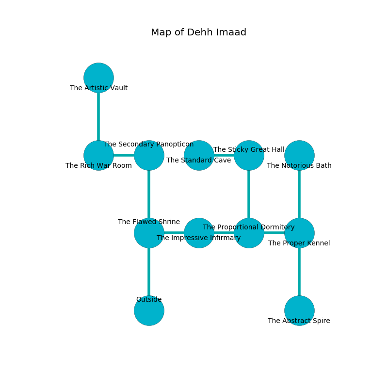

%Ruin Dogs

##Dehh Imaad
###Overview
Dehh Imaad is located on a ruined plain. Parts of it are cursed. A massive storm is happening outside. It is occupied by Giants. Lily Jeter The Secretive, a Frost Giant is here. The Giants are battling Lily Jeter The Secretive. She  is trying to steal [The Provincial Size](#The-Provincial-Size). 

###Artifact
####The Provincial Size

The Provincial Size looks like a warm crystal. Psychic energy slips around it. It smells like goat. When cradled it tunnels into the earth. 

###Locations

####the flawed shrine
The floor is cluttered with debris. There are a Hill Giant and a Stone Giant here. The obsidion walls are caving in. White ferns are swaying in a patch on the floor. The air smells like lavender here. One of the Giants is on watch, the rest are feasting. 

* There is an amulet here.
* There is a diamond here.
* To the east a dripping artery leads to [the impressive infirmary](#the-impressive-infirmary).
* To the north a narrow path opens to [the secondary panopticon](#the-secondary-panopticon).
* To the south is the entrance.

####the impressive infirmary
The floor is smooth. There are a Chimera, a Winged Kobold, a Half-Red Dragon Veteran, a Boar, and a Rat here. Red moss is sprouting in cracks in the floor. 

* There is a table here.
* To the west a dripping artery leads to [the flawed shrine](#the-flawed-shrine).
* To the east a narrow cave leads to [the proportional dormitory](#the-proportional-dormitory).

####the proportional dormitory
The air tastes like burnt butter here. The floor is cluttered with bones. 

* To the west a narrow cave opens to [the impressive infirmary](#the-impressive-infirmary).
* To the east a windy corridor opens to [the proper kennel](#the-proper-kennel).
* To the north a small pathway opens to [the sticky great hall](#the-sticky-great-hall).

####the proper kennel
The air tastes like lobster here. Red mushrooms are growing from the ceiling. The floor is cluttered with broken glass. 

* [The Provincial Size](#The-Provincial-Size) is here.
* To the west a windy corridor connects to [the proportional dormitory](#the-proportional-dormitory).
* To the north a narrow cave connects to [the notorious bath](#the-notorious-bath).
* To the south a twisted corridor opens to [the abstract spire](#the-abstract-spire).

####the abstract spire
Gray mushrooms are decaying in a patch on the floor. The air smells like currant here. The floor is cluttered with broken glass. 

There is an engraving on a stone written in common. 

> Oh my! the world is poor
>
> spatial and mature
>
> yet progressive
>
> all is aggressive
>

* To the north a twisted corridor connects to [the proper kennel](#the-proper-kennel).

####the secondary panopticon
The air tastes like tomato leaf here. There is a Frost Giant here. The obsidion walls are covered in mold. The Frost Giant is fighting amongst themselves. 

* To the west a torchlit corridor opens to [the rich war Room](#the-rich-war-Room).
* To the south a narrow path connects to [the flawed shrine](#the-flawed-shrine).

####the rich war Room
The brick walls are unsettled. The floor is sticky. 

There is an engraving on a stone written in common. 

> A thumb is a retirement
>
> always dependent
>
> We are free
>
> decisive and basic
>
> you must never be hidden
>

* To the east a torchlit corridor opens to [the secondary panopticon](#the-secondary-panopticon).
* To the north a small path connects to [the artistic vault](#the-artistic-vault).

####the artistic vault
Yellow ferns are sprouting in cracks in the floor. There is a trap here. When activated, a pressure plate will fire an acid arrow. The air smells like orange peel here. The floor is bloodstained. 

* To the south a small path opens to [the rich war Room](#the-rich-war-Room).

####the sticky great hall
There are a Hill Giant and a Frost Giant here. The air tastes like seed here. The Giants are feasting. 

* [Lily Jeter The Secretive](#Lily-Jeter-The-Secretive) is here.
* To the west a windy artery opens to [the standard cave](#the-standard-cave).
* To the south a small pathway leads to [the proportional dormitory](#the-proportional-dormitory).

####the standard cave
Green ferns are decaying in a patch on the floor. 

* There is a net here.
* To the east a windy artery leads to [the sticky great hall](#the-sticky-great-hall).

####the notorious bath
The air smells like almond here. The floor is cluttered with broken glass. The metallic walls are caving in. White ferns are sprouting in a patch on the floor. There are an Ogre, a Noble, a Bronze Dragon Wyrmling, two Sahuagin Priestesses, two Worgs,  here. 

There is an engraving on the floor written in Giants Script. 

> I am old.
>

* To the south a narrow cave opens to [the proper kennel](#the-proper-kennel).

