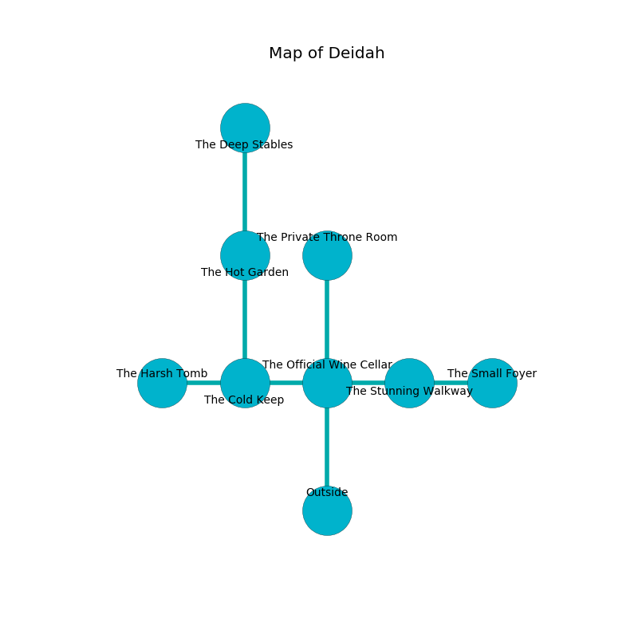

%Ruin Dogs

##Deidah
###Overview
Deidah is constructed on a poisoned plain. Regions of it are flooded. A lunar eclipse is happening outside. It is occupied by Drows. Jeffery Mendez The Deceitful, an Incubus is here. The Drows are the slaves of Jeffery Mendez The Deceitful. He  is founding a new religion. 

###Artifact
####The Privileged Fence

The Privileged Fence is a powerful artifact in the shape of a smooth cube. It smells like cooked onion. When carried it floats above the ground. 

###Locations

####the official wine cellar
The concrete walls are scratched. 

* To the west a dripping threshold leads to [the cold keep](#the-cold-keep).
* To the east a long hall connects to [the stunning walkway](#the-stunning-walkway).
* To the north a dark pathway leads to [the private throne room](#the-private-throne-room).
* To the south is the entrance.

####the cold keep
Red razorgrass is decaying in a patch on the floor. The floor is glossy. The obsidion walls are bloodstained. 

* [The Privileged Fence](#The-Privileged-Fence) is here.
* [Jeffery Mendez The Deceitful](#Jeffery-Mendez-The-Deceitful) is here.
* To the west a flooded cave leads to [the harsh tomb](#the-harsh-tomb).
* To the east a dripping threshold opens to [the official wine cellar](#the-official-wine-cellar).
* To the north a flooded cave connects to [the hot garden](#the-hot-garden).

####the hot garden
White razorgrass is growing in a patch on the floor. There are a Rug of Smothering and a Gibbering Mouther here. The floor is glossy. The air smells like garlic here. 

* To the north a torchlit opening leads to [the deep stables](#the-deep-stables).
* To the south a flooded cave opens to [the cold keep](#the-cold-keep).

####the stunning walkway
The air smells like calamus here. White moss is growing in a patch on the floor. The concrete walls are covered in mold. 

* There is an icon here.
* To the west a long hall opens to [the official wine cellar](#the-official-wine-cellar).
* To the east a narrow cave leads to [the small foyer](#the-small-foyer).

####the private throne room
There are a Veteran, a Kenku, an Acolyte, an Ice Mephit, a Giant Bat, and a Goat here. The floor is flooded with three inch deep lukewarm water. 

* There is a flag here.
* To the south a dark pathway leads to [the official wine cellar](#the-official-wine-cellar).

####the small foyer
Red ferns are sprouting from the ceiling. The floor is sticky. The mirrored walls are ruined. 

* To the west a narrow cave connects to [the stunning walkway](#the-stunning-walkway).

####the deep stables
The floor is sticky. Blue razorgrass is growing from the ceiling. The air smells like truffle here. 

* There is a breastplate here.
* To the south a torchlit opening leads to [the hot garden](#the-hot-garden).

####the harsh tomb
The concrete walls are pristine. Red razorgrass is growing in broken urns. The floor is smooth. 

* To the east a flooded cave opens to [the cold keep](#the-cold-keep).

