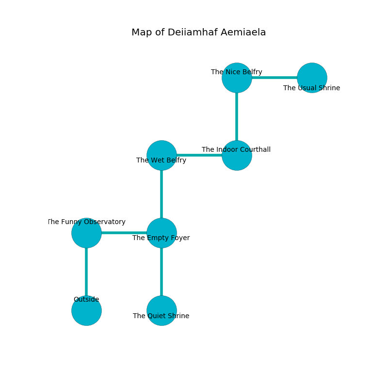

%Ruin Dogs

##Deiiamhaf Aemiaela
###Overview
Deiiamhaf Aemiaela is constructed on an alien tree. Some rooms of it are foggy. The ruin is collapsing slowly. It is occupied by Orc. Kimbery Knight The Bitchy, a Kuo-Toa Whip is here. The Orc are the slaves of Kimbery Knight The Bitchy. She  is trying to use [The Low Logic](#The-Low-Logic). 

###Artifact
####The Low Logic

The Low Logic is a powerful artifact in the shape of a wet amulet. When touched it destroys others. 

###Locations

####the funny observatory
There are four Orcs here. The floor is sticky. Green mushrooms are growing from the walls. The metallic walls are ruined. The air tastes like eggs here. The Orc are willing to negotiate. 

There is an engraving on the floor written in common. 

> Do not try giving up.
>

* There is a plate here.
* To the east a small passageway opens to [the empty foyer](#the-empty-foyer).
* To the south is the entrance.

####the empty foyer
The floor is smooth. Yellow lichens are growing in broken urns. The air tastes like sandalwood here. The mirrored walls are pristine. 

There is an engraving on a stone written in common. 

> O! the memory of you is poor
>
> ever secure
>
> important and democratic
>
> all is secure
>

* To the west a small passageway opens to [the funny observatory](#the-funny-observatory).
* To the north a narrow walkway leads to [the wet belfry](#the-wet-belfry).
* To the south a torchlit passageway connects to [the quiet shrine](#the-quiet-shrine).

####the wet belfry
The floor is smooth. 

* To the east a long walkway leads to [the indoor courthall](#the-indoor-courthall).
* To the south a narrow walkway leads to [the empty foyer](#the-empty-foyer).

####the quiet shrine
Red moss is sprouting from the walls. There are four Orcs here. There is a trap here. When activated, a magical sound detector will launch stone blocks from the ceiling. The floor is bloodstained. If the Orc notice the Ruin Dogs, one of them will retreat and alert the others. 

* To the north a torchlit passageway opens to [the empty foyer](#the-empty-foyer).

####the indoor courthall
The floor is flooded with seven inch deep hot water. The wooden walls are covered in mold. The air tastes like sulfur here. 

* To the west a long walkway opens to [the wet belfry](#the-wet-belfry).
* To the north a long passageway leads to [the nice belfry](#the-nice-belfry).

####the nice belfry
The mirrored walls are caving in. There are a Wererat, a Vine Blight, a Spider, and an Orc here. There is a trap here. When activated, a magical sound detector will swing a tripping chain. 

There is an engraving on a monolith written in Orc Script. 

> Try hiding.
>

* [The Low Logic](#The-Low-Logic) is here.
* To the east a dripping cave leads to [the usual shrine](#the-usual-shrine).
* To the south a long passageway leads to [the indoor courthall](#the-indoor-courthall).

####the usual shrine
The air smells like cumin here. There are a Troglodyte, a Brass Dragon Wyrmling, a Warhorse Skeleton, and a Bandit here. The stone walls are pristine. 

* There is a table here.
* There is a fork here.
* [Kimbery Knight The Bitchy](#Kimbery-Knight-The-Bitchy) is here.
* To the west a dripping cave connects to [the nice belfry](#the-nice-belfry).

