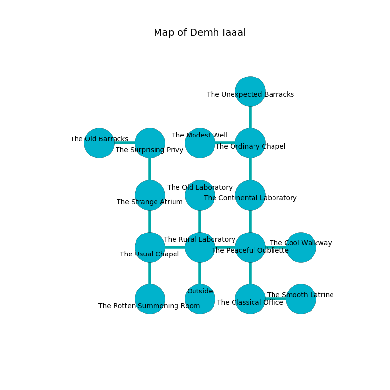

%Ruin Dogs

##Demh Iaaal
###Overview
Demh Iaaal is located on a crystal mountain. Some areas of it are inaccessible. The ruin is burning. It is occupied by Satyrs. Chuck Carrington The Cynical, a Mind Flayer is here. The Satyrs have been charmed by Chuck Carrington The Cynical. He  is founding a new religion. 

###Artifact
####Cuffaidumlamca

Cuffaidumlamca has the form of a hard prism. Air incinerates around it. When touched it grants psychic powers. 

###Locations

####the rural laboratory
There are a Wolf, a Tribal Warrior, a Giant Sea Horse, an Ettercap, a Cambion, and a Giant Elk here. Yellow razorgrass is sprouting in broken urns. The concrete walls are scratched. The floor is sticky. 

* To the west a narrow path opens to [the usual chapel](#the-usual-chapel).
* To the east a narrow artery opens to [the peaceful oubliette](#the-peaceful-oubliette).
* To the north a twisted gap leads to [the old laboratory](#the-old-laboratory).
* To the south is the entrance.

####the peaceful oubliette
The air smells like hyssop here. There are a Medusa and a Giant Lizard here. Yellow moss is sprouting in a patch on the floor. 

There is an engraving on the floor written in Satyrs Script. 

> All of us are lost
>
> ever rational
>
> marine, firsthand, alive
>
> We are lost
>
> wise, talkative, philosophical
>
> you must be cursed
>

* To the west a narrow artery connects to [the rural laboratory](#the-rural-laboratory).
* To the east a twisted pathway opens to [the cool walkway](#the-cool-walkway).
* To the north a twisted gap connects to [the continental laboratory](#the-continental-laboratory).
* To the south a dripping hallway connects to [the classical office](#the-classical-office).

####the continental laboratory
The floor is cluttered with ashes. Green razorgrass is decaying in cracks in the floor. The air tastes like lemongrass here. There are twelve Satyrs here. The Satyrs are performing a ritual. If not interrupted, the Satyrs will become more powerful. 

There is an engraving on the floor written in Satyrs Script. 

> I could not try leaving.
>

* There is a basket here.
* To the north a narrow threshold connects to [the ordinary chapel](#the-ordinary-chapel).
* To the south a twisted gap connects to [the peaceful oubliette](#the-peaceful-oubliette).

####the ordinary chapel
There is a trap here. When activated, a pressure plate will launch a blade. There are a Darkmantle, a Kuo-Toa Whip, a Barbed Devil, a Fire Snake, and a Manes here. The brick walls are ruined. The air tastes like vanilla here. Green moss is swaying in broken urns. The floor is glossy. 

* There is a potato here.
* To the west a dripping gap connects to [the modest well](#the-modest-well).
* To the north a dripping hallway leads to [the unexpected barracks](#the-unexpected-barracks).
* To the south a narrow threshold connects to [the continental laboratory](#the-continental-laboratory).

####the classical office
Blue ferns are decaying in cracks in the floor. The air tastes like carnation here. 

* To the east a twisted hallway opens to [the smooth latrine](#the-smooth-latrine).
* To the north a dripping hallway connects to [the peaceful oubliette](#the-peaceful-oubliette).

####the cool walkway
Yellow ferns are swaying in broken urns. There are a Young Faerie Dragon, a Fire Elemental, a Bearded Devil, and a Scout here. The wooden walls are bloodstained. 

There is an engraving on the wall written in common. 

> [Cuffaidumlamca](#Cuffaidumlamca)
>
> dangerous and academic
>
> statistical, continuous, impressive
>

* There is a mug here.
* To the west a twisted pathway opens to [the peaceful oubliette](#the-peaceful-oubliette).

####the old laboratory
The air smells like umami here. The stone walls are bloodstained. Blue lichens are swaying in a patch on the floor. There are a Displacer Beast and a Lizard King here. 

There is an engraving on a monolith written in Satyrs Script. 

> I am alone.
>
> I tried giving up.
>

* To the south a twisted gap leads to [the rural laboratory](#the-rural-laboratory).

####the usual chapel
Green lichens are sprouting from the ceiling. The air smells like chamomile here. The floor is bloodstained. 

* To the east a narrow path opens to [the rural laboratory](#the-rural-laboratory).
* To the north a twisted artery leads to [the strange atrium](#the-strange-atrium).
* To the south a hazy cave leads to [the rotten summoning room](#the-rotten-summoning-room).

####the smooth latrine
There are an Ape, a Swarm of Bats, a Merrow, a Giant Vulture, a Giant Toad, and a Green Dragon Wyrmling here. The concrete walls are caving in. 

There is an engraving on a stone written in common. 

> [Cuffaidumlamca](#Cuffaidumlamca)
>
> straight and exclusive
>
> A table is a school
>
> rational, formal, excited
>
> They are hidden
>
> balanced, imperial, conventional
>
> pleasant, basic, sophisticated
>
> [Cuffaidumlamca](#Cuffaidumlamca)
>

* [Chuck Carrington The Cynical](#Chuck-Carrington-The-Cynical) is here.
* To the west a twisted hallway leads to [the classical office](#the-classical-office).

####the modest well
There are twelve Satyrs here. The obsidion walls are ruined. The air tastes like fungus here. Gray ferns are decaying from the walls. The floor is cluttered with bones. One of the Satyrs is working a mechanism that can flood the room. 

There is an engraving on a tablet written in common. 

> A pin is an index
>
> steady and dull
>
> All of us are dying
>
> strict, bare, competent
>
> annual, considerable, marine
>
> [Cuffaidumlamca](#Cuffaidumlamca)
>
> relevant, provincial, civilian
>
> A pin is an index
>

* To the east a dripping gap opens to [the ordinary chapel](#the-ordinary-chapel).

####the strange atrium
There are a Swarm of Ravens, a Tribal Warrior, a Tiger, a Quipper, a Giant Toad, a Twig Blight, a Giant Crocodile, and a Peryton here. The floor is cluttered with ashes. The mirrored walls are scratched. The air smells like freshly cut hay here. 

* To the north a windy artery leads to [the surprising privy](#the-surprising-privy).
* To the south a twisted artery connects to [the usual chapel](#the-usual-chapel).

####the surprising privy
White mushrooms are swaying from the ceiling. The glass walls are covered in mold. The floor is sticky. 

* [Cuffaidumlamca](#Cuffaidumlamca) is here.
* To the west a narrow cave leads to [the old barracks](#the-old-barracks).
* To the south a windy artery opens to [the strange atrium](#the-strange-atrium).

####the unexpected barracks
There is a trap here. When activated, a magical proximity detector will launch a poison dart. Red razorgrass is sprouting in broken urns. 

* To the south a dripping hallway leads to [the ordinary chapel](#the-ordinary-chapel).

####the rotten summoning room
There are twelve Satyrs here. The obsidion walls are caving in. The floor is glossy. One of the Satyrs is on watch, the rest are caring for babies. 

* To the north a hazy cave opens to [the usual chapel](#the-usual-chapel).

####the old barracks
The glass walls are scratched. The air smells like baked potato here. 

There is an engraving on a monolith written in Satyrs Script. 

> A roof is a marsh
>
> yet essential
>
> All of us are joyful
>
> fresh and blank
>
> primary, dominant, continuous
>

* To the east a narrow cave connects to [the surprising privy](#the-surprising-privy).

