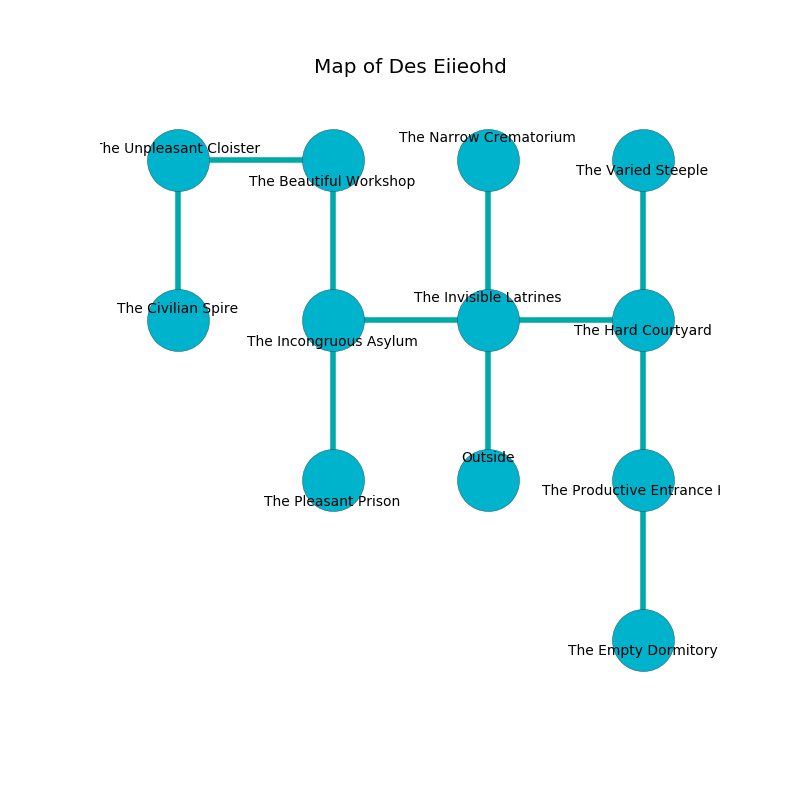

%Ruin Dogs

##Des Eiieohd
###Overview
Des Eiieohd is located under a cursed tree. Regions of Des Eiieohd are flooded. A solar eclipse is happening outside. It is occupied by Kobolds. Tom Skidmore The Silly, a Quaggoth is here. The Kobolds are the minions of Tom Skidmore The Silly. He  is trying to hide [The Available Wagon](#The-Available-Wagon). 

###Artifact
####The Available Wagon

The Available Wagon has the form of a glassy crystal. It is a shifting blue color. It smells like roasted peanut. When eaten it changes the past. 

###Locations

####the invisible latrines
The metallic walls are ruined. Green ferns are sprouting in broken urns. 

* To the west a twisted corridor opens to [the incongruous asylum](#the-incongruous-asylum).
* To the east a torchlit cavern leads to [the hard courtyard](#the-hard-courtyard).
* To the north a narrow threshold leads to [the narrow crematorium](#the-narrow-crematorium).
* To the south is the entrance.

####the incongruous asylum
Gray mushrooms are swaying from the ceiling. The air smells like citrus peel here. There are a Displacer Beast, a Swarm of Ravens, a Giant Scorpion, a Crawling Claw, and a Boar here. 

* To the east a twisted corridor connects to [the invisible latrines](#the-invisible-latrines).
* To the north a hazy hallway leads to [the beautiful workshop](#the-beautiful-workshop).
* To the south a small passageway connects to [the pleasant prison](#the-pleasant-prison).

####the pleasant prison
The crystal walls are caving in. White mushrooms are decaying in a patch on the floor. 

* To the north a small passageway connects to [the incongruous asylum](#the-incongruous-asylum).

####the narrow crematorium
The air smells like gravy here. There are a Satyr, a Dryad, a Raven, a Kenku, a Pixie, a Quaggoth Spore Servant, a Crawling Claw, a Hawk, a Death Dog, a Sahuagin, and a Tribal Warrior here. White razorgrass is sprouting from the ceiling. The floor is bloodstained. 

* To the south a narrow threshold connects to [the invisible latrines](#the-invisible-latrines).

####the beautiful workshop
There are a Quaggoth Thonot, a Goblin, a Ghost, and a Flying Snake here. The air smells like whiskey here. The floor is flooded with six inch deep scalding water. The concrete walls are caving in. 

* To the west a windy pathway opens to [the unpleasant cloister](#the-unpleasant-cloister).
* To the south a hazy hallway connects to [the incongruous asylum](#the-incongruous-asylum).

####the unpleasant cloister
The floor is flooded with six inch deep cold water. 

* [The Available Wagon](#The-Available-Wagon) is here.
* To the east a windy pathway opens to [the beautiful workshop](#the-beautiful-workshop).
* To the south a narrow corridor leads to [the civilian spire](#the-civilian-spire).

####the hard courtyard
Yellow lichens are decaying in cracks in the floor. There are a Jackal, a Ghoul, a Yuan-Ti Pureblood, a Lizardfolk, an Elk, and a Giant Elk here. 

* To the west a torchlit cavern opens to [the invisible latrines](#the-invisible-latrines).
* To the north a small opening leads to [the varied steeple](#the-varied-steeple).
* To the south a twisted artery leads to [the productive entrance hall](#the-productive-entrance-hall).

####the varied steeple
The crystal walls are caving in. The floor is smooth. There are a Hobgoblin Captain, a Hobgoblin, and a Bandit here. 

* To the south a small opening opens to [the hard courtyard](#the-hard-courtyard).

####the productive entrance hall
Blue moss is sprouting in broken urns. There are twelve Winged Kobolds and eight Kobolds here. The concrete walls are pristine. If the Kobolds notice the Ruin Dogs, one of them will retreat and alert [Tom Skidmore](#Tom-Skidmore). 

* To the north a twisted artery opens to [the hard courtyard](#the-hard-courtyard).
* To the south a long hall opens to [the empty dormitory](#the-empty-dormitory).

####the empty dormitory

There is an engraving on the floor written in Kobolds Script. 

> Poor me! weak you
>
> always due
>
> ever great
>
> the world is late
>

* To the north a long hall leads to [the productive entrance hall](#the-productive-entrance-hall).

####the civilian spire
The floor is smooth. 

* [Tom Skidmore The Silly](#Tom-Skidmore-The-Silly) is here.
* To the north a narrow corridor leads to [the unpleasant cloister](#the-unpleasant-cloister).

