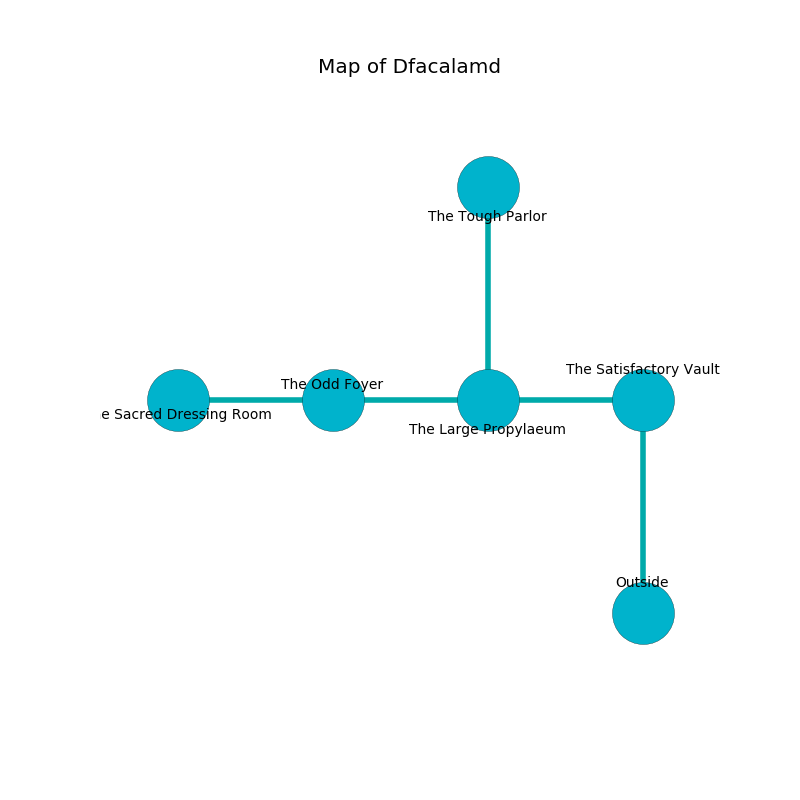

%Ruin Dogs

##Dfacalamd
###Overview
Dfacalamd is located in a haunted mountain. Regions of it are flooded. A lunar eclipse is happening outside. It is occupied by Deep Gnomes. Willian Hollingsworth The Greedy, a Cloud Giant is here. The Deep Gnomes are the minions of Willian Hollingsworth The Greedy. He  is trying to find [The Senior Form](#The-Senior-Form). 

###Artifact
####The Senior Form

The Senior Form is a powerful artifact in the shape of a soft sphere. It is a bright black color. Cacophony slides around it. It smells like autumn. When worn it levitates those nearby. 

###Locations

####the satisfactory vault
Red razorgrass is decaying in a patch on the floor. 

There is an engraving on the wall written in common. 

> [The Senior Form](#The-Senior-Form)
>
> free and polite
>
> We are sorrowful
>
> ever capable
>
> cruel, indigenous, romantic
>
> romantic and competent
>

* There is a door here.
* To the west a long corridor leads to [the large propylaeum](#the-large-propylaeum).
* To the south is the entrance.

####the large propylaeum

* There is a specter here.
* There is a carriage here.
* To the west a torchlit cavern opens to [the odd foyer](#the-odd-foyer).
* To the east a long corridor opens to [the satisfactory vault](#the-satisfactory-vault).
* To the north a small path connects to [the tough parlor](#the-tough-parlor).

####the tough parlor
Yellow razorgrass is decaying from the ceiling. The floor is smooth. There are twenty Deep Gnomes here. One of the Deep Gnomes is on watch, the rest are feasting. 

There is an engraving on a tablet written in Deep Gnomes Script. 

> I am old.
>
> Go away.
>

* To the south a small path leads to [the large propylaeum](#the-large-propylaeum).

####the odd foyer
The floor is cluttered with rocks. Yellow razorgrass is decaying in broken urns. The air tastes like elderflower here. There is a trap here. When activated, a tripwire will shoot a lightning bolt. 

* There is a whistle here.
* [The Senior Form](#The-Senior-Form) is here.
* To the west a narrow walkway connects to [the sacred dressing room](#the-sacred-dressing-room).
* To the east a torchlit cavern opens to [the large propylaeum](#the-large-propylaeum).

####the sacred dressing room
The concrete walls are scratched. 

* [Willian Hollingsworth The Greedy](#Willian-Hollingsworth-The-Greedy) is here.
* To the east a narrow walkway opens to [the odd foyer](#the-odd-foyer).

