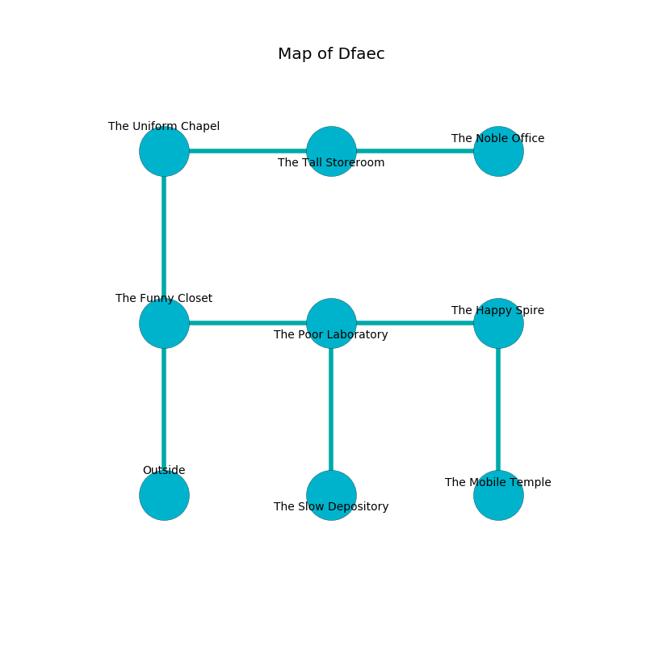

%Ruin Dogs

##Dfaec
###Overview
Dfaec is located on a cursed tree. Parts of Dfaec are frozen. The ruin is flooding. It is occupied by Vampires. Andy Stuckey The Boring, a Fire Giant is here. The Vampires are ruled by Andy Stuckey The Boring. He  is founding a new religion. 

###Artifact
####Iaesa Cubbamd

Iaesa Cubbamd is a powerful artifact in the shape of a mushy gem. It is a bright purple color. It smells like roast beef. When worn it levitates surrounding objects. 

###Locations

####the funny closet
The floor is flooded with six inch deep scalding water. The air smells like burnt butter here. Red ferns are growing in cracks in the floor. There are a Shadow, a Grell, a Gelatinous Cube, a Gas Spore, and a Young Bronze Dragon here. 

* To the east a small pathway connects to [the poor laboratory](#the-poor-laboratory).
* To the north a torchlit artery connects to [the uniform chapel](#the-uniform-chapel).
* To the south is the entrance.

####the uniform chapel
Blue moss is decaying from the walls. The concrete walls are covered in mold. The floor is bloodstained. 

There is an engraving on the ceiling written in Vampires Script. 

> A key is an university
>
> junior, seasonal, standard
>
> warm and past
>

* To the east a dark corridor leads to [the tall storeroom](#the-tall-storeroom).
* To the south a torchlit artery leads to [the funny closet](#the-funny-closet).

####the poor laboratory
Red razorgrass is decaying from the walls. There is a trap here. When activated, a magical proximity detector will launch a rolling boulder. There are two Vampire Spawns here. The air tastes like paper here. One of the Vampires is on watch, the rest are sleeping. 

* To the west a small pathway connects to [the funny closet](#the-funny-closet).
* To the east a small gap connects to [the happy spire](#the-happy-spire).
* To the south a torchlit cave connects to [the slow depository](#the-slow-depository).

####the tall storeroom
The floor is glossy. The air smells like beef here. 

* [Iaesa Cubbamd](#Iaesa-Cubbamd) is here.
* To the west a dark corridor leads to [the uniform chapel](#the-uniform-chapel).
* To the east a hazy path opens to [the noble office](#the-noble-office).

####the happy spire
The floor is flooded with two inch deep hot water. There are a Troglodyte, a Quaggoth Thonot, a Raven, a Draft Horse, and a Bulette here. The air tastes like macadamia here. The glass walls are bloodstained. 

There is an engraving on a monolith written in Vampires Script. 

> I thought about cowering.
>

* To the west a small gap connects to [the poor laboratory](#the-poor-laboratory).
* To the south a dripping passageway leads to [the mobile temple](#the-mobile-temple).

####the slow depository
The air smells like chrysanthemum here. The crystal walls are scratched. The floor is sticky. Red ferns are sprouting in broken urns. There are a Goblin Boss, a Spectator, a Giant Shark, and a Berserker here. 

* To the north a torchlit cave opens to [the poor laboratory](#the-poor-laboratory).

####the mobile temple
Green mushrooms are swaying in broken urns. 

* To the north a dripping passageway opens to [the happy spire](#the-happy-spire).

####the noble office
The air smells like ammonia here. The stone walls are bloodstained. Blue moss is decaying from the ceiling. The floor is bloodstained. 

There is an engraving on a tablet written in Vampires Script. 

> O! dire god
>
> it is always odd
>
> it is always obese
>
> nothing is odd
>

* [Andy Stuckey The Boring](#Andy-Stuckey-The-Boring) is here.
* To the west a hazy path leads to [the tall storeroom](#the-tall-storeroom).

