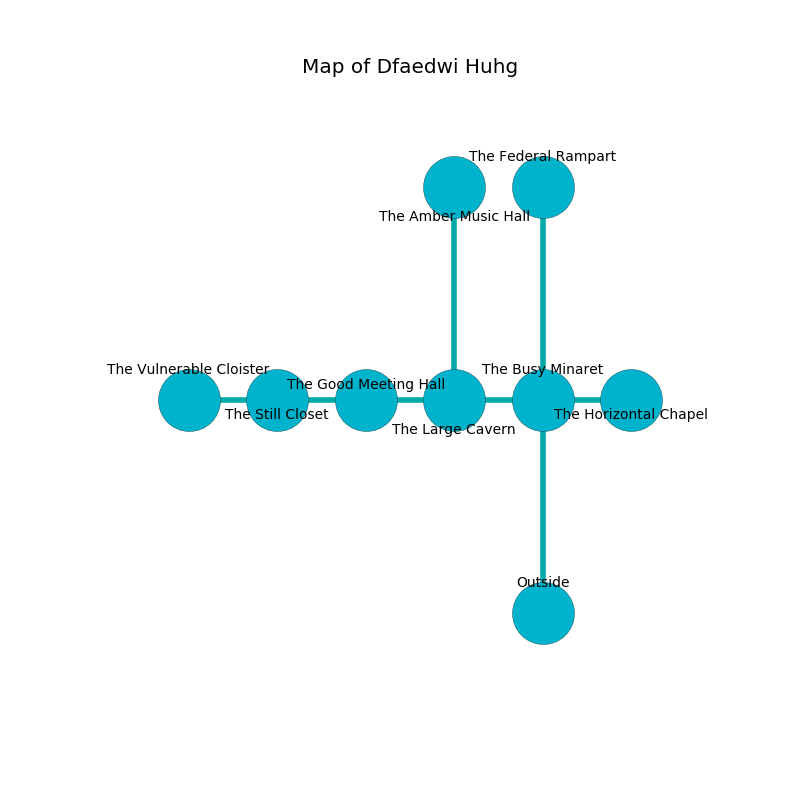

%Ruin Dogs

##Dfaedwi Huhg
###Overview
Dfaedwi Huhg is located on a flooded tree. Regions of it are corrupted. A windstorm is happening outside. It is occupied by Pixies. Reginald Moniz The Self-Indulgent, a Mind Flayer is here. The Pixies are battling Reginald Moniz The Self-Indulgent. He  is founding a new religion. 

###Artifact
####Hfedmaeci Daem

Hfedmaeci Daem looks like a hard blade. It smells like tomato leaf. When held it shows an image of the future. 

###Locations

####the busy minaret
There are twenty eight Pixies here. The air tastes like orange peel here. The Pixies are crazy with bloodlust. 

* [Reginald Moniz The Self-Indulgent](#Reginald-Moniz-The-Self-Indulgent) is here.
* To the west a windy gap connects to [the large cavern](#the-large-cavern).
* To the east a twisted gap leads to [the horizontal chapel](#the-horizontal-chapel).
* To the north a torchlit path leads to [the federal rampart](#the-federal-rampart).
* To the south is the entrance.

####the large cavern
The air tastes like eucalyptus here. The floor is smooth. White lichens are decaying in a patch on the floor. 

* To the west a dripping path connects to [the good meeting hall](#the-good-meeting-hall).
* To the east a windy gap opens to [the busy minaret](#the-busy-minaret).
* To the north a dark corridor connects to [the amber music hall](#the-amber-music-hall).

####the good meeting hall
The glass walls are caving in. Blue ferns are swaying in broken urns. The floor is sticky. There are twenty eight Pixies here. The air tastes like dairy here. The Pixies are defending this room from intruders. 

* To the west a windy passageway opens to [the still closet](#the-still-closet).
* To the east a dripping path opens to [the large cavern](#the-large-cavern).

####the horizontal chapel
The air smells like hyacinth here. There are twenty eight Pixies here. The obsidion walls are covered in mold. Red moss is swaying in a patch on the floor. The Pixies are performing a ritual. If not interrupted, the ruin dogs will be weakened. 

* To the west a twisted gap leads to [the busy minaret](#the-busy-minaret).

####the still closet
The air tastes like barley here. Red lichens are sprouting in cracks in the floor. 

There is an engraving on the wall written in Pixies Script. 

> I want to find [Hfedmaeci Daem](#Hfedmaeci-Daem).
>

* [Hfedmaeci Daem](#Hfedmaeci-Daem) is here.
* To the west a dripping artery leads to [the vulnerable cloister](#the-vulnerable-cloister).
* To the east a windy passageway leads to [the good meeting hall](#the-good-meeting-hall).

####the federal rampart
There are twenty eight Pixies here. Red mushrooms are sprouting in cracks in the floor. The Pixies are willing to negotiate. 

* There is a stocking here.
* There is a sponge here.
* To the south a torchlit path connects to [the busy minaret](#the-busy-minaret).

####the amber music hall
The floor is flooded with five inch deep cool water. There are twenty eight Pixies here. Yellow mushrooms are sprouting from the walls. One of the Pixies is pointing a ballista at the entrance. 

* To the south a dark corridor leads to [the large cavern](#the-large-cavern).

####the vulnerable cloister
The air tastes like feces here. The crystal walls are covered in mold. There are an Ochre Jelly, a Chimera, and a Worg here. Green moss is swaying from the ceiling. 

* To the east a dripping artery opens to [the still closet](#the-still-closet).

