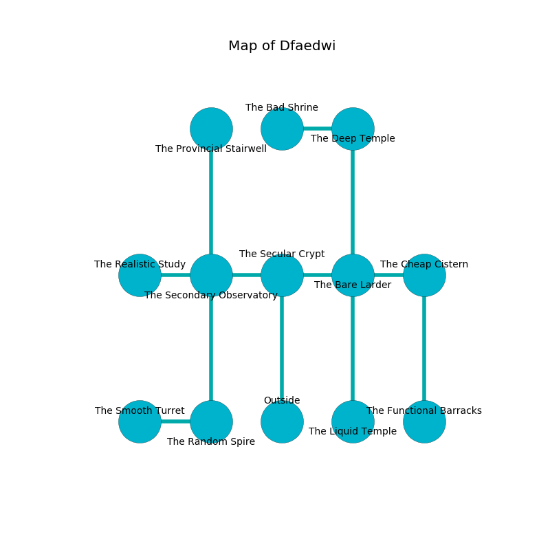

%Ruin Dogs

##Dfaedwi
###Overview
Dfaedwi is located on a flooded city. Parts of Dfaedwi are foggy. The ruin is coming to life. It is occupied by Demons. Joellen Mccartney The Untrustworthy, a Gladiator is here. The Demons are battling Joellen Mccartney The Untrustworthy. She  is trying to hide [Iaaefa](#Iaaefa). 

###Artifact
####Iaaefa

Iaaefa has the form of a transparent sphere. It smells like red rose. When touched it dissappears. 

###Locations

####the secular crypt
The floor is sticky. There is a Succubus here. One of the Succubus is on watch, the rest are celebrating. 

There is an engraving on a tablet written in common. 

> You are hidden
>
> complete and productive
>
> vain and harsh
>
> You are hidden
>

* To the west a small hallway leads to [the secondary observatory](#the-secondary-observatory).
* To the east a windy passageway leads to [the bare larder](#the-bare-larder).
* To the south is the entrance.

####the bare larder
Gray moss is swaying from the walls. The floor is bloodstained. The stone walls are ruined. 

There is an engraving on a stone written in common. 

> I could not try jumping.
>

* There is a cat here.
* To the west a windy passageway opens to [the secular crypt](#the-secular-crypt).
* To the east a dark hall connects to [the cheap cistern](#the-cheap-cistern).
* To the north a twisted hall leads to [the deep temple](#the-deep-temple).
* To the south a twisted gap leads to [the liquid temple](#the-liquid-temple).

####the secondary observatory
There is a trap here. When activated, a pressure plate will open a large pit in the floor. Green mushrooms are sprouting from the ceiling. The floor is cluttered with bones. 

* [Iaaefa](#Iaaefa) is here.
* To the west a twisted corridor opens to [the realistic study](#the-realistic-study).
* To the east a small hallway connects to [the secular crypt](#the-secular-crypt).
* To the north a long opening leads to [the provincial stairwell](#the-provincial-stairwell).
* To the south a long hall connects to [the random spire](#the-random-spire).

####the cheap cistern
There is an Incubus here. The floor is sticky. The Incubus is drunk. 

* To the west a dark hall leads to [the bare larder](#the-bare-larder).
* To the south a twisted hall leads to [the functional barracks](#the-functional-barracks).

####the liquid temple
The air smells like oatmeal here. The crystal walls are caving in. Blue ferns are sprouting in cracks in the floor. 

* To the north a twisted gap leads to [the bare larder](#the-bare-larder).

####the random spire
The air smells like cardamom here. Blue moss is growing in cracks in the floor. 

* [Joellen Mccartney The Untrustworthy](#Joellen-Mccartney-The-Untrustworthy) is here.
* To the west a twisted artery connects to [the smooth turret](#the-smooth-turret).
* To the north a long hall connects to [the secondary observatory](#the-secondary-observatory).

####the realistic study
Yellow lichens are decaying in broken urns. The floor is glossy. There is an Incubus here. The Incubus is performing a ritual. If not interrupted, the Incubus will become more powerful. 

* There is a brooch here.
* There is a plate here.
* To the east a twisted corridor leads to [the secondary observatory](#the-secondary-observatory).

####the deep temple

* There is a horn here.
* To the west a narrow gap connects to [the bad shrine](#the-bad-shrine).
* To the south a twisted hall opens to [the bare larder](#the-bare-larder).

####the smooth turret
There are a Spectator and a Grick here. The air smells like camphoreous here. The floor is bloodstained. White ferns are growing from the ceiling. The crystal walls are covered in mold. 

* To the east a twisted artery leads to [the random spire](#the-random-spire).

####the bad shrine
The air tastes like pepper here. The floor is smooth. There are a White Dragon Wyrmling, a Sea Hag, a Shrieker, and a Rat here. 

* There is a bag here.
* To the east a narrow gap connects to [the deep temple](#the-deep-temple).

####the functional barracks
The air tastes like white rose here. The floor is flooded with five inch deep cool water. There is an Incubus here. Blue ferns are swaying from the walls. The Incubus is performing a ritual. If not interrupted, the Incubus will become more powerful. 

* To the north a twisted hall leads to [the cheap cistern](#the-cheap-cistern).

####the provincial stairwell
The air tastes like ginseng here. There are a Homunculus and a Bone Naga here. The floor is sticky. 

There is an engraving on a tablet written in common. 

> Treasure here.
>

* To the south a long opening opens to [the secondary observatory](#the-secondary-observatory).

