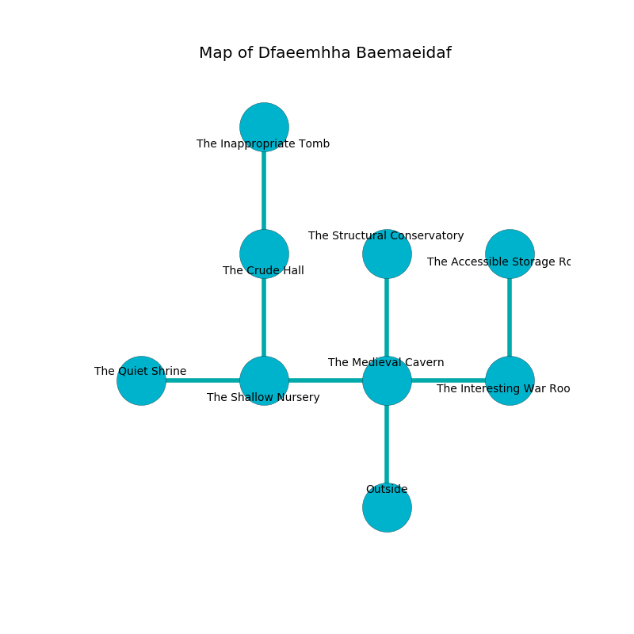

%Ruin Dogs

##Dfaeemhha Baemaeidaf
###Overview
Dfaeemhha Baemaeidaf is located on a flooded plain. Parts of it are incredibly cold. A windstorm is happening outside. It is occupied by Lizardfolk. Misty Hass The Dishonest, a Gnoll Fang of Yeenoghu is here. The Lizardfolk are the soldiers of Misty Hass The Dishonest. She  is trying to find [Hhoa Hefhaec](#Hhoa-Hefhaec). 

###Artifact
####Hhoa Hefhaec

Hhoa Hefhaec is a powerful artifact in the shape of a mushy monument. Fire bends away from it. When worn it repels insects. 

###Locations

####the medieval cavern
The wooden walls are ruined. The floor is glossy. There are a Lizardfolk Shaman and two Lizardfolk here. One of the Lizardfolk is pointing a ballista at the entrance. 

* [Hhoa Hefhaec](#Hhoa-Hefhaec) is here.
* To the west a flooded passageway leads to [the shallow nursery](#the-shallow-nursery).
* To the east a twisted hallway opens to [the interesting war Room](#the-interesting-war-Room).
* To the north a dripping passageway connects to [the structural conservatory](#the-structural-conservatory).
* To the south is the entrance.

####the shallow nursery
The floor is flooded with six inch deep lukewarm water. Red mushrooms are decaying from the ceiling. 

* There is a brake here.
* There is a hoard here.
* [Misty Hass The Dishonest](#Misty-Hass-The-Dishonest) is here.
* To the west a torchlit cave leads to [the quiet shrine](#the-quiet-shrine).
* To the east a flooded passageway connects to [the medieval cavern](#the-medieval-cavern).
* To the north a windy path leads to [the crude hall](#the-crude-hall).

####the quiet shrine
Gray mushrooms are growing from the walls. The floor is bloodstained. The crystal walls are unsettled. 

* There is a box here.
* To the east a torchlit cave opens to [the shallow nursery](#the-shallow-nursery).

####the interesting war Room
The floor is smooth. 

There is an engraving on the ceiling written in common. 

> O cruel we
>
> yet free
>
> it is never harmful
>
> nothing is free
>

* To the west a twisted hallway leads to [the medieval cavern](#the-medieval-cavern).
* To the north a torchlit hall opens to [the accessible storage room](#the-accessible-storage-room).

####the crude hall
The air smells like cantaloupe here. The concrete walls are pristine. Blue moss is swaying in cracks in the floor. The floor is glossy. 

* To the north a torchlit pathway connects to [the inappropriate tomb](#the-inappropriate-tomb).
* To the south a windy path connects to [the shallow nursery](#the-shallow-nursery).

####the inappropriate tomb
There is a trap here. When activated, a tripwire will close a portcullis. The obsidion walls are caving in. 

There is an engraving on the ceiling written in Lizardfolk Script. 

> I am lost in Dfaeemhha Baemaeidaf.
>
> Hide here.
>

* To the south a torchlit pathway leads to [the crude hall](#the-crude-hall).

####the accessible storage room
White moss is growing from the walls. 

* To the south a torchlit hall leads to [the interesting war Room](#the-interesting-war-Room).

####the structural conservatory
There are a Quaggoth Spore Servant, a Spider, a Bugbear Chief, and a Black Bear here. Yellow razorgrass is swaying from the ceiling. 

* There is a brake here.
* There is a bell here.
* To the south a dripping passageway connects to [the medieval cavern](#the-medieval-cavern).

