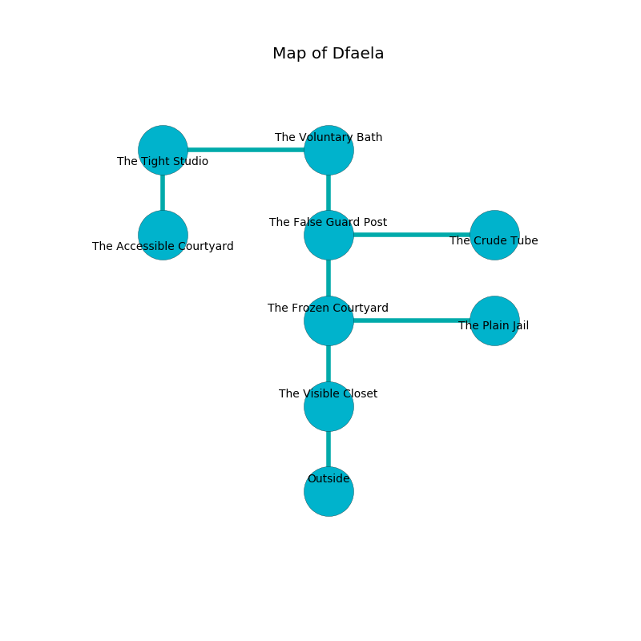

%Ruin Dogs

##Dfaela
###Overview
Dfaela is constructed on a poisoned mountain. Parts of Dfaela are incredibly cold. The ruin is larger on the inside than the outside. It is occupied by Gnolls. Leigha Forrester The Aggressive, a Fire Giant is here. The Gnolls have been charmed by Leigha Forrester The Aggressive. She  is founding a new religion. 

###Artifact
####The False Gift

The False Gift has the form of an opaque amulet. When rubbed it becomes a shielding force. 

###Locations

####the visible closet

* To the north a dark hall opens to [the frozen courtyard](#the-frozen-courtyard).
* To the south is the entrance.

####the frozen courtyard
The air smells like tolu here. The floor is sticky. 

* To the east a hazy cave connects to [the plain jail](#the-plain-jail).
* To the north a torchlit artery leads to [the false guard post](#the-false-guard-post).
* To the south a dark hall leads to [the visible closet](#the-visible-closet).

####the false guard post
The air smells like ammonia here. The floor is sticky. Green ferns are sprouting in broken urns. 

* [Leigha Forrester The Aggressive](#Leigha-Forrester-The-Aggressive) is here.
* To the east a twisted cavern opens to [the crude tube](#the-crude-tube).
* To the north a windy hall leads to [the voluntary bath](#the-voluntary-bath).
* To the south a torchlit artery connects to [the frozen courtyard](#the-frozen-courtyard).

####the voluntary bath

There is an engraving on the ceiling written in common. 

> I am looting this place.
>
> Treasure here.
>

* There is an orb here.
* To the west a windy opening opens to [the tight studio](#the-tight-studio).
* To the south a windy hall leads to [the false guard post](#the-false-guard-post).

####the plain jail
Blue razorgrass is swaying in a patch on the floor. There are three Gnoll Fangs of Yeenoghu and two Gnolls here. If the Gnolls notice the Ruin Dogs, one of them will retreat and alert [Leigha Forrester](#Leigha-Forrester). 

* To the west a hazy cave leads to [the frozen courtyard](#the-frozen-courtyard).

####the crude tube
The air smells like hyssop here. The floor is cluttered with ashes. 

There is an engraving on the ceiling written in Gnolls Script. 

> I am fleeing Dfaela.
>

* There is a potato here.
* To the west a twisted cavern leads to [the false guard post](#the-false-guard-post).

####the tight studio
The air smells like cashew here. The glass walls are caving in. There are a Gnoll Fang of Yeenoghu, two Gnolls, three Gnoll Pack Lords,  here. The Gnolls are drunk. 

There is an engraving on the ceiling written in common. 

> Poor me! terrible soul
>
> wise and whole
>
> ever residential
>
> death is whole
>

* There is a box here.
* [The False Gift](#The-False-Gift) is here.
* To the east a windy opening leads to [the voluntary bath](#the-voluntary-bath).
* To the south a windy path connects to [the accessible courtyard](#the-accessible-courtyard).

####the accessible courtyard
The metallic walls are bloodstained. The air tastes like sap here. 

* There is a flag here.
* To the north a windy path leads to [the tight studio](#the-tight-studio).

