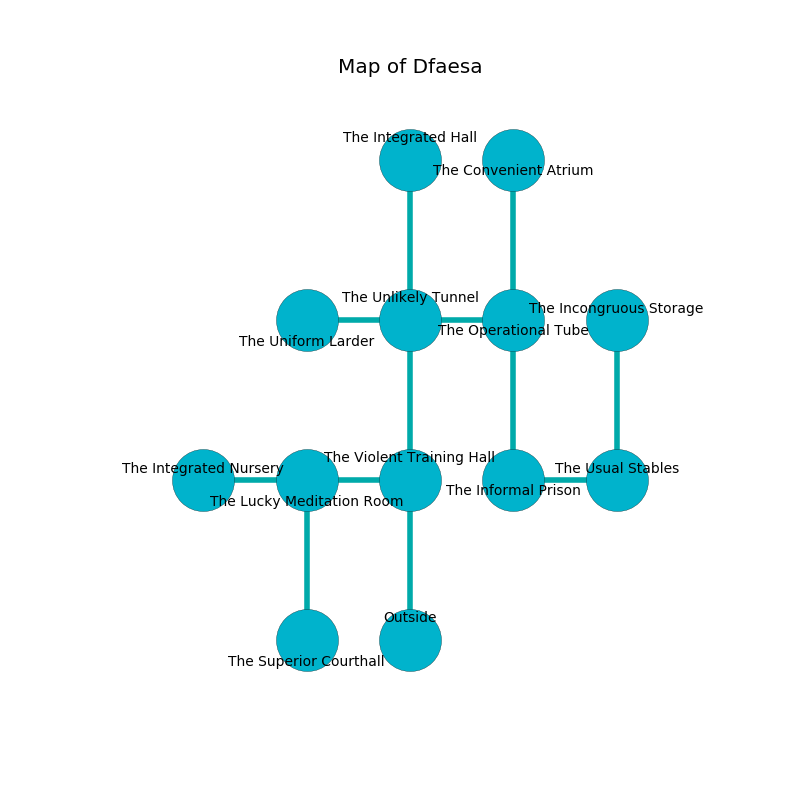

%Ruin Dogs

##Dfaesa
###Overview
Dfaesa is located under an alien city. Regions of Dfaesa are cursed. A blizzard is happening outside. It is occupied by Demons. Marinda Arellano The Dogmatic, a Gladiator is here. The Demons have been charmed by Marinda Arellano The Dogmatic. She  is trying to use [Iaedaf](#Iaedaf). 

###Artifact
####Iaedaf

Iaedaf is a powerful artifact in the shape of a wet prism. It smells like sweet pea. Magic pours towards it. When picked up it destroys others. 

###Locations

####the violent training hall
The brick walls are bloodstained. There is a Cambion here. The Cambion is performing a ritual. If not interrupted, the ruin dogs will be weakened. 

* There is a hook here.
* To the west a long artery connects to [the lucky meditation room](#the-lucky-meditation-room).
* To the north a flooded hall leads to [the unlikely tunnel](#the-unlikely-tunnel).
* To the south is the entrance.

####the unlikely tunnel
The floor is cluttered with rocks. Yellow razorgrass is decaying in broken urns. There are a Kuo-Toa Monitor, an Umber Hulk, a Giant Weasel, and a Gas Spore here. The mirrored walls are scratched. 

* To the west a small hallway connects to [the uniform larder](#the-uniform-larder).
* To the east a hazy cavern opens to [the operational tube](#the-operational-tube).
* To the north a torchlit passageway opens to [the integrated hall](#the-integrated-hall).
* To the south a flooded hall leads to [the violent training hall](#the-violent-training-hall).

####the uniform larder
The air smells like cauliflower here. The brick walls are bloodstained. The floor is glossy. 

* To the east a small hallway opens to [the unlikely tunnel](#the-unlikely-tunnel).

####the lucky meditation room
The air smells like orange peel here. 

* To the west a hazy opening leads to [the integrated nursery](#the-integrated-nursery).
* To the east a long artery leads to [the violent training hall](#the-violent-training-hall).
* To the south a torchlit walkway opens to [the superior courthall](#the-superior-courthall).

####the operational tube
The crystal walls are pristine. 

* To the west a hazy cavern opens to [the unlikely tunnel](#the-unlikely-tunnel).
* To the north a long artery connects to [the convenient atrium](#the-convenient-atrium).
* To the south a twisted gap opens to [the informal prison](#the-informal-prison).

####the integrated nursery
Yellow razorgrass is sprouting from the walls. The floor is flooded with nine inch deep lukewarm water. The obsidion walls are unsettled. 

* [Marinda Arellano The Dogmatic](#Marinda-Arellano-The-Dogmatic) is here.
* To the east a hazy opening connects to [the lucky meditation room](#the-lucky-meditation-room).

####the integrated hall
The air tastes like mutton here. Gray ferns are swaying from the walls. 

* To the south a torchlit passageway opens to [the unlikely tunnel](#the-unlikely-tunnel).

####the informal prison
There are an Imp, a Spined Devil, and a Cambion here. The air tastes like cinnamon here. The crystal walls are bloodstained. There is a trap here. When activated, a magical proximity detector will shoot a lightning bolt. One of the Demons is pointing a ballista at the entrance. 

* To the east a twisted gap leads to [the usual stables](#the-usual-stables).
* To the north a twisted gap opens to [the operational tube](#the-operational-tube).

####the convenient atrium
White ferns are sprouting from the walls. There are a Plesiosaurus, a Giant Centipede, a Phase Spider, a Tridrone, and a Swarm of Insects here. The metallic walls are unsettled. 

* To the south a long artery leads to [the operational tube](#the-operational-tube).

####the usual stables
There are a Bearded Devil and a Cambion here. The mirrored walls are pristine. The floor is sticky. Yellow lichens are swaying from the walls. The Demons are performing a ritual. If not interrupted, the ruin dogs will be weakened. 

There is an engraving on a monolith written in Demons Script. 

> I am worshipping this place.
>

* There is a leaf here.
* [Iaedaf](#Iaedaf) is here.
* To the west a twisted gap connects to [the informal prison](#the-informal-prison).
* To the north a flooded hallway leads to [the incongruous storage](#the-incongruous-storage).

####the superior courthall
There are an Imp, a Bearded Devil, and an Incubus here. The floor is cluttered with broken glass. The air smells like lettuce here. If the Demons notice the Ruin Dogs, one of them will retreat and alert the others. 

* There is a baby here.
* To the north a torchlit walkway connects to [the lucky meditation room](#the-lucky-meditation-room).

####the incongruous storage
There are two Imp, a Spined Devil, a Succubus, and  here. The air tastes like seed here. The mirrored walls are scratched. Blue moss is decaying from the ceiling. The Demons are willing to negotiate. 

There is an engraving on a stone written in Demons Script. 

> I am old.
>

* To the south a flooded hallway leads to [the usual stables](#the-usual-stables).

