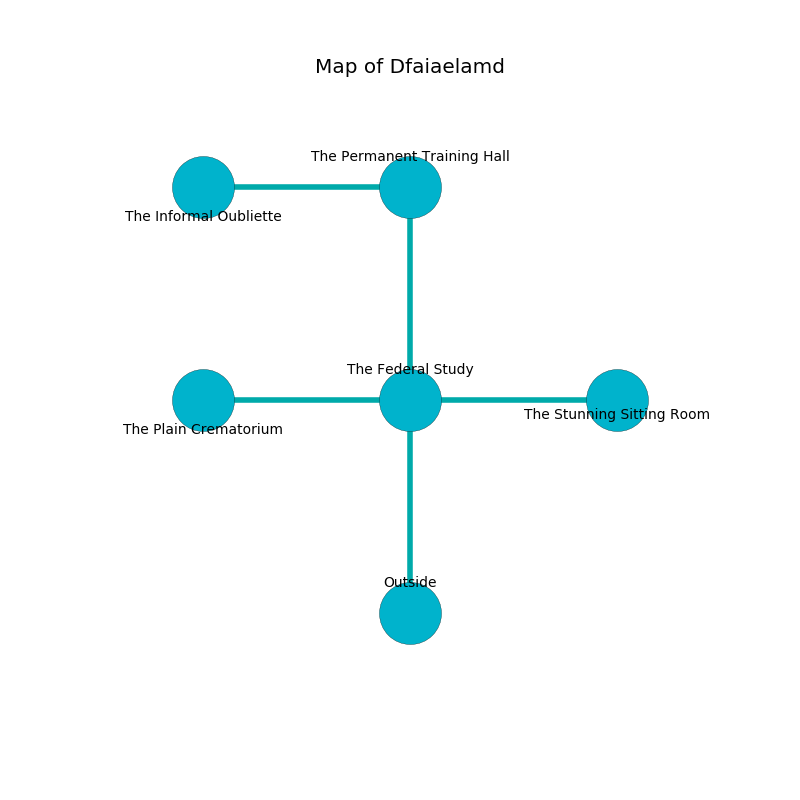

%Ruin Dogs

##Dfaiaelamd
###Overview
Dfaiaelamd is located under a volcanic mountain. Some rooms of it are foggy. The ruin is collapsing slowly. It is occupied by Thri-Kreens. Pearle Begley The Quick-Tempered, a Bulette is here. The Thri-Kreens have been charmed by Pearle Begley The Quick-Tempered. She  is trying to understand [The Compatible Pension](#The-Compatible-Pension). 

###Artifact
####The Compatible Pension

The Compatible Pension has the form of a wet spear. When rubbed it curses all nearby. 

###Locations

####the federal study
Yellow moss is growing from the walls. The air smells like guava here. 

* To the west a small cavern opens to [the plain crematorium](#the-plain-crematorium).
* To the east a hazy hall opens to [the stunning sitting Room](#the-stunning-sitting-Room).
* To the north a small gap connects to [the permanent training hall](#the-permanent-training-hall).
* To the south is the entrance.

####the plain crematorium
The floor is glossy. The air smells like huckleberry here. 

* To the east a small cavern leads to [the federal study](#the-federal-study).

####the stunning sitting Room
The air smells like basil here. The floor is glossy. There are a Badger, a Hawk, an Elephant, and a Young Remorhaz here. 

There is an engraving on a tablet written in Thri-Kreens Script. 

> Do not try dying.
>

* To the west a hazy hall connects to [the federal study](#the-federal-study).

####the permanent training hall
The mirrored walls are pristine. The floor is sticky. Green mushrooms are sprouting in broken urns. There are six Thri-Kreens here. One of the Thri-Kreens is working a mechanism that can flood the room. 

* [The Compatible Pension](#The-Compatible-Pension) is here.
* [Pearle Begley The Quick-Tempered](#Pearle-Begley-The-Quick-Tempered) is here.
* To the west a hazy hallway leads to [the informal oubliette](#the-informal-oubliette).
* To the south a small gap connects to [the federal study](#the-federal-study).

####the informal oubliette
Blue razorgrass is sprouting in cracks in the floor. The brick walls are bloodstained. 

* To the east a hazy hallway opens to [the permanent training hall](#the-permanent-training-hall).

