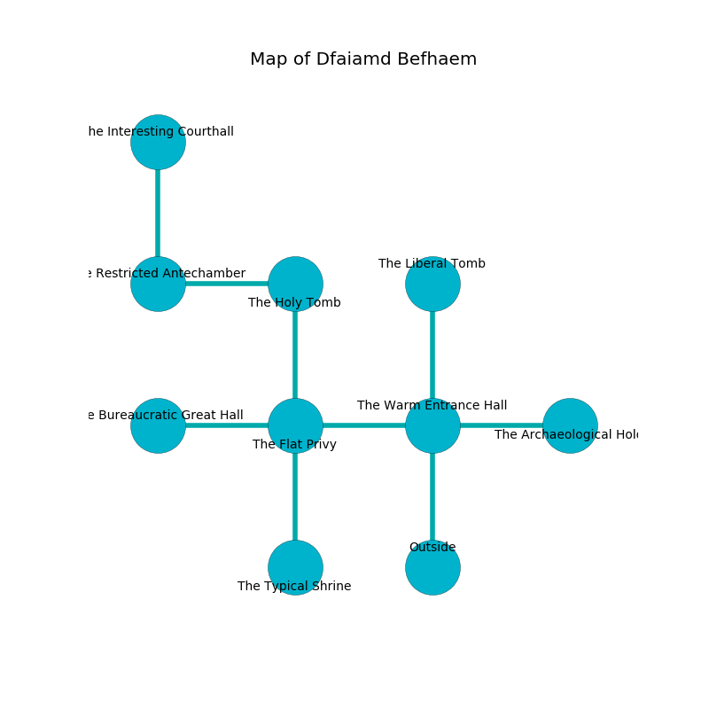

%Ruin Dogs

##Dfaiamd Befhaem
###Overview
Dfaiamd Befhaem is located on an alien plain. Some areas of it are unbearably cold. A massive flood is happening outside. It is occupied by Gnolls. Matilda Mccracken The Interfering, an Assassin is here. The Gnolls worship Matilda Mccracken The Interfering. She  is founding a new religion. 

###Artifact
####Demaec

Demaec looks like a hard prism. Cacophony pours away from it. When worn it becomes a shielding force. 

###Locations

####the warm entrance hall
The air smells like corn here. The stone walls are covered in mold. There is a trap here. When activated, a magical sound detector will make the ceiling slowly lower. 

* To the west a narrow cave leads to [the flat privy](#the-flat-privy).
* To the east a windy gap leads to [the archaeological hold](#the-archaeological-hold).
* To the north a narrow hall leads to [the liberal tomb](#the-liberal-tomb).
* To the south is the entrance.

####the flat privy
The air smells like alcohol here. There are three Gnoll Fangs of Yeenoghu and a Gnoll here. The glass walls are bloodstained. There is a trap here. When activated, a magical rune will launch a poison needle. White mushrooms are swaying from the walls. One of the Gnolls is on watch, the rest are feasting. 

* To the west a dark path connects to [the bureaucratic great hall](#the-bureaucratic-great-hall).
* To the east a narrow cave leads to [the warm entrance hall](#the-warm-entrance-hall).
* To the north a torchlit pathway opens to [the holy tomb](#the-holy-tomb).
* To the south a flooded pathway connects to [the typical shrine](#the-typical-shrine).

####the holy tomb
There are a Gnoll Fang of Yeenoghu, a Gnoll, three Gnoll Pack Lords,  here. The air smells like starfruit here. The wooden walls are scratched. The floor is smooth. The Gnolls are performing a ritual. If not interrupted, [Matilda Mccracken](#Matilda-Mccracken) will be magically alarmed. 

* To the west a small path opens to [the restricted antechamber](#the-restricted-antechamber).
* To the south a torchlit pathway connects to [the flat privy](#the-flat-privy).

####the liberal tomb
There are two Gnoll Fangs of Yeenoghu, a Gnoll, two Gnoll Pack Lords,  here. Green razorgrass is growing in cracks in the floor. The floor is smooth. The Gnolls are defending this room from intruders. 

There is an engraving on a tablet written in common. 

> Dig here.
>

* There is a hare here.
* To the south a narrow hall opens to [the warm entrance hall](#the-warm-entrance-hall).

####the typical shrine
The stone walls are caving in. There is a trap here. When activated, a magical proximity detector will shoot a lightning bolt. The air smells like spruce here. 

* [Matilda Mccracken The Interfering](#Matilda-Mccracken-The-Interfering) is here.
* To the north a flooded pathway connects to [the flat privy](#the-flat-privy).

####the bureaucratic great hall
Red mushrooms are sprouting from the ceiling. The air tastes like paper here. The floor is glossy. 

* To the east a dark path leads to [the flat privy](#the-flat-privy).

####the archaeological hold
Gray razorgrass is growing in broken urns. The air smells like cucumber here. The concrete walls are scratched. 

* There is a crossbow here.
* To the west a windy gap connects to [the warm entrance hall](#the-warm-entrance-hall).

####the restricted antechamber
The air tastes like immortelle here. The brick walls are caving in. 

There is an engraving on a stone written in Gnolls Script. 

> I discovered [Demaec](#Demaec).
>

* [Demaec](#Demaec) is here.
* To the east a small path opens to [the holy tomb](#the-holy-tomb).
* To the north a small path connects to [the interesting courthall](#the-interesting-courthall).

####the interesting courthall
The obsidion walls are bloodstained. There are a Gnoll Fang of Yeenoghu, a Gnoll, three Gnoll Pack Lords,  here. The Gnolls are willing to negotiate. 

There is an engraving on the floor written in common. 

> O! the world is sadistic
>
> historical, easy, new
>
> always artistic
>
> cruelty is due
>

* To the south a small path connects to [the restricted antechamber](#the-restricted-antechamber).

