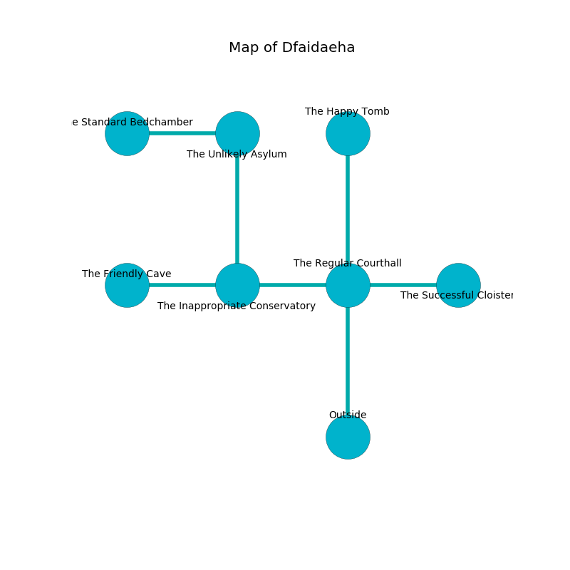

%Ruin Dogs

##Dfaidaeha
###Overview
Dfaidaeha is located on a giant tree. Parts of it are corrupted. A solar eclipse is happening outside. It is occupied by Lizardfolk. Millard Doucette The Inflexible, a Cambion is here. The Lizardfolk have been charmed by Millard Doucette The Inflexible. He  is founding a new religion. 

###Artifact
####Fahfad Aemuaededaeum

Fahfad Aemuaededaeum is a powerful artifact in the shape of an opaque spear. Air flows from it. When gazed upon it dissappears. 

###Locations

####the regular courthall
There is a Gorgon here. The floor is bloodstained. Yellow razorgrass is growing from the ceiling. 

There is an engraving on the ceiling written in common. 

> I discovered Dfaidaeha.
>

* [Millard Doucette The Inflexible](#Millard-Doucette-The-Inflexible) is here.
* To the west a dark hallway opens to [the inappropriate conservatory](#the-inappropriate-conservatory).
* To the east a twisted cave opens to [the successful cloister](#the-successful-cloister).
* To the north a dripping pathway leads to [the happy tomb](#the-happy-tomb).
* To the south is the entrance.

####the inappropriate conservatory
The air tastes like umami here. There is a trap here. When activated, a magical rune will ring a bell. 

* There is a hoard here.
* There is a casket here.
* [Fahfad Aemuaededaeum](#Fahfad-Aemuaededaeum) is here.
* To the west a hazy cave leads to [the friendly cave](#the-friendly-cave).
* To the east a dark hallway connects to [the regular courthall](#the-regular-courthall).
* To the north a flooded hall connects to [the unlikely asylum](#the-unlikely-asylum).

####the successful cloister
Yellow mushrooms are sprouting from the ceiling. 

* To the west a twisted cave leads to [the regular courthall](#the-regular-courthall).

####the happy tomb
The floor is flooded with three inch deep scalding water. There are two Lizardfolk Shamans and two Lizardfolk here. The glass walls are ruined. Blue razorgrass is decaying from the walls. The Lizardfolk are performing a ritual. If not interrupted, a powerful monster will be summoned. 

* To the south a dripping pathway leads to [the regular courthall](#the-regular-courthall).

####the unlikely asylum
The stone walls are scratched. The air smells like raspberry here. 

* To the west a narrow hall opens to [the standard bedchamber](#the-standard-bedchamber).
* To the south a flooded hall leads to [the inappropriate conservatory](#the-inappropriate-conservatory).

####the standard bedchamber
The mirrored walls are scratched. Gray moss is sprouting from the walls. There are an Incubus and a Lizard King here. The floor is smooth. 

* To the east a narrow hall opens to [the unlikely asylum](#the-unlikely-asylum).

####the friendly cave
The stone walls are pristine. Gray mushrooms are swaying from the walls. The floor is flooded with two inch deep lukewarm water. 

There is an engraving on the ceiling written in Lizardfolk Script. 

> Oh my! sorry we
>
> but never free
>
> always new
>
> sadness is due
>

* To the east a hazy cave connects to [the inappropriate conservatory](#the-inappropriate-conservatory).

