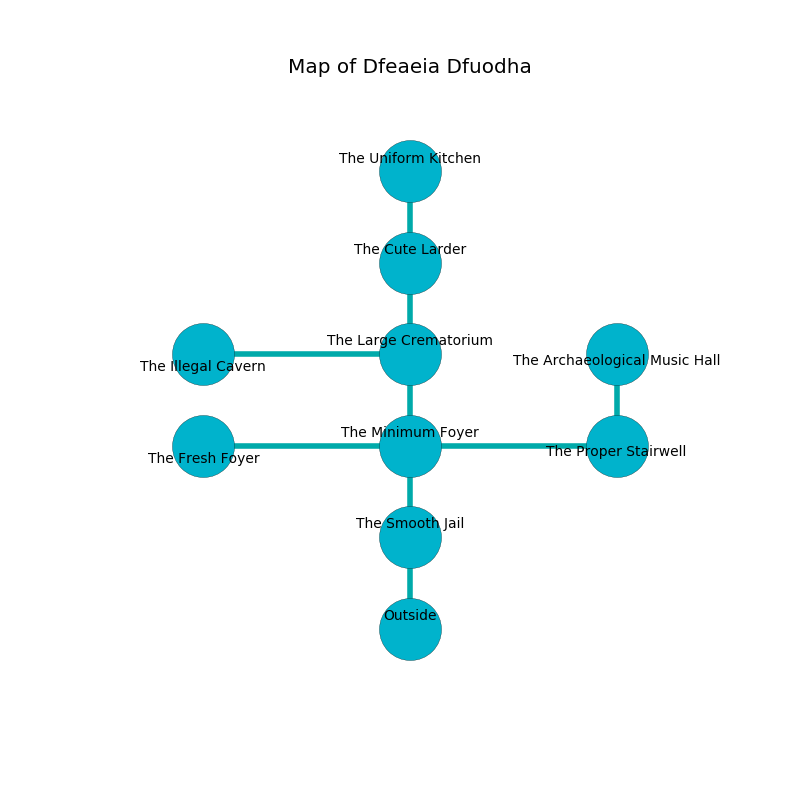

%Ruin Dogs

##Dfeaeia Dfuodha
###Overview
Dfeaeia Dfuodha is constructed on a crystal plain. Some areas of Dfeaeia Dfuodha are flooded. The ruin is larger on the inside than the outside. It is occupied by Myconids. Bruce Shapiro The Pusillanimous, a Cloud Giant is here. The Myconids are ruled by Bruce Shapiro The Pusillanimous. He  is founding a new religion. 

###Artifact
####The Delicate Service

The Delicate Service has the form of a mushy blade. When worshipped it tunnels into the earth. 

###Locations

####the smooth jail
Red mushrooms are growing in broken urns. The glass walls are unsettled. The air tastes like acai here. 

* To the north a twisted threshold leads to [the minimum foyer](#the-minimum-foyer).
* To the south is the entrance.

####the minimum foyer
Gray moss is growing in cracks in the floor. The mirrored walls are ruined. The floor is cluttered with broken glass. There are an Orog, a Dretch, a Thug, a Chuul, a Xorn, and a Bandit Captain here. The air tastes like rose tea here. 

* To the west a narrow hall leads to [the fresh foyer](#the-fresh-foyer).
* To the east a windy opening leads to [the proper stairwell](#the-proper-stairwell).
* To the north a windy hall leads to [the large crematorium](#the-large-crematorium).
* To the south a twisted threshold leads to [the smooth jail](#the-smooth-jail).

####the proper stairwell
Blue ferns are sprouting from the walls. 

* To the west a windy opening opens to [the minimum foyer](#the-minimum-foyer).
* To the north a narrow hallway connects to [the archaeological music hall](#the-archaeological-music-hall).

####the archaeological music hall
Green lichens are swaying in cracks in the floor. 

There is an engraving on the wall written in Myconids Script. 

> I could not try leaving.
>

* To the south a narrow hallway leads to [the proper stairwell](#the-proper-stairwell).

####the fresh foyer
Green lichens are decaying in broken urns. The stone walls are bloodstained. 

* [Bruce Shapiro The Pusillanimous](#Bruce-Shapiro-The-Pusillanimous) is here.
* To the east a narrow hall opens to [the minimum foyer](#the-minimum-foyer).

####the large crematorium
There are a Nothic, a Peryton, a Lizard King, and a Will-O’-Wisp here. The air smells like cucumber here. 

There is an engraving on a tablet written in Myconids Script. 

> I worship [The Delicate Service](#The-Delicate-Service).
>

* To the west a twisted cavern opens to [the illegal cavern](#the-illegal-cavern).
* To the north a twisted threshold opens to [the cute larder](#the-cute-larder).
* To the south a windy hall leads to [the minimum foyer](#the-minimum-foyer).

####the illegal cavern
Green moss is swaying from the ceiling. The floor is glossy. 

* To the east a twisted cavern leads to [the large crematorium](#the-large-crematorium).

####the cute larder
Red mushrooms are swaying in a patch on the floor. The glass walls are caving in. There are a Poisonous Snake, a Cyclops, a Fire Snake, and a Troll here. The floor is flooded with five inch deep cold water. 

There is an engraving on a stone written in common. 

> I am seeking [The Delicate Service](#The-Delicate-Service).
>

* [The Delicate Service](#The-Delicate-Service) is here.
* To the north a long gap leads to [the uniform kitchen](#the-uniform-kitchen).
* To the south a twisted threshold opens to [the large crematorium](#the-large-crematorium).

####the uniform kitchen
The wooden walls are bloodstained. 

* To the south a long gap connects to [the cute larder](#the-cute-larder).

