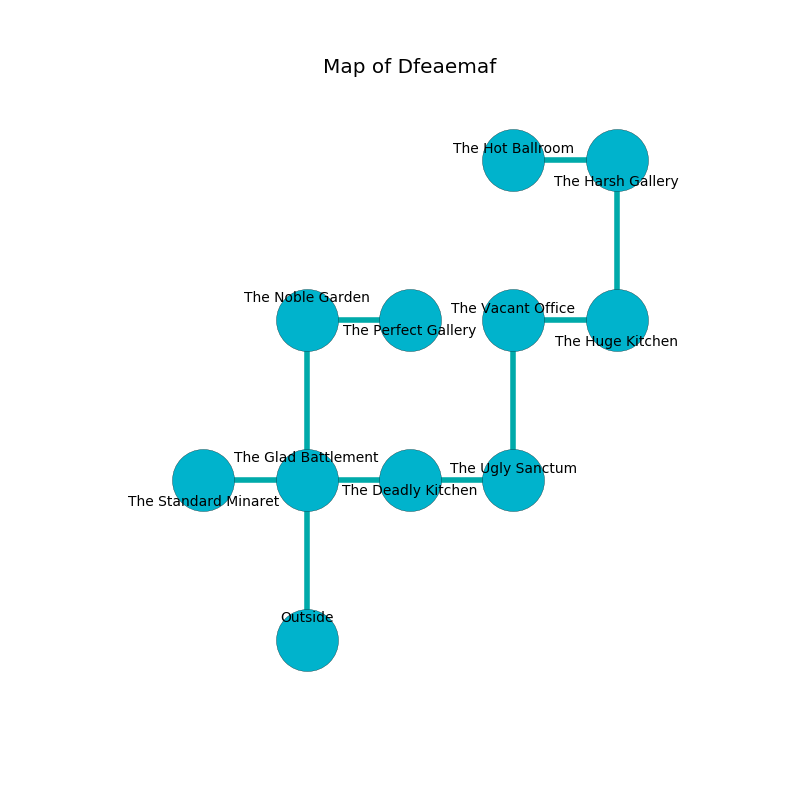

%Ruin Dogs

##Dfeaemaf
###Overview
Dfeaemaf is located in an alien plain. Some rooms of Dfeaemaf are flooded. A massive storm is happening outside. It is occupied by Yuan-Ti. Tanesha Farrington The Tactless, a Gladiator is here. The Yuan-Ti are battling Tanesha Farrington The Tactless. She  is trying to research [Haebd](#Haebd). 

###Artifact
####Haebd

Haebd is a powerful artifact in the shape of a hard orb. It is a sickly brown color. When eaten it ignites its surrroundings. 

###Locations

####the glad battlement
The air smells like bell pepper here. The floor is smooth. There are two Yuan-Ti Malisons here. The metallic walls are caving in. The Yuan-Ti are fighting amongst themselves. 

There is an engraving on a tablet written in common. 

> I am afraid.
>

* [Tanesha Farrington The Tactless](#Tanesha-Farrington-The-Tactless) is here.
* To the west a narrow corridor leads to [the standard minaret](#the-standard-minaret).
* To the east a twisted cave connects to [the deadly kitchen](#the-deadly-kitchen).
* To the north a torchlit artery leads to [the noble garden](#the-noble-garden).
* To the south is the entrance.

####the noble garden
The air smells like moss here. The obsidion walls are pristine. There are a Death Dog, a Nightmare, a Giant Eagle, a Hyena, and an Axe Beak here. 

There is an engraving on the ceiling written in Yuan-Ti Script. 

> I found Dfeaemaf.
>

* To the east a dark pathway connects to [the perfect gallery](#the-perfect-gallery).
* To the south a torchlit artery opens to [the glad battlement](#the-glad-battlement).

####the standard minaret
The floor is sticky. There are a Yuan-Ti Malison and three Yuan-Ti Purebloods here. If the Yuan-Ti notice the Ruin Dogs, one of them will retreat and alert the others. 

* To the east a narrow corridor leads to [the glad battlement](#the-glad-battlement).

####the perfect gallery
The air smells like zedoary here. There are a Plesiosaurus, a Poltergeist, and a Dire Wolf here. Yellow lichens are decaying from the ceiling. The floor is sticky. The crystal walls are pristine. 

* To the west a dark pathway opens to [the noble garden](#the-noble-garden).

####the deadly kitchen
There are an Aarakocra, a Jackal, a Boar, a Will-O’-Wisp, a Basilisk, and a Kobold here. Red razorgrass is growing from the walls. The mirrored walls are pristine. 

* There is a brush here.
* There is a nail here.
* To the west a twisted cave connects to [the glad battlement](#the-glad-battlement).
* To the east a dark hall connects to [the ugly sanctum](#the-ugly-sanctum).

####the ugly sanctum
There are a Draft Horse, a Minotaur Skeleton, a Myconid Adult, a Spider, a Deep Gnome, a Goat, a Scarecrow, a Specter, and a Flying Sword here. Green lichens are swaying from the walls. The air smells like toffee here. The floor is flooded with eight inch deep scalding water. 

* To the west a dark hall opens to [the deadly kitchen](#the-deadly-kitchen).
* To the north a long gap leads to [the vacant office](#the-vacant-office).

####the vacant office
Red ferns are swaying from the ceiling. The floor is glossy. The air tastes like butterscotch here. 

There is an engraving on the floor written in Yuan-Ti Script. 

> O everything is woe
>
> it is always sympathetic
>
> it is never low
>
> death is magnetic
>

* To the east a small pathway opens to [the huge kitchen](#the-huge-kitchen).
* To the south a long gap leads to [the ugly sanctum](#the-ugly-sanctum).

####the huge kitchen
Gray razorgrass is sprouting in cracks in the floor. There are a Frog, a Bugbear, and an Ettin here. The air smells like rye bread here. 

* To the west a small pathway leads to [the vacant office](#the-vacant-office).
* To the north a windy opening leads to [the harsh gallery](#the-harsh-gallery).

####the harsh gallery
The floor is glossy. Blue mushrooms are growing in cracks in the floor. The concrete walls are bloodstained. 

There is an engraving on the wall written in common. 

> Maybe try hiding.
>

* [Haebd](#Haebd) is here.
* To the west a twisted artery opens to [the hot ballroom](#the-hot-ballroom).
* To the south a windy opening connects to [the huge kitchen](#the-huge-kitchen).

####the hot ballroom
The air tastes like watercress here. The floor is flooded with one inch deep lukewarm water. 

* To the east a twisted artery connects to [the harsh gallery](#the-harsh-gallery).

