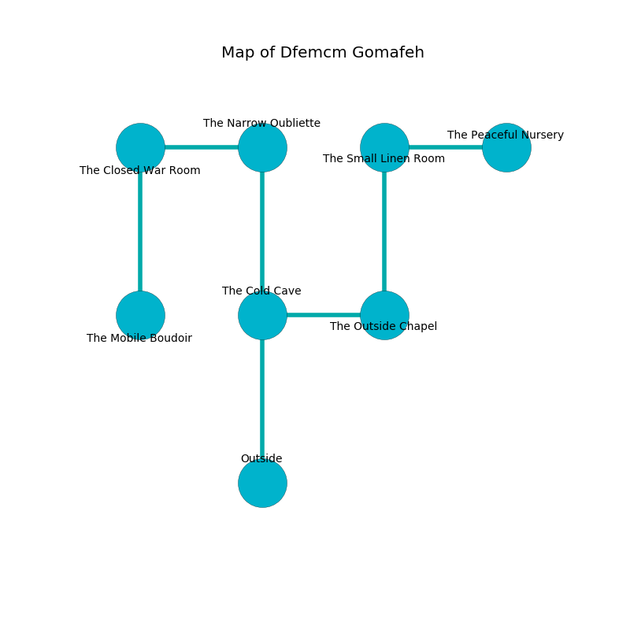

%Ruin Dogs

##Dfemcm Gomafeh
###Overview
Dfemcm Gomafeh is located on a volcanic rift. Parts of it are flooded. The ruin is coming to life. It is occupied by Thri-Kreens. Kirsten Hardy The Flirtatious, a Gnoll Fang of Yeenoghu is here. The Thri-Kreens are battling Kirsten Hardy The Flirtatious. She  is founding a new religion. 

###Artifact
####Imua Iwihhedha

Imua Iwihhedha is a powerful artifact in the shape of a cold monument. Gravity slips towards it. It is a medium pink color. It smells like mint. When touched it projects energy. 

###Locations

####the cold cave
There are a Wraith, two Winged Kobolds, an Elk, and  here. The floor is flooded with two inch deep cold water. The air tastes like milk here. 

* To the east a small gap leads to [the outside chapel](#the-outside-chapel).
* To the north a twisted artery leads to [the narrow oubliette](#the-narrow-oubliette).
* To the south is the entrance.

####the outside chapel
The air tastes like dry	durian here. The metallic walls are covered in mold. The floor is glossy. There are five Thri-Kreens here. One of the Thri-Kreens is on watch, the rest are celebrating. 

* To the west a small gap leads to [the cold cave](#the-cold-cave).
* To the north a flooded opening connects to [the small linen room](#the-small-linen-room).

####the narrow oubliette
The floor is bloodstained. The obsidion walls are scratched. 

* [Kirsten Hardy The Flirtatious](#Kirsten-Hardy-The-Flirtatious) is here.
* To the west a dripping pathway connects to [the closed war Room](#the-closed-war-Room).
* To the south a twisted artery leads to [the cold cave](#the-cold-cave).

####the small linen room
There are five Thri-Kreens here. The Thri-Kreens are feasting. 

There is an engraving on the ceiling written in common. 

> I was injured in Dfemcm Gomafeh.
>

* [Imua Iwihhedha](#Imua-Iwihhedha) is here.
* To the east a torchlit cavern opens to [the peaceful nursery](#the-peaceful-nursery).
* To the south a flooded opening opens to [the outside chapel](#the-outside-chapel).

####the closed war Room
There are five Thri-Kreens here. The crystal walls are covered in mold. Yellow lichens are sprouting in a patch on the floor. The Thri-Kreens are willing to negotiate. 

* There is a treasure here.
* To the east a dripping pathway leads to [the narrow oubliette](#the-narrow-oubliette).
* To the south a flooded passageway connects to [the mobile boudoir](#the-mobile-boudoir).

####the mobile boudoir
There is a trap here. When activated, a magical proximity detector will collapse a column. Red mushrooms are growing in broken urns. 

There is an engraving on a stone written in common. 

> Poor me! dire you
>
> ever true
>
> it is never tight
>
> hope is white
>

* To the north a flooded passageway opens to [the closed war Room](#the-closed-war-Room).

####the peaceful nursery
The mirrored walls are unsettled. The floor is bloodstained. Red mushrooms are growing from the ceiling. 

* To the west a torchlit cavern leads to [the small linen room](#the-small-linen-room).

