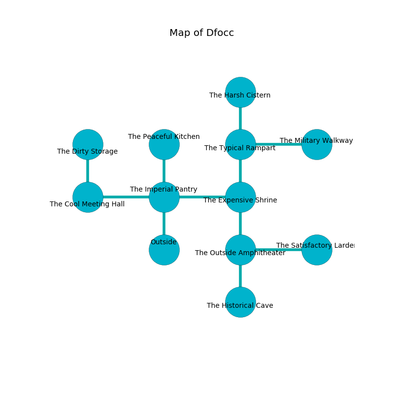

%Ruin Dogs

##Dfocc
###Overview
Dfocc is constructed on a broken rift. Parts of Dfocc are flooded. The ruin is flooding. It is occupied by Deep Gnomes. Temika Hardaway The Weak-Willed, a Drow Elite Warrior is here. The Deep Gnomes are ruled by Temika Hardaway The Weak-Willed. She  is founding a new religion. 

###Artifact
####The Active Company

The Active Company looks like a smooth prism. Light shifts near it. When cradled it ignites its surrroundings. 

###Locations

####the imperial pantry
The air tastes like autumn here. The glass walls are pristine. There are twelve Deep Gnomes here. Red mushrooms are sprouting in broken urns. The Deep Gnomes are performing a ritual. If not interrupted, the ruin dogs will be weakened. 

* To the west a dripping cave leads to [the cool meeting hall](#the-cool-meeting-hall).
* To the east a hazy walkway leads to [the expensive shrine](#the-expensive-shrine).
* To the north a windy pathway connects to [the peaceful kitchen](#the-peaceful-kitchen).
* To the south is the entrance.

####the expensive shrine
The brick walls are covered in mold. Blue ferns are growing in broken urns. 

* To the west a hazy walkway leads to [the imperial pantry](#the-imperial-pantry).
* To the north a dripping passageway opens to [the typical rampart](#the-typical-rampart).
* To the south a flooded opening leads to [the outside amphitheater](#the-outside-amphitheater).

####the cool meeting hall
The brick walls are bloodstained. The floor is flooded with two inch deep cold water. There are a Cult Fanatic, a Werewolf, and a Flameskull here. 

* There is a baby here.
* There is a brick here.
* To the east a dripping cave leads to [the imperial pantry](#the-imperial-pantry).
* To the north a small path opens to [the dirty storage](#the-dirty-storage).

####the outside amphitheater
Yellow lichens are swaying from the ceiling. The floor is smooth. 

There is an engraving on a monolith written in common. 

> A board is a voice
>
> but dull
>
> successful and transparent
>

* There is a monkey here.
* [The Active Company](#The-Active-Company) is here.
* To the east a twisted cave opens to [the satisfactory larder](#the-satisfactory-larder).
* To the north a flooded opening connects to [the expensive shrine](#the-expensive-shrine).
* To the south a torchlit hallway connects to [the historical cave](#the-historical-cave).

####the typical rampart
The wooden walls are ruined. There are twelve Deep Gnomes here. Red ferns are growing from the walls. If the Deep Gnomes notice the Ruin Dogs, one of them will retreat and alert [Temika Hardaway](#Temika-Hardaway). 

There is an engraving on a stone written in common. 

> Try dying.
>

* [Temika Hardaway The Weak-Willed](#Temika-Hardaway-The-Weak-Willed) is here.
* To the east a dripping cave leads to [the military walkway](#the-military-walkway).
* To the north a dripping corridor connects to [the harsh cistern](#the-harsh-cistern).
* To the south a dripping passageway connects to [the expensive shrine](#the-expensive-shrine).

####the harsh cistern
The floor is bloodstained. 

* There is a shoe here.
* To the south a dripping corridor leads to [the typical rampart](#the-typical-rampart).

####the dirty storage
The brick walls are unsettled. The floor is cluttered with ashes. 

There is an engraving on the wall written in Deep Gnomes Script. 

> I am a coward.
>
> I thought about cowering.
>

* To the south a small path leads to [the cool meeting hall](#the-cool-meeting-hall).

####the peaceful kitchen
There are a Death Dog, a Flumph, a Sea Hag, a Giant Goat, a Brass Dragon Wyrmling, a Shambling Mound, an Elk, and a Commoner here. The floor is smooth. 

* To the south a windy pathway connects to [the imperial pantry](#the-imperial-pantry).

####the satisfactory larder
The concrete walls are pristine. The floor is bloodstained. Blue mushrooms are growing from the ceiling. There are twelve Deep Gnomes here. One of the Deep Gnomes is working a mechanism that can launch acid at the Ruin Dogs. 

* To the west a twisted cave connects to [the outside amphitheater](#the-outside-amphitheater).

####the military walkway
The floor is glossy. The air tastes like incense here. There are a Kuo-Toa Monitor, a Giant Owl, a Bandit, an Ettercap, and a Magmin here. 

* To the west a dripping cave leads to [the typical rampart](#the-typical-rampart).

####the historical cave
The floor is flooded with five inch deep hot water. The stone walls are pristine. The air tastes like lemon here. There are twelve Deep Gnomes here. The Deep Gnomes are willing to negotiate. 

There is an engraving on the floor written in common. 

> Run away.
>

* To the north a torchlit hallway opens to [the outside amphitheater](#the-outside-amphitheater).

