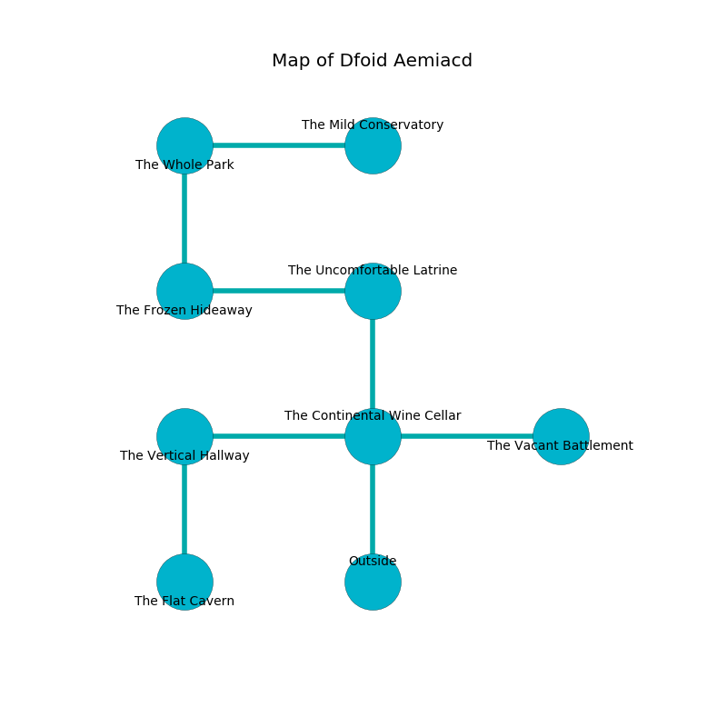

%Ruin Dogs

##Dfoid Aemiacd
###Overview
Dfoid Aemiacd is located under a broken mountain. Parts of it are cursed. A windstorm is happening outside. It is occupied by Kobolds. Rod Knutson The Stupid, a Myconid Sovereign is here. The Kobolds have been charmed by Rod Knutson The Stupid. He  is trying to research [The Blonde Herd](#The-Blonde-Herd). 

###Artifact
####The Blonde Herd

The Blonde Herd looks like a glassy doll. Cacophony bends from it. When cradled it become energized with a powerful vibration. 

###Locations

####the continental wine cellar
The floor is cluttered with shells. The obsidion walls are covered in mold. Green moss is decaying from the ceiling. The air tastes like dill here. 

There is an engraving on a stone written in common. 

> I am fleeing Dfoid Aemiacd.
>
> Leave now.
>

* To the west a twisted hallway connects to [the vertical hallway](#the-vertical-hallway).
* To the east a long corridor leads to [the vacant battlement](#the-vacant-battlement).
* To the north a dark passageway opens to [the uncomfortable latrine](#the-uncomfortable-latrine).
* To the south is the entrance.

####the uncomfortable latrine
The mirrored walls are caving in. The floor is sticky. The air smells like peppermint here. There are an Ankheg and a Blood Hawk here. 

There is an engraving on a tablet written in Kobolds Script. 

> Dear me! death is inhumane
>
> enthusiastic and main
>
> always profound
>
> sadness is sound
>

* To the west a flooded hallway opens to [the frozen hideaway](#the-frozen-hideaway).
* To the south a dark passageway leads to [the continental wine cellar](#the-continental-wine-cellar).

####the vacant battlement
The air smells like cloth here. The floor is flooded with nine inch deep hot water. 

* To the west a long corridor opens to [the continental wine cellar](#the-continental-wine-cellar).

####the frozen hideaway
The obsidion walls are unsettled. The floor is glossy. 

* To the east a flooded hallway leads to [the uncomfortable latrine](#the-uncomfortable-latrine).
* To the north a flooded hallway connects to [the whole park](#the-whole-park).

####the vertical hallway
There are eight Winged Kobolds and a Kobold here. The air smells like naphthyl here. One of the Kobolds is on watch, the rest are fighting amongst themselves. 

* There is a bee here.
* To the east a twisted hallway leads to [the continental wine cellar](#the-continental-wine-cellar).
* To the south a torchlit path opens to [the flat cavern](#the-flat-cavern).

####the flat cavern
White moss is growing from the walls. The air tastes like lime here. 

* To the north a torchlit path opens to [the vertical hallway](#the-vertical-hallway).

####the whole park
The floor is sticky. The brick walls are ruined. There are two Blink Dogs, a Dust Mephit, a Shrieker, a Pixie, two Twig Blights, a Cultist, an Octopus, a Piercer,  here. 

* There is a ring here.
* [The Blonde Herd](#The-Blonde-Herd) is here.
* To the east a dark hallway connects to [the mild conservatory](#the-mild-conservatory).
* To the south a flooded hallway leads to [the frozen hideaway](#the-frozen-hideaway).

####the mild conservatory
The air tastes like raspberry here. The floor is bloodstained. 

There is an engraving on the ceiling written in common. 

> Poor me! sorry you
>
> incongruous, bold, new
>
> but homosexual
>
> everything is new
>

* [Rod Knutson The Stupid](#Rod-Knutson-The-Stupid) is here.
* To the west a dark hallway leads to [the whole park](#the-whole-park).

