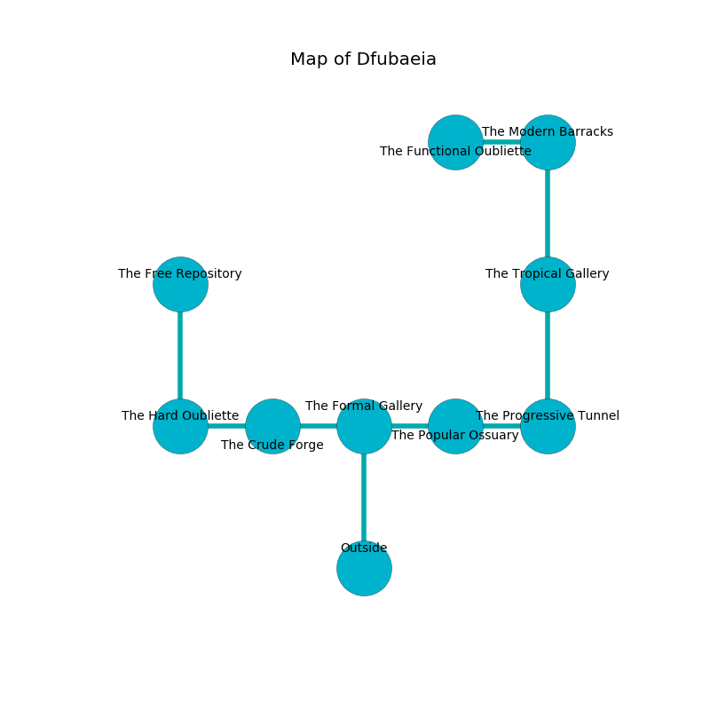

%Ruin Dogs

##Dfubaeia
###Overview
Dfubaeia is located under a volcanic plain. Parts of it are flooded. A blizzard is happening outside. It is occupied by Orc. Cecilia Durant The Self-Centred, a Drow Priestess of Lolth is here. The Orc have been charmed by Cecilia Durant The Self-Centred. She  is founding a new religion. 

###Artifact
####Iaaaehmd Dulwi

Iaaaehmd Dulwi is a powerful artifact in the shape of a glassy gem. It is a bright purple color. When gazed upon it illuminates its surroundings. 

###Locations

####the formal gallery
The floor is flooded with nine inch deep scalding water. There are eighteen Orcs here. The Orc are feasting. 

* There is an amulet here.
* [Cecilia Durant The Self-Centred](#Cecilia-Durant-The-Self-Centred) is here.
* To the west a dripping opening leads to [the crude forge](#the-crude-forge).
* To the east a torchlit threshold leads to [the popular ossuary](#the-popular-ossuary).
* To the south is the entrance.

####the crude forge
The crystal walls are bloodstained. The floor is flooded with eight inch deep cold water. The air smells like muguet here. 

* To the west a flooded cavern opens to [the hard oubliette](#the-hard-oubliette).
* To the east a dripping opening connects to [the formal gallery](#the-formal-gallery).

####the popular ossuary
The air smells like resin here. The metallic walls are ruined. There are a Drow Priestess of Lolth, a Thri-Kreen, a Grick, and an Animated Armor here. Gray lichens are sprouting in cracks in the floor. 

* To the west a torchlit threshold opens to [the formal gallery](#the-formal-gallery).
* To the east a windy cave leads to [the progressive tunnel](#the-progressive-tunnel).

####the progressive tunnel
The floor is cluttered with ashes. 

* To the west a windy cave opens to [the popular ossuary](#the-popular-ossuary).
* To the north a dark path opens to [the tropical gallery](#the-tropical-gallery).

####the tropical gallery
The mirrored walls are unsettled. The floor is cluttered with shells. There are a Giant Bat, a Pentadrone, a Mimic, and a Troll here. The air tastes like lychee here. 

* To the north a narrow cave opens to [the modern barracks](#the-modern-barracks).
* To the south a dark path connects to [the progressive tunnel](#the-progressive-tunnel).

####the modern barracks
Blue lichens are sprouting in a patch on the floor. There are a Gray Slaad, a Bone Naga, and a Rat here. The metallic walls are scratched. 

* There is a drawer here.
* To the west a hazy pathway connects to [the functional oubliette](#the-functional-oubliette).
* To the south a narrow cave leads to [the tropical gallery](#the-tropical-gallery).

####the hard oubliette
The floor is sticky. The air smells like raw potato here. 

* [Iaaaehmd Dulwi](#Iaaaehmd-Dulwi) is here.
* To the east a flooded cavern opens to [the crude forge](#the-crude-forge).
* To the north a long pathway connects to [the free repository](#the-free-repository).

####the functional oubliette
The crystal walls are covered in mold. 

* To the east a hazy pathway leads to [the modern barracks](#the-modern-barracks).

####the free repository
There are a Giant Elk and a Githyanki Knight here. The air tastes like bell pepper here. The crystal walls are ruined. 

* To the south a long pathway connects to [the hard oubliette](#the-hard-oubliette).

