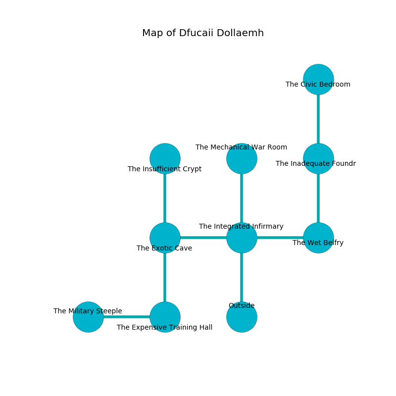

%Ruin Dogs

##Dfucaii Dollaemh
###Overview
Dfucaii Dollaemh is located in a crystal rift. Some rooms of it are corrupted. A blizzard is happening outside. It is occupied by Demons. August Key The Big-Headed, a Fire Giant is here. The Demons are the slaves of August Key The Big-Headed. He  is trying to discover [The Paralyzed Puzzle](#The-Paralyzed-Puzzle). 

###Artifact
####The Paralyzed Puzzle

The Paralyzed Puzzle is a powerful artifact in the shape of a warm amulet. Air shifts near it. It smells like lemon peel. When gazed upon it becomes a deadly projectile. 

###Locations

####the integrated infirmary
The floor is smooth. There are a Thug, a Lion, a Veteran, a Kobold, and a Yochlol here. The brick walls are bloodstained. 

There is an engraving on a stone written in Demons Script. 

> [The Paralyzed Puzzle](#The-Paralyzed-Puzzle)
>
> always thirsty
>
> You are dying
>
> but polite
>

* To the west a twisted threshold leads to [the exotic cave](#the-exotic-cave).
* To the east a flooded path leads to [the wet belfry](#the-wet-belfry).
* To the north a small cavern opens to [the mechanical war Room](#the-mechanical-war-Room).
* To the south is the entrance.

####the wet belfry
The metallic walls are pristine. The air tastes like paint here. There is a trap here. When activated, a magical proximity detector will open a large pit in the floor. Red mushrooms are decaying in a patch on the floor. 

* [August Key The Big-Headed](#August-Key-The-Big-Headed) is here.
* To the west a flooded path leads to [the integrated infirmary](#the-integrated-infirmary).
* To the north a twisted path leads to [the inadequate foundry](#the-inadequate-foundry).

####the exotic cave

* To the east a twisted threshold leads to [the integrated infirmary](#the-integrated-infirmary).
* To the north a flooded cavern connects to [the insufficient crypt](#the-insufficient-crypt).
* To the south a long cavern opens to [the expensive training hall](#the-expensive-training-hall).

####the expensive training hall
The floor is glossy. The metallic walls are unsettled. Yellow moss is decaying in cracks in the floor. 

* To the west a torchlit threshold leads to [the military steeple](#the-military-steeple).
* To the north a long cavern leads to [the exotic cave](#the-exotic-cave).

####the military steeple
There are a Kuo-Toa Whip, a Wererat, a Pentadrone, a Shrieker, a Cambion, and a Gnoll here. 

* To the east a torchlit threshold leads to [the expensive training hall](#the-expensive-training-hall).

####the mechanical war Room
The crystal walls are scratched. The floor is smooth. 

* To the south a small cavern leads to [the integrated infirmary](#the-integrated-infirmary).

####the inadequate foundry
The obsidion walls are unsettled. There are a Stirge, a Tribal Warrior, a Spider, a Cambion, a Magma Mephit, a Poisonous Snake, a Winged Kobold, a Night Hag, and a Yuan-Ti Malison here. 

* [The Paralyzed Puzzle](#The-Paralyzed-Puzzle) is here.
* To the north a flooded threshold connects to [the civic bedroom](#the-civic-bedroom).
* To the south a twisted path opens to [the wet belfry](#the-wet-belfry).

####the insufficient crypt
The floor is bloodstained. The brick walls are covered in mold. The air tastes like starch here. There are a Medusa, a Grick Alpha, a Jackal, and an Elk here. 

* To the south a flooded cavern leads to [the exotic cave](#the-exotic-cave).

####the civic bedroom
The brick walls are caving in. White moss is growing from the walls. 

There is an engraving on a tablet written in Demons Script. 

> I thought about cowering.
>

* There is a pin here.
* To the south a flooded threshold connects to [the inadequate foundry](#the-inadequate-foundry).

