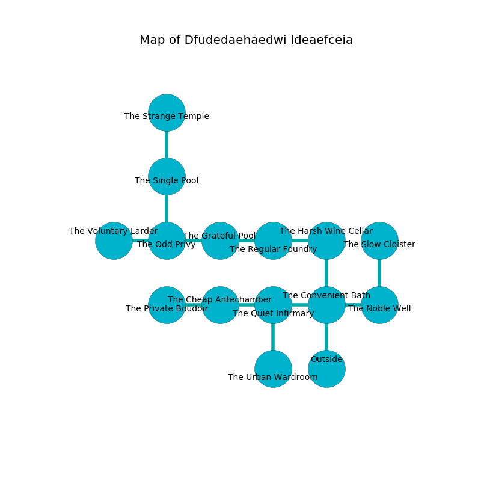

%Ruin Dogs

##Dfudedaehaedwi Ideaefceia
###Overview
Dfudedaehaedwi Ideaefceia is constructed on a haunted plain. Regions of it are somewhat hot. The ruin is collapsing slowly. It is occupied by Vampires. Anja Nicholson The Impatient, a Mind Flayer Arcanist is here. The Vampires worship Anja Nicholson The Impatient. She  is founding a new religion. 

###Artifact
####Colha Decchfuoml

Colha Decchfuoml is a powerful artifact in the shape of a cold doll. It is a shifting green color. When worn it shows an image of the future. 

###Locations

####the convenient bath
There are two Vampire Spawns here. If the Vampires notice the Ruin Dogs, one of them will retreat and alert [Anja Nicholson](#Anja-Nicholson). 

There is an engraving on a monolith written in Vampires Script. 

> Try praying.
>

* To the west a dark path connects to [the quiet infirmary](#the-quiet-infirmary).
* To the east a windy threshold opens to [the noble well](#the-noble-well).
* To the north a dripping pathway leads to [the harsh wine cellar](#the-harsh-wine-cellar).
* To the south is the entrance.

####the quiet infirmary
Red ferns are swaying in a patch on the floor. 

* To the west a narrow pathway opens to [the cheap antechamber](#the-cheap-antechamber).
* To the east a dark path leads to [the convenient bath](#the-convenient-bath).
* To the south a windy pathway opens to [the urban wardroom](#the-urban-wardroom).

####the cheap antechamber
The wooden walls are covered in mold. There are two Vampire Spawns here. The Vampires are willing to fight to the death. 

* To the west a torchlit hallway opens to [the private boudoir](#the-private-boudoir).
* To the east a narrow pathway leads to [the quiet infirmary](#the-quiet-infirmary).

####the harsh wine cellar
Gray moss is growing from the ceiling. There are a Wolf, a Black Bear, a Giant Octopus, a Gnoll Fang of Yeenoghu, a Succubus, and a Flying Snake here. The floor is sticky. There is a trap here. When activated, a magical proximity detector will launch a poison needle. 

* There is a lyre here.
* To the west a torchlit cavern leads to [the regular foundry](#the-regular-foundry).
* To the south a dripping pathway connects to [the convenient bath](#the-convenient-bath).

####the regular foundry
There are a Wraith, a Giant Toad, an Ogre, and a Giant Goat here. The crystal walls are scratched. The air tastes like beeswax here. 

* To the west a windy corridor connects to [the grateful pool](#the-grateful-pool).
* To the east a torchlit cavern connects to [the harsh wine cellar](#the-harsh-wine-cellar).

####the private boudoir
The obsidion walls are bloodstained. 

* To the east a torchlit hallway leads to [the cheap antechamber](#the-cheap-antechamber).

####the grateful pool
The air smells like rosemary here. Red moss is growing in cracks in the floor. The crystal walls are pristine. 

* To the west a hazy passageway connects to [the odd privy](#the-odd-privy).
* To the east a windy corridor opens to [the regular foundry](#the-regular-foundry).

####the odd privy
The floor is cluttered with bones. Red ferns are swaying from the ceiling. There are a Githzerai Zerth and a Basilisk here. The mirrored walls are caving in. 

There is an engraving on a stone written in common. 

> I thought about dying.
>

* To the west a flooded opening leads to [the voluntary larder](#the-voluntary-larder).
* To the east a hazy passageway leads to [the grateful pool](#the-grateful-pool).
* To the north a hazy passageway connects to [the single pool](#the-single-pool).

####the single pool
Gray lichens are growing in cracks in the floor. There is a trap here. When activated, a magical proximity detector will fire a scything blade. 

* There is a carriage here.
* To the north a narrow opening opens to [the strange temple](#the-strange-temple).
* To the south a hazy passageway connects to [the odd privy](#the-odd-privy).

####the noble well
The air smells like styrene here. Red moss is growing in cracks in the floor. 

* [Colha Decchfuoml](#Colha-Decchfuoml) is here.
* [Anja Nicholson The Impatient](#Anja-Nicholson-The-Impatient) is here.
* To the west a windy threshold opens to [the convenient bath](#the-convenient-bath).
* To the north a windy walkway leads to [the slow cloister](#the-slow-cloister).

####the voluntary larder
The air smells like fennel here. The floor is bloodstained. Gray razorgrass is growing from the walls. 

* To the east a flooded opening connects to [the odd privy](#the-odd-privy).

####the urban wardroom
Green mushrooms are decaying from the walls. 

* To the north a windy pathway leads to [the quiet infirmary](#the-quiet-infirmary).

####the strange temple
Blue razorgrass is decaying in a patch on the floor. The air tastes like meat here. There are two Vampire Spawns here. The stone walls are bloodstained. The Vampires are feasting. 

* To the south a narrow opening opens to [the single pool](#the-single-pool).

####the slow cloister
The metallic walls are pristine. 

* To the south a windy walkway leads to [the noble well](#the-noble-well).

