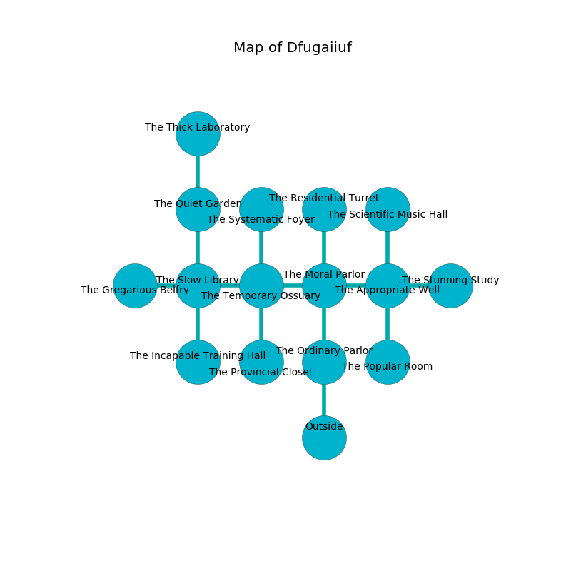

%Ruin Dogs

##Dfugaiiuf
###Overview
Dfugaiiuf is located in a cursed mountain. Regions of it are frozen. The ruin is larger on the inside than the outside. It is occupied by Pixies. Perry Erickson The Impatient, a Cloud Giant is here. The Pixies are the minions of Perry Erickson The Impatient. He  is trying to recover [The Dynamic Blue](#The-Dynamic-Blue). 

###Artifact
####The Dynamic Blue

The Dynamic Blue looks like a sharp monument. When eaten it becomes a deadly projectile. 

###Locations

####the ordinary parlor
There is a trap here. When activated, a magical rune will launch a ceiling pendulum. The stone walls are pristine. The air smells like herbs here. The floor is flooded with three inch deep hot water. 

* To the north a dripping opening connects to [the moral parlor](#the-moral-parlor).
* To the south is the entrance.

####the moral parlor
The air smells like filbert here. The glass walls are caving in. Green mushrooms are decaying from the walls. There are a Wight, a Red Slaad, and a Werebear here. 

* There is a tree here.
* [Perry Erickson The Impatient](#Perry-Erickson-The-Impatient) is here.
* To the west a torchlit cave connects to [the temporary ossuary](#the-temporary-ossuary).
* To the east a hazy cave connects to [the appropriate well](#the-appropriate-well).
* To the north a narrow hallway connects to [the residential turret](#the-residential-turret).
* To the south a dripping opening opens to [the ordinary parlor](#the-ordinary-parlor).

####the temporary ossuary
The floor is smooth. The air tastes like cranberry here. 

There is an engraving on the floor written in common. 

> I am old.
>
> Go away.
>

* To the west a small corridor connects to [the slow library](#the-slow-library).
* To the east a torchlit cave leads to [the moral parlor](#the-moral-parlor).
* To the north a windy cavern connects to [the systematic foyer](#the-systematic-foyer).
* To the south a dark path opens to [the provincial closet](#the-provincial-closet).

####the provincial closet
There are forty Pixies here. Blue razorgrass is decaying in a patch on the floor. The air tastes like grapefruit here. One of the Pixies is on watch, the rest are caring for babies. 

* To the north a dark path leads to [the temporary ossuary](#the-temporary-ossuary).

####the systematic foyer
Yellow ferns are swaying in a patch on the floor. The floor is cluttered with bones. 

* To the south a windy cavern opens to [the temporary ossuary](#the-temporary-ossuary).

####the slow library
The air tastes like flesh here. The floor is flooded with nine inch deep hot water. There are a Bugbear Chief, a Vine Blight, a Helmed Horror, a Giant Wasp, and a Mind Flayer here. 

* There is a chainmail here.
* To the west a flooded cave connects to [the gregarious belfry](#the-gregarious-belfry).
* To the east a small corridor opens to [the temporary ossuary](#the-temporary-ossuary).
* To the north a long path leads to [the quiet garden](#the-quiet-garden).
* To the south a flooded cavern opens to [the incapable training hall](#the-incapable-training-hall).

####the appropriate well
The air smells like orchid here. The concrete walls are caving in. The floor is sticky. 

* To the west a hazy cave connects to [the moral parlor](#the-moral-parlor).
* To the east a narrow threshold leads to [the stunning study](#the-stunning-study).
* To the north a narrow hallway opens to [the scientific music hall](#the-scientific-music-hall).
* To the south a flooded cavern connects to [the popular room](#the-popular-room).

####the popular room
The air tastes like banana here. Yellow lichens are sprouting in broken urns. 

* There is an orb here.
* To the north a flooded cavern leads to [the appropriate well](#the-appropriate-well).

####the residential turret
Blue mushrooms are sprouting from the ceiling. The metallic walls are unsettled. There are a Red Dragon Wyrmling, a Giant Octopus, a Kuo-Toa, a Young Black Dragon, an Animated Armor, a Scarecrow, and an Awakened Tree here. 

* To the south a narrow hallway connects to [the moral parlor](#the-moral-parlor).

####the quiet garden

* [The Dynamic Blue](#The-Dynamic-Blue) is here.
* To the north a small opening opens to [the thick laboratory](#the-thick-laboratory).
* To the south a long path connects to [the slow library](#the-slow-library).

####the gregarious belfry
Red mushrooms are growing from the ceiling. The floor is flooded with three inch deep hot water. There are forty Pixies here. The concrete walls are caving in. One of the Pixies is on watch, the rest are celebrating. 

There is an engraving on a tablet written in Pixies Script. 

> I am lost in Dfugaiiuf.
>

* To the east a flooded cave connects to [the slow library](#the-slow-library).

####the stunning study
The air tastes like strawberry here. The floor is bloodstained. 

* There is a bell here.
* To the west a narrow threshold opens to [the appropriate well](#the-appropriate-well).

####the scientific music hall

* To the south a narrow hallway connects to [the appropriate well](#the-appropriate-well).

####the incapable training hall
The air smells like black currant here. The metallic walls are scratched. There are forty Pixies here. One of the Pixies is pointing a ballista at the entrance. 

* To the north a flooded cavern leads to [the slow library](#the-slow-library).

####the thick laboratory
The floor is smooth. There are a Death Dog, a Young Silver Dragon, a Sahuagin Priestess, a Giant Shark, a Sea Horse, and an Awakened Shrub here. The crystal walls are unsettled. Red moss is decaying in broken urns. The air tastes like acerola here. 

There is an engraving on the wall written in common. 

> I am powerful.
>

* To the south a small opening leads to [the quiet garden](#the-quiet-garden).

