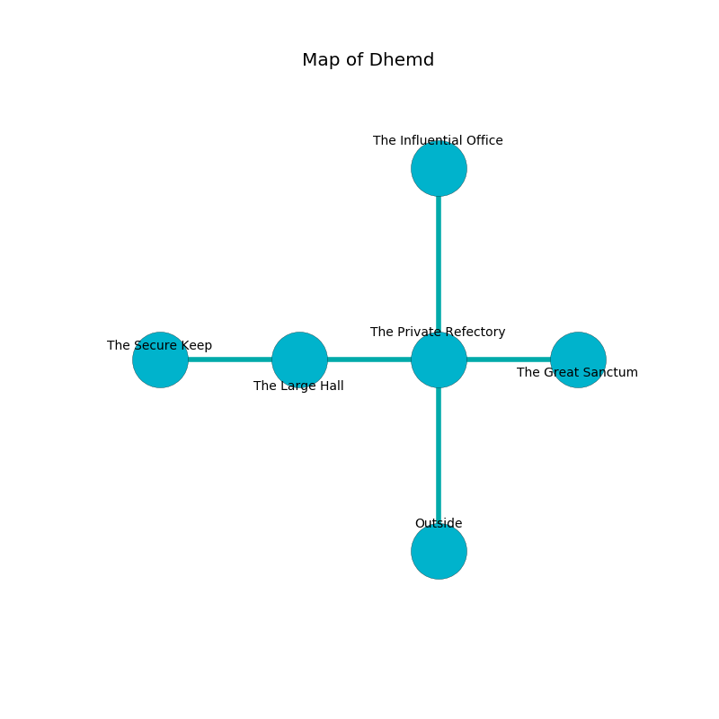

%Ruin Dogs

##Dhemd
###Overview
Dhemd is located under a giant mountain. Some areas of Dhemd are inaccessible. The ruin is collapsing slowly. It is occupied by Satyrs. Marianela Zamora The Cynical, a Mage is here. The Satyrs are the soldiers of Marianela Zamora The Cynical. She  is founding a new religion. 

###Artifact
####The Hostile Traffic

The Hostile Traffic is a powerful artifact in the shape of a wet doll. When rubbed it frightens children. 

###Locations

####the private refectory
The air tastes like nutmeg here. 

* To the west a dripping passageway opens to [the large hall](#the-large-hall).
* To the east a flooded passageway leads to [the great sanctum](#the-great-sanctum).
* To the north a torchlit cavern leads to [the influential office](#the-influential-office).
* To the south is the entrance.

####the large hall
The floor is flooded with seven inch deep scalding water. The air smells like citrus peel here. There is a trap here. When activated, a pressure plate will fire a net. 

* There is a feather here.
* [The Hostile Traffic](#The-Hostile-Traffic) is here.
* To the west a dark corridor opens to [the secure keep](#the-secure-keep).
* To the east a dripping passageway leads to [the private refectory](#the-private-refectory).

####the great sanctum
Green razorgrass is decaying in broken urns. There are ten Satyrs here. The air tastes like cloth here. The floor is cluttered with bones. The Satyrs are meditating. 

* To the west a flooded passageway connects to [the private refectory](#the-private-refectory).

####the influential office
Blue razorgrass is swaying from the walls. The air tastes like pepper here. 

There is an engraving on a tablet written in common. 

> I am lost in Dhemd.
>

* There is a boot here.
* To the south a torchlit cavern leads to [the private refectory](#the-private-refectory).

####the secure keep
The air smells like jasmin here. The stone walls are scratched. There are ten Satyrs here. The Satyrs are willing to negotiate. 

* [Marianela Zamora The Cynical](#Marianela-Zamora-The-Cynical) is here.
* To the east a dark corridor connects to [the large hall](#the-large-hall).

