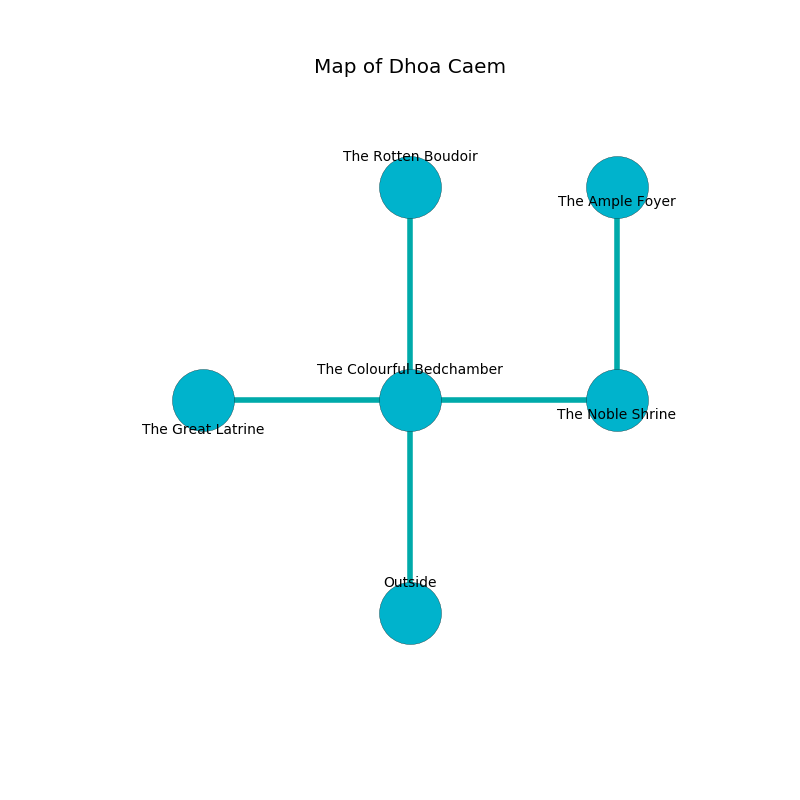

%Ruin Dogs

##Dhoa Caem
###Overview
Dhoa Caem is constructed on an alien tree. Parts of Dhoa Caem are inaccessible. A massive flood is happening outside. It is occupied by Deep Gnomes. Winford Burdette The Irresponsible, a Mind Flayer Arcanist is here. The Deep Gnomes are the slaves of Winford Burdette The Irresponsible. He  is founding a new religion. 

###Artifact
####Cuggaa Doiaemaii

Cuggaa Doiaemaii is a powerful artifact in the shape of a transparent gem. Air incinerates away from it. It smells like beef. When smelled it shows an image of the future. 

###Locations

####the colourful bedchamber
There are a Homunculus, a Giant Toad, a Hawk, a Myconid Sovereign, and a Werebear here. The air smells like walnut here. White lichens are swaying from the walls. 

* There is a goblin here.
* [Cuggaa Doiaemaii](#Cuggaa-Doiaemaii) is here.
* To the west a flooded gap leads to [the great latrine](#the-great-latrine).
* To the east a dark cave connects to [the noble shrine](#the-noble-shrine).
* To the north a flooded hallway connects to [the rotten boudoir](#the-rotten-boudoir).
* To the south is the entrance.

####the great latrine
The floor is flooded with six inch deep cool water. 

* There is a pin here.
* To the east a flooded gap leads to [the colourful bedchamber](#the-colourful-bedchamber).

####the noble shrine
There are a Bone Naga and a Werebear here. The air tastes like green apple here. The floor is sticky. The wooden walls are unsettled. 

There is an engraving on a stone written in common. 

> I am lost in Dhoa Caem.
>
> Leave at once.
>

* There is a potato here.
* To the west a dark cave leads to [the colourful bedchamber](#the-colourful-bedchamber).
* To the north a small pathway opens to [the ample foyer](#the-ample-foyer).

####the ample foyer
The air tastes like clam here. 

* To the south a small pathway opens to [the noble shrine](#the-noble-shrine).

####the rotten boudoir
The air smells like powder here. The floor is glossy. 

* [Winford Burdette The Irresponsible](#Winford-Burdette-The-Irresponsible) is here.
* To the south a flooded hallway leads to [the colourful bedchamber](#the-colourful-bedchamber).

